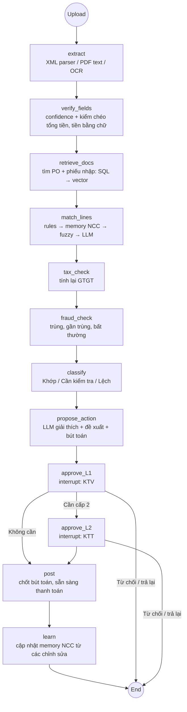
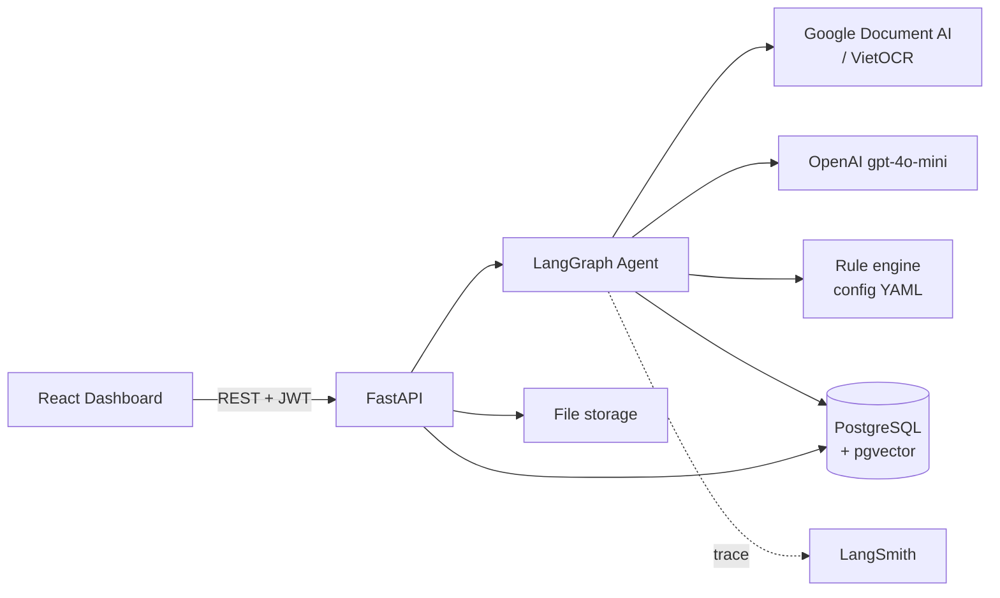

# Brief: Invoice Reconciliation Agent cho Xe X

> AI Agent đối soát hóa đơn với PO và phiếu nhập hàng (3-way matching)
> Đề bài: Xe X / Dịch vụ gọi xe X · Repo: `AI20K-Build-Phase-Cohort-4/P-143` · Framework: AI20K Agent Template
> Ngày: 19/09/2026 · Trạng thái: Draft v2 (theo đề bài chính thức)

---

## 1. Tóm tắt

Agent **đọc hóa đơn** (XML hóa đơn điện tử, PDF, ảnh), **tự tìm PO và phiếu nhập hàng liên quan**, đối chiếu 3 chiều theo từng dòng hàng, **phát hiện chênh lệch về giá, số lượng và thuế**, rồi đề xuất cách xử lý. **Kế toán luôn là người duyệt** trước khi ghi sổ hoặc thanh toán.

Ba nguyên tắc không được phá:
1. **Không có bút toán hay lệnh thanh toán nào đi qua mà không có người duyệt** (HITL bắt buộc).
2. **LLM không bao giờ tạo ra con số.** Mọi số tiền, số lượng và tiền thuế đều lấy từ nguồn (XML, OCR) và do rule engine tính, dùng `Decimal`, không dùng `float`.
3. **Không chắc thì phải báo.** Trường nào OCR có độ tin cậy thấp thì gắn cờ và chặn tự động phân loại "khớp".

## 2. Thực trạng và vấn đề

- Kế toán Xe X đối soát hóa đơn với PO và phiếu nhập hàng **bằng tay**. Khối lượng dồn vào cuối tháng, dễ sai số liệu và làm chậm thanh toán cho nhà cung cấp.
- Hóa đơn đến ở 3 dạng với độ khó khác nhau:

| Dạng | Cách đọc | Độ tin cậy | Chi phí |
|---|---|---|---|
| XML hóa đơn điện tử | Parser, không cần OCR | Tuyệt đối | ~0 |
| PDF có lớp text | Trích text trực tiếp, LLM map vào các trường | Cao | Thấp |
| PDF scan / ảnh chụp | OCR, LLM map vào các trường | Phải đo từng trường | Cao nhất |

- Phần khó nhất sau khi đọc được là **khớp dữ liệu**: tên hàng trên hóa đơn khác tên trên PO, đơn vị tính khác nhau, giao hàng thiếu một phần, một PO nhận nhiều lần, lệch do làm tròn VAT.

**Giả định nghiệp vụ (cần xác nhận với Xe X):** nhóm hàng mua phổ biến là phụ tùng, lốp, ắc quy xe điện; dịch vụ bảo dưỡng, sửa chữa, vệ sinh xe; điện sạc; đồng phục tài xế; văn phòng phẩm. Dữ liệu mẫu sẽ sinh theo các nhóm này.

## 3. Người dùng và phân quyền

| Vai trò | Được làm | Không được làm |
|---|---|---|
| **Kế toán viên (KTV)** | Upload hóa đơn, xem kết quả đối chiếu, sửa trường OCR sai, duyệt cấp 1, trả lại hoặc từ chối | Duyệt cấp 2, sửa cấu hình rule |
| **Kế toán trưởng (KTT)** | Mọi quyền của KTV, duyệt cấp 2, cấu hình ngưỡng và rule riêng từng NCC, xem audit log | Tự duyệt cấp 2 cho hóa đơn do chính mình duyệt cấp 1 |

**Tách biệt trách nhiệm:** người duyệt cấp 1 và cấp 2 của cùng một hóa đơn phải là 2 người khác nhau. Mọi thao tác đều ghi audit log (ai, làm gì, lúc nào, giá trị trước và sau).

## 4. Phạm vi

### 4.1 Cơ bản (bắt buộc)
1. **Web deploy, đăng nhập 2 vai trò** (KTV, KTT) bằng JWT và phân quyền theo vai trò.
2. **Upload hóa đơn** (XML, PDF, ảnh; upload nhiều file một lần) và **nhập PO + phiếu nhập** (Excel/CSV, hoặc seed sẵn trong DB).
3. **Agent đối chiếu 3 chiều** theo từng dòng hàng, **phân loại** mỗi hóa đơn:
   - 🟢 **Khớp**: mọi dòng khớp trong ngưỡng dung sai, mọi trường có độ tin cậy cao
   - 🟡 **Cần kiểm tra**: có trường OCR tin cậy thấp, hoặc LLM khớp mờ với độ tin cậy trung bình
   - 🔴 **Lệch**: có chênh lệch giá, số lượng hoặc thuế, kèm số tiền lệch và giải thích
4. **Đề xuất xử lý** cho từng chỗ lệch: chấp nhận, yêu cầu NCC xuất hóa đơn điều chỉnh, chờ nhập đủ hàng, từ chối.
5. **Duyệt hạch toán:** KTV duyệt, hệ thống sinh **bút toán đề xuất** (ví dụ Nợ TK chi phí hoặc hàng tồn kho, Nợ 1331, Có 331) và chuyển trạng thái sang "Sẵn sàng thanh toán". MVP **không ghi thẳng vào ERP**, chỉ xuất file.

### 4.2 Nâng cao
| # | Tính năng | Cách làm |
|---|---|---|
| N1 | **Cảnh báo độ tin cậy OCR** | Confidence theo từng trường; kiểm chéo (tổng các dòng = cộng tiền hàng, tiền hàng + thuế = tổng thanh toán, **số tiền bằng số khớp số tiền viết bằng chữ**); dưới ngưỡng thì bắt người xác nhận |
| N2 | **Giới hạn xử lý** | Giới hạn số trang mỗi file, số file mỗi lượt, ngân sách OCR/LLM mỗi ngày; vượt thì xếp hàng đợi và báo rõ |
| N3 | **Tính thuế GTGT** | Rule engine kiểm thuế suất (0/5/8/10%, KCT, KKKNT), tính lại tiền thuế từng dòng, so với hóa đơn. Thuế suất và các chính sách giảm thuế nằm trong config có ngày hiệu lực |
| N4 | **Tự truy hồi chứng từ liên quan** | Agent dùng tool: tìm theo số PO in trên hóa đơn, rồi theo MST + khoảng ngày, rồi **tìm ngữ nghĩa bằng vector** trên tên NCC và tên hàng khi không có số PO |
| N5 | **Phát hiện trùng / gian lận** | Trùng chính xác (MST + ký hiệu + số hóa đơn); gần trùng (cùng NCC, cùng số tiền, ngày gần nhau, khác số); giá hóa đơn cao hơn giá PO; tách nhỏ hóa đơn để né ngưỡng duyệt; MST ngừng hoạt động (mock); tài khoản nhận tiền khác với dữ liệu gốc của NCC |
| N6 | **Duyệt nhiều cấp** | KTV duyệt cấp 1; cần KTT duyệt cấp 2 khi: tổng tiền vượt ngưỡng, có chỗ lệch được chấp nhận, hoặc có cờ gian lận. Ngưỡng do KTT cấu hình |
| N7 | **Memory quy tắc riêng từng NCC** | Lưu: ánh xạ tên hàng NCC ↔ mã hàng nội bộ, quy đổi đơn vị tính, dung sai giá riêng, thói quen xuất hóa đơn (gộp nhiều PO, giao nhiều đợt). **Tự học từ các lần kế toán sửa và duyệt**; KTT xem và sửa được |

### 4.3 Ngoài phạm vi MVP
- Ghi sổ trực tiếp vào ERP hoặc phần mềm kế toán, và thực hiện thanh toán (chỉ export)
- Đối chiếu sao kê ngân hàng, công nợ phải thu, hóa đơn đầu ra
- Tra cứu thật trên hệ thống của cơ quan thuế (dùng mock sau một interface để sau này thay)

## 5. Luồng xử lý (LangGraph)



**Trạng thái hóa đơn:** `UPLOADED → EXTRACTED → MATCHED → PENDING_L1 → PENDING_L2 → APPROVED → POSTED` (hoặc `REJECTED` / `RETURNED`). Graph dùng checkpointer Postgres để các bước chờ duyệt (interrupt) tồn tại qua các lần restart server.

**LLM chỉ được dùng ở 3 chỗ:**
- Map text từ PDF hoặc OCR vào các trường của hóa đơn (structured output)
- Khớp mờ tên hàng khi rule, memory NCC và fuzzy đều không chắc
- Viết lời giải thích chỗ lệch và đề xuất xử lý

Mọi con số LLM trả về đều bị **đối chiếu lại với text gốc**. Nếu không tìm thấy trong text gốc thì loại bỏ.

## 6. Kiến trúc và stack



| Thành phần | Công nghệ | Ghi chú |
|---|---|---|
| Agent | LangGraph + LangChain 0.3 | Có sẵn trong template; thêm Postgres checkpointer cho interrupt |
| LLM | OpenAI `gpt-4o-mini` | **`temperature=0`** cho mọi node (template đang để 0.7) |
| Parser XML | `lxml` + schema XML hóa đơn điện tử VN | Nguồn tin cậy nhất, ưu tiên hàng đầu |
| PDF có text | `pdfplumber` | Không tốn tiền OCR |
| OCR | **Google Document AI** (chính), **VietOCR** (phương án tự host) | Xem ghi chú bên dưới |
| Rule engine | Python thuần + YAML | Dung sai, thuế suất, ngưỡng duyệt |
| Fuzzy | `rapidfuzz` | Lọc ứng viên trước khi gọi LLM |
| Vector DB | **pgvector** trong cùng PostgreSQL | Không phải chạy thêm service; Render Postgres hỗ trợ |
| Backend | FastAPI + SQLAlchemy + Alembic | Có sẵn khung |
| Auth | JWT + phân quyền theo vai trò | 2 vai trò KTV, KTT |
| Frontend | React + TypeScript (Vite) | Dashboard, đạt tiêu chí chấm responsive và dark mode |
| Deploy | Render: Web Service (API), Static Site (React), PostgreSQL | Theo đề bài |
| Tracing / chi phí | LangSmith | Deliverable #4, đo chi phí mỗi hóa đơn |

**Ghi chú về OCR:**
- **Document AI** trả về confidence cho từng token hoặc trường, đúng với yêu cầu "cảnh báo khi OCR thấp tin cậy". **Tuần 1 phải thử ngay** xem Invoice Parser có đọc tốt hóa đơn tiếng Việt không. Nếu không tốt thì dùng Enterprise Document OCR lấy text + confidence, rồi LLM map vào trường.
- **VietOCR** chỉ nhận dạng từng dòng text, phải ghép với một bộ phát hiện vùng chữ (ví dụ PaddleOCR detection). Nên giữ làm phương án khi dữ liệu không được gửi ra ngoài; không ưu tiên trong 5 tuần.
- Confidence của một trường do LLM map = **confidence thấp nhất của các token OCR tạo ra giá trị đó**.

### Cấu trúc thư mục, ánh xạ vào template
```
src/
├── agents/
│   ├── graph.py              # reconciliation graph
│   ├── state.py              # ReconState
│   ├── nodes/                # extract, verify_fields, retrieve_docs, match_lines, tax_check,
│   │                         # fraud_check, classify, propose_action, approve, post, learn
│   └── tools/                # find_po, find_grn, vector_search, vendor_memory, tax_lookup (mock)
├── services/
│   ├── llm.py
│   ├── extraction/           # xml_invoice.py, pdf_text.py, ocr_docai.py, ocr_viet.py, amount_in_words.py
│   ├── rules/                # tolerance.py, vat.py, approval_policy.py
│   ├── auth.py
│   └── export.py             # bút toán, báo cáo Excel
├── db/                       # SQLAlchemy models, Alembic migrations
├── models/schemas.py         # Pydantic: Invoice, InvoiceLine, PurchaseOrder, GoodsReceipt, MatchResult, Discrepancy, Approval
├── api/                      # auth.py, invoices.py, approvals.py, vendors.py, admin.py
└── config.py
config/                       # vat_rates.yaml, tolerances.yaml, approval_policy.yaml, limits.yaml
samples/                      # dữ liệu mẫu tổng hợp (data/ bị gitignore)
eval/
├── generator/                # sinh XML → render PDF → ảnh scan có nhiễu
├── datasets/                 # bộ test có đáp án chuẩn
└── results/report.md
frontend/                     # React dashboard
```

### Bảng dữ liệu chính
`users`, `vendors`, `vendor_rules` (memory NCC), `purchase_orders`, `po_lines`, `goods_receipts`, `grn_lines`, `invoices`, `invoice_lines`, `extraction_fields` (giá trị + confidence + nguồn), `match_results`, `discrepancies`, `approvals`, `journal_entries`, `audit_logs`, `embeddings` (pgvector).

## 7. Tối ưu chi phí khi xử lý số lượng lớn

1. **Chọn cách đọc rẻ nhất trước:** XML (miễn phí), rồi PDF có text, rồi mới OCR.
2. **Chọn cách khớp rẻ nhất trước:** rule, rồi memory NCC, rồi fuzzy, rồi mới LLM. Chỉ những dòng chưa khớp mới được gửi cho LLM.
3. **Memory NCC giảm chi phí dần theo thời gian:** ánh xạ tên hàng đã được kế toán duyệt thì lần sau không gọi LLM nữa.
4. **Cache** kết quả OCR và LLM theo hash file, để upload lại cùng một file không phải trả tiền lần nữa.
5. **Xử lý theo lô** bằng hàng đợi nền, không xử lý đồng bộ trong request.
6. **Giới hạn và ngân sách** trong `config/limits.yaml` (tính năng N2).
7. **Đo chi phí mỗi hóa đơn** theo từng dạng (XML, PDF, scan) qua LangSmith từ tuần 2, rồi mới đặt mục tiêu.

## 8. Bảo mật dữ liệu tài chính

- **Live URL và demo chỉ dùng dữ liệu tổng hợp.** Hóa đơn thật (nếu Xe X cung cấp) chỉ chạy local, không commit, không deploy.
- Mật khẩu băm bằng bcrypt; JWT hết hạn ngắn; phân quyền kiểm tra ở backend, không chỉ ẩn nút ở frontend.
- **Audit log không sửa được** cho mọi thao tác duyệt, sửa trường và cấu hình.
- Chỉ gửi cho LLM những trường cần thiết; **che số tài khoản ngân hàng** và thông tin không liên quan.
- Key và secret để trong `.env` hoặc biến môi trường của Render, không bao giờ commit.
- Ghi rõ trong tài liệu: dùng Document AI và OpenAI thì dữ liệu hóa đơn đi ra dịch vụ bên ngoài. Muốn giữ dữ liệu trong nội bộ thì dùng VietOCR và LLM tự host.

## 9. Chỉ số thành công

Đo trên **bộ dữ liệu tổng hợp có đáp án chuẩn**: sinh XML, render ra PDF, rồi tạo ảnh scan có nhiễu (nghiêng, mờ, bóng). Vì mọi ảnh đều sinh từ XML nên luôn biết đáp án đúng. Dự kiến khoảng 300 hóa đơn, cố ý cài sẵn đủ các loại lệch, trùng và gian lận ở mục 4.

| Chỉ số | Mục tiêu |
|---|---|
| Độ chính xác trích xuất trường (XML) | 100% |
| Độ chính xác trích xuất trường số tiền (PDF/scan) **trên các trường không bị gắn cờ** | ≥ 99% |
| **Tỷ lệ trường sai nhưng không bị gắn cờ tin cậy thấp** | **≈ 0%**: đây là chỉ số quan trọng nhất |
| **Recall chỗ lệch thật** | **≥ 98%** |
| Precision chỗ lệch | ≥ 85% |
| Recall hóa đơn trùng / gian lận đã cài | ≥ 95% |
| Tỷ lệ hóa đơn được phân loại "Khớp" đúng | ≥ 70% |
| Thời gian xử lý | XML < 3 giây, scan < 15 giây mỗi hóa đơn |
| Thời gian đối chiếu của kế toán | Giảm ≥ 50% so với làm tay (đo trong buổi dùng thử) |
| Chi phí mỗi hóa đơn | Đo ở tuần 2, đặt mục tiêu sau |
| Test coverage | ≥ 60% |

## 10. Lộ trình 5 tuần

| Tuần | Sản phẩm | Deliverables Demo Day |
|---|---|---|
| **1** | Setup repo, Postgres (Docker local), schema DB + Alembic, **auth 2 vai trò**, parser XML, **bộ sinh dữ liệu mẫu** (NCC, PO, phiếu nhập, hóa đơn XML/PDF/scan). **Thử Document AI với hóa đơn tiếng Việt.** Khung React: đăng nhập, upload, danh sách hóa đơn | `ARCHITECTURE.md` + diagram, bắt đầu `JOURNAL.md` và `WORKLOG.md` |
| **2** | Trích xuất PDF/OCR + confidence + kiểm chéo (N1 bản đầu). Node `retrieve_docs` (SQL), `match_lines` (rule + fuzzy + LLM), `classify`. Unit test cho parser và rule | **Deploy lần đầu lên Render** |
| **3** | `propose_action`, `approve_L1` (interrupt), bút toán đề xuất, `tax_check` (N3). Dashboard: danh sách theo trạng thái, màn hình chi tiết so sánh hóa đơn/PO/phiếu nhập, duyệt. **Xong phần Cơ bản** | Live URL chạy đủ phần Cơ bản |
| **4** | Nâng cao: duyệt nhiều cấp (N6), trùng/gian lận (N5), vector search (N4), memory NCC (N7), giới hạn xử lý (N2). Chạy eval. Cho kế toán dùng thử | Điền `eval/results/report.md` |
| **5** | Sửa lỗi, tinh chỉnh ngưỡng và prompt, đo lại chỉ số, hoàn thiện UI | `README.md`, pitch deck 10 slide, video demo ≤ 5 phút, bản deploy cuối |

**Nếu trễ, cắt theo thứ tự (không bao giờ cắt HITL, N1 hay N3):**
1. VietOCR (chỉ dùng Document AI)
2. Tự học của memory NCC (giữ phần KTT nhập quy tắc bằng tay)
3. Vector search (giữ tìm bằng SQL theo số PO và MST)
4. Các loại gian lận nâng cao (giữ phát hiện trùng và gần trùng)

**Phân công gợi ý (4 người):**
- **A:** trích xuất (XML, PDF, OCR), confidence, bộ sinh dữ liệu và eval
- **B:** agent (graph, matching, memory NCC, LLM), rule engine
- **C:** backend (auth, API, DB, duyệt nhiều cấp, audit log), deploy
- **D:** frontend React; tuần 5 phụ trách deck và video

## 11. Câu hỏi mở

- [ ] Xe X có cung cấp mẫu hóa đơn, PO, phiếu nhập thật (đã che thông tin) không? Nhóm hàng mua chính là gì?
- [ ] Ngưỡng tiền cần KTT duyệt cấp 2 là bao nhiêu?
- [ ] Dung sai chấp nhận được cho giá và số lượng (theo % hay số tuyệt đối)?
- [ ] Chế độ kế toán và hệ thống tài khoản Xe X đang dùng, để bút toán đề xuất đúng tài khoản?
- [ ] Có được gửi dữ liệu hóa đơn ra Google Document AI / OpenAI không, hay bắt buộc tự host?
- [ ] Nhóm có mấy người, và có credit Google Cloud để dùng Document AI không?
