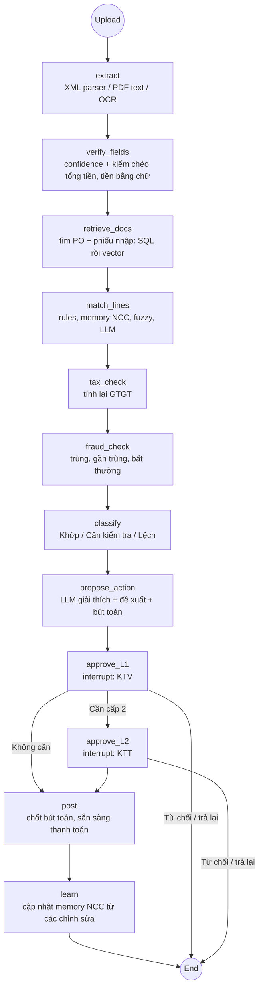
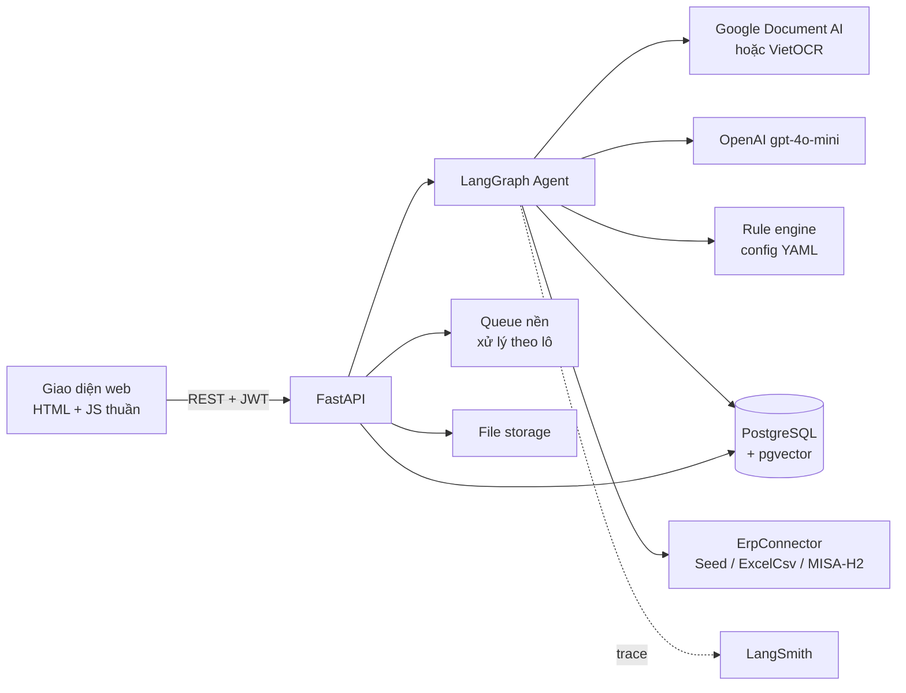

# Brief v3 — Invoice Reconciliation Agent

> AI Agent đối soát hóa đơn ↔ PO ↔ phiếu nhập (3-way matching) với **Exception Intelligence**
> Pilot: Xe X / Dịch vụ gọi xe X · Repo: `AI20K-Build-Phase-Cohort-4/P-143` · Framework: AI20K Agent Template
> Ngày: 20/09/2026 · Trạng thái: v3 — hợp nhất đề bài cohort (v2) với định hướng sản phẩm thương mại
> Tài liệu liên quan: `PRD.md` (yêu cầu chi tiết) · `WIREFRAME.md` (luồng và màn hình) · `BRIEF.md` (v2, đề bài gốc)

---

## 0. Có gì thay đổi so với v2

v2 là một brief tốt và **toàn bộ phần nghiệp vụ, 3 nguyên tắc cứng, LangGraph flow và stack đều được giữ nguyên**. v3 bổ sung 5 điểm, tất cả đều là quyết định *kiến trúc* rẻ khi làm ngay và đắt khi sửa sau:

| # | Bổ sung | Vì sao phải quyết ngay từ tuần 1 |
|---|---|---|
| A | **Định vị sản phẩm**: lớp *Exception Intelligence*, không phải OCR, không phải AP automation toàn phần | Quyết định tính năng nào là lõi, tính năng nào được cắt khi trễ |
| B | **Multi-tenant từ ngày đầu**: mọi bảng có `org_id`, mọi query lọc theo tenant | Thêm `org_id` ở tuần 1 tốn 1 giờ; retrofit ở tháng thứ 6 tốn 2 tuần và rủi ro rò dữ liệu giữa khách hàng |
| C | **Cổng ERP là một interface**, MVP chỉ có 2 implementation (Seed, Excel/CSV) | Connector MISA/Fast chỉ là 1 class mới, không phải viết lại core |
| D | **PO mềm (soft PO)**: không bắt buộc khớp `po_number` tuyệt đối | Đây là lý do các engine hiện có chỉ tự động được ~30% hóa đơn |
| E | **Vendor Automation Readiness Score** | Biến điểm yếu "dữ liệu bẩn" thành một tính năng bán được, thay vì một lời phàn nàn |

---

## 1. Tóm tắt

Agent **đọc hóa đơn** (XML hóa đơn điện tử, PDF, ảnh), **tự tìm PO và phiếu nhập hàng liên quan**, đối chiếu 3 chiều theo từng dòng hàng, **phát hiện và phân loại chênh lệch** về giá, số lượng, thuế, chứng từ, rồi **đề xuất cách xử lý kèm lý do**. **Kế toán luôn là người duyệt** trước khi ghi sổ hoặc thanh toán.

Ba nguyên tắc không được phá (giữ nguyên từ v2):

1. **Không có bút toán hay lệnh thanh toán nào đi qua mà không có người duyệt.** HITL bắt buộc, không có chế độ "auto-post".
2. **LLM không bao giờ tạo ra con số.** Mọi số tiền, số lượng và tiền thuế đều lấy từ nguồn (XML, OCR) và do rule engine tính, dùng `Decimal`, không dùng `float`.
3. **Không chắc thì phải báo.** Trường nào OCR có độ tin cậy thấp thì gắn cờ và **chặn** tự động phân loại "Khớp".

Nguyên tắc thứ tư, thêm ở v3:

4. **Mọi kết luận phải truy được về nguồn.** Mỗi trường trích xuất giữ `source` (xml path / trang + bounding box / người sửa) và `confidence`. Mỗi chênh lệch giữ công thức tính ra con số lệch. Không có "AI nói thế".

---

## 2. Định vị: chúng ta bán cái gì

### 2.1 Bản đồ thị trường

| Nhóm | Ví dụ | Mạnh | Yếu |
|---|---|---|---|
| AP automation toàn cầu | Coupa, Ariba, Tipalti | Đầy đủ, chuẩn kiểm toán | Nặng, đắt, triển khai hàng quý, không hiểu hóa đơn điện tử VN |
| Nền tảng kế toán VN có module AI | MISA AMIS + AVA, ASOFT | Sẵn dữ liệu trong hệ thống, sẵn tệp khách hàng | Chỉ phục vụ khách của chính nền tảng đó; ngoại lệ vẫn đẩy về người |
| OCR/IDP + RPA | Bizzi, akaBot, và nhóm tool nhỏ | Trích xuất nhanh, rẻ | Dừng ở "đọc được"; khớp cứng theo `po_number`; ngoại lệ không được phân loại |

**Khoảng trống chung của cả ba nhóm:** phần khó không nằm ở OCR mà ở **ngoại lệ**. Khảo sát ngành 2024 cho thấy hơn nửa đội AP coi xử lý ngoại lệ là nút thắt lớn nhất, không phải trích xuất dữ liệu. Các engine hiện tại khớp cứng nên chỉ tự động được khoảng một phần ba số hóa đơn; phần còn lại rơi xuống hàng đợi thủ công và người vẫn phải ngồi so từng dòng.

### 2.2 Một câu định vị

> **Lớp Exception Intelligence cho kế toán phải trả tại Việt Nam.** Không thay thế phần mềm kế toán; đứng trước nó, nhận hóa đơn và chứng từ ở mọi định dạng, tự khớp những gì khớp được, và với phần không khớp thì **nói rõ lệch bao nhiêu, vì sao lệch, nên làm gì** — kèm bằng chứng để kế toán bấm duyệt trong vài giây thay vì mở ba file ra so.

Ba thứ tạo khác biệt, xếp theo mức độ khó sao chép:

1. **Taxonomy ngoại lệ có ngữ nghĩa thương mại** (mục 4 của `PRD.md`): phân biệt *giao hàng từng phần hợp lệ* với *thiếu hàng*, *điều chỉnh giá theo hợp đồng* với *sai giá*, *lệch làm tròn VAT* với *sai thuế suất*. Mỗi loại có đề xuất xử lý riêng.
2. **Memory quy tắc riêng từng nhà cung cấp**, tự học từ các lần kế toán sửa và duyệt. Dùng càng lâu càng ít gọi LLM, càng ít ngoại lệ giả.
3. **Audit trail đủ để giải trình** với kiểm toán và quyết toán thuế: ai đọc gì, khớp thế nào, ai duyệt, lý do gì, lúc nào.

### 2.3 Cái chúng ta cố tình **không** làm

- Không thay thế phần mềm kế toán. Không làm sổ cái, không làm báo cáo tài chính.
- Không thực hiện thanh toán. Chỉ đẩy hóa đơn đến trạng thái "sẵn sàng thanh toán".
- Không auto-approve. Kể cả khi mô hình chắc chắn 100%.

---

## 3. Lộ trình 3 chân trời

Ngách hẹp trước, mở rộng sau — nhưng **schema và interface của chân trời 1 đã phải chứa sẵn chỗ cho chân trời 2**.

| | H1 — Pilot Xe X (5 tuần, phạm vi MVP) | H2 — SME thương mại/dịch vụ dùng MISA/Fast (tháng 2–6) | H3 — Nền tảng (tháng 6+) |
|---|---|---|---|
| Khách hàng | 1 công ty gọi xe, đội kế toán nội bộ | Công ty thương mại / dịch vụ, 200–800 hóa đơn NCC/tháng | Mid-market, nhiều ngành, và dịch vụ kế toán làm cho nhiều khách |
| Nguồn PO/GRN | Excel/CSV hoặc seed trong DB | MISA Open API; Fast qua file trung gian hoặc DB | Nhiều ERP qua connector registry |
| Đầu ra | File bút toán đề xuất (Excel/CSV) | Đẩy chứng từ vào MISA qua `save voucher` | Hai chiều, có đối soát công nợ |
| Tính năng lõi | 3-way match + exception + duyệt 2 cấp | Thêm: làm sạch vendor master, readiness score, đối soát công nợ NCC | Thêm: hợp đồng giá, rebate, đa chi nhánh |
| Mục tiêu chứng minh | Recall chỗ lệch ≥ 98%, kế toán giảm ≥ 50% thời gian | 3 khách trả tiền, thời gian onboard < 1 tuần | Onboard tự phục vụ |

**Quyết định kiến trúc bắt buộc ở H1 để H2 không phải viết lại** (chi tiết ở `PRD.md` mục 7):

- Mọi bảng nghiệp vụ có `org_id`, mọi truy vấn qua một lớp repository ép điều kiện tenant.
- `ErpConnector` là một Protocol với `fetch_purchase_orders()`, `fetch_goods_receipts()`, `fetch_vendors()`, `push_journal_entries()`. MVP có `SeedConnector` và `ExcelCsvConnector`. MISA là class thứ ba.
- Cấu hình nghiệp vụ (dung sai, thuế suất, ngưỡng duyệt, giới hạn) nằm trong YAML có phiên bản và ngày hiệu lực, **không hardcode**, và có thể override theo tenant rồi theo nhà cung cấp.
- Mọi tiền tệ lưu `Decimal(18,4)`, đơn vị lưu kèm mã ISO. Không giả định VND ở tầng dữ liệu.

---

## 4. Thực trạng và vấn đề

- Kế toán Xe X đối soát hóa đơn với PO và phiếu nhập hàng **bằng tay**. Khối lượng dồn vào cuối tháng, dễ sai số liệu và làm chậm thanh toán cho nhà cung cấp.
- Hóa đơn đến ở 3 dạng với độ khó và chi phí khác hẳn nhau:

| Dạng | Cách đọc | Độ tin cậy | Chi phí | Ưu tiên |
|---|---|---|---|---|
| XML hóa đơn điện tử | Parser theo schema, không cần OCR | Tuyệt đối | ~0 | 1 |
| PDF có lớp text | `pdfplumber` trích text, LLM map vào các trường | Cao | Thấp | 2 |
| PDF scan / ảnh chụp | OCR, LLM map vào các trường | Phải đo từng trường | Cao nhất | 3 |

- Phần khó nhất **sau khi đọc được** là khớp dữ liệu: tên hàng trên hóa đơn khác tên trên PO, đơn vị tính khác nhau (thùng ↔ cái), giao hàng thiếu một phần, một PO nhận nhiều lần, một hóa đơn gộp nhiều PO, lệch do làm tròn VAT theo dòng hay theo tổng.

**Giả định nghiệp vụ (cần xác nhận với Xe X):** nhóm hàng mua phổ biến là phụ tùng, lốp, ắc quy xe điện; dịch vụ bảo dưỡng, sửa chữa, vệ sinh xe; điện sạc; đồng phục tài xế; văn phòng phẩm. Dữ liệu mẫu sinh theo các nhóm này. Nếu Xe X xác nhận khác, chỉ cần sửa file cấu hình danh mục của bộ sinh dữ liệu.

---

## 5. Người dùng và phân quyền

| Vai trò | Được làm | Không được làm |
|---|---|---|
| **Kế toán viên (KTV)** | Upload hóa đơn, xem kết quả đối chiếu, sửa trường OCR sai, duyệt cấp 1, trả lại hoặc từ chối | Duyệt cấp 2, sửa cấu hình rule, sửa memory NCC |
| **Kế toán trưởng (KTT)** | Mọi quyền của KTV, duyệt cấp 2, cấu hình ngưỡng và rule riêng từng NCC, duyệt memory NCC, xem audit log | Tự duyệt cấp 2 cho hóa đơn do chính mình duyệt cấp 1 |

**Tách biệt trách nhiệm:** người duyệt cấp 1 và cấp 2 của cùng một hóa đơn phải là 2 người khác nhau, kiểm ở backend chứ không chỉ ẩn nút. Mọi thao tác ghi audit log: ai, làm gì, lúc nào, giá trị trước và sau, IP.

*(H2 sẽ thêm vai trò `ADMIN` cấp tenant và `VIEWER` cho kiểm toán; schema `users.role` để dạng enum mở rộng được.)*

---

## 6. Phạm vi

### 6.1 Cơ bản (bắt buộc, không bao giờ cắt)

1. **Web deploy, đăng nhập 2 vai trò** (KTV, KTT) bằng JWT, phân quyền theo vai trò kiểm ở backend.
2. **Upload hóa đơn** (XML, PDF, ảnh; nhiều file một lần) và **nhập PO + phiếu nhập** (Excel/CSV, hoặc seed sẵn trong DB).
3. **Agent đối chiếu 3 chiều** theo từng dòng hàng, **phân loại** mỗi hóa đơn:
   - 🟢 **Khớp** — mọi dòng khớp trong ngưỡng dung sai, mọi trường có độ tin cậy cao
   - 🟡 **Cần kiểm tra** — có trường OCR tin cậy thấp, hoặc khớp mờ với độ tin cậy trung bình
   - 🔴 **Lệch** — có chênh lệch giá, số lượng hoặc thuế, kèm số tiền lệch và giải thích
4. **Đề xuất xử lý** cho từng chỗ lệch: chấp nhận, yêu cầu NCC xuất hóa đơn điều chỉnh, chờ nhập đủ hàng, từ chối.
5. **Duyệt hạch toán** — KTV duyệt, hệ thống sinh **bút toán đề xuất** (Nợ TK chi phí hoặc hàng tồn kho / Nợ 1331 / Có 331) và chuyển trạng thái "Sẵn sàng thanh toán". MVP **không ghi thẳng vào ERP**, chỉ xuất file.

### 6.2 Nâng cao

| # | Tính năng | Cách làm |
|---|---|---|
| N1 | **Cảnh báo độ tin cậy OCR** | Confidence theo từng trường; kiểm chéo (tổng các dòng = cộng tiền hàng; tiền hàng + thuế = tổng thanh toán; **số tiền bằng số khớp số tiền viết bằng chữ**); dưới ngưỡng thì bắt người xác nhận |
| N2 | **Giới hạn xử lý** | Giới hạn số trang mỗi file, số file mỗi lượt, ngân sách OCR/LLM mỗi ngày; vượt thì xếp hàng đợi và báo rõ |
| N3 | **Tính thuế GTGT** | Rule engine kiểm thuế suất (0/5/8/10%, KCT, KKKNT), tính lại tiền thuế từng dòng, so với hóa đơn. Thuế suất và chính sách giảm thuế nằm trong config có ngày hiệu lực |
| N4 | **Tự truy hồi chứng từ liên quan** | Agent dùng tool theo bậc thang: số PO in trên hóa đơn → MST + khoảng ngày → **tìm ngữ nghĩa bằng vector** trên tên NCC và tên hàng khi không có số PO |
| N5 | **Phát hiện trùng / gian lận** | Trùng chính xác (MST + ký hiệu + số hóa đơn); gần trùng (cùng NCC, cùng số tiền, ngày gần nhau, khác số); giá hóa đơn cao hơn giá PO; tách nhỏ hóa đơn để né ngưỡng duyệt; MST ngừng hoạt động (mock); tài khoản nhận tiền khác dữ liệu gốc của NCC |
| N6 | **Duyệt nhiều cấp** | KTV duyệt cấp 1; cần KTT duyệt cấp 2 khi tổng tiền vượt ngưỡng, có chỗ lệch được chấp nhận, hoặc có cờ gian lận. Ngưỡng do KTT cấu hình |
| N7 | **Memory quy tắc riêng từng NCC** | Ánh xạ tên hàng NCC ↔ mã hàng nội bộ, quy đổi đơn vị tính, dung sai giá riêng, thói quen xuất hóa đơn. **Tự học từ các lần kế toán sửa và duyệt**; KTT xem và sửa được |
| **N8** | **Vendor Automation Readiness Score** *(mới ở v3)* | Với mỗi NCC, chấm điểm 0–100 dựa trên: tỉ lệ hóa đơn có XML, tỉ lệ có PO hợp lệ, tỉ lệ tên hàng đã ánh xạ, tỉ lệ khớp tự động, số ngoại lệ lặp lại. Kèm 1–3 khuyến nghị cụ thể ("đề nghị NCC gửi XML thay vì PDF scan" / "chuẩn hóa 12 tên hàng chưa ánh xạ"). Là màn hình bán hàng mạnh nhất và chi phí làm rất thấp vì dữ liệu đã có sẵn |

### 6.3 Ngoài phạm vi MVP

- Ghi sổ trực tiếp vào ERP hoặc phần mềm kế toán, và thực hiện thanh toán (chỉ export)
- Đối chiếu sao kê ngân hàng, công nợ phải thu, hóa đơn đầu ra
- Tra cứu thật trên hệ thống cơ quan thuế (dùng mock sau một interface để sau này thay)
- Hợp đồng giá, rebate, chiết khấu theo sản lượng — để H3

---

## 7. Luồng xử lý (LangGraph)



**Trạng thái hóa đơn:** `UPLOADED → EXTRACTED → MATCHED → PENDING_L1 → PENDING_L2 → APPROVED → POSTED`, nhánh phụ `REJECTED` / `RETURNED`. Graph dùng checkpointer Postgres để các bước chờ duyệt (interrupt) tồn tại qua các lần restart server.

**LLM chỉ được dùng ở 3 chỗ:**

- Map text từ PDF hoặc OCR vào các trường của hóa đơn (structured output)
- Khớp mờ tên hàng khi rule, memory NCC và fuzzy đều không chắc
- Viết lời giải thích chỗ lệch và đề xuất xử lý

Mọi con số LLM trả về đều bị **đối chiếu lại với text gốc**. Không tìm thấy trong text gốc thì loại bỏ và gắn cờ.

---

## 8. Kiến trúc và stack



| Thành phần | Công nghệ | Ghi chú |
|---|---|---|
| Agent | LangGraph + LangChain 0.3 | Có sẵn trong template; thêm Postgres checkpointer cho interrupt |
| LLM | OpenAI `gpt-4o-mini` | **`temperature=0`** cho mọi node (template đang để 0.7 — phải sửa) |
| Parser XML | `lxml` + schema XML hóa đơn điện tử VN | Nguồn tin cậy nhất, ưu tiên hàng đầu |
| PDF có text | `pdfplumber` | Không tốn tiền OCR |
| OCR | **Google Document AI** (chính), **VietOCR** (phương án tự host) | Xem ghi chú bên dưới |
| Rule engine | Python thuần + YAML | Dung sai, thuế suất, ngưỡng duyệt; có ngày hiệu lực |
| Fuzzy | `rapidfuzz` | Lọc ứng viên trước khi gọi LLM |
| Vector DB | **pgvector** trong cùng PostgreSQL | Không phải chạy thêm service; Render Postgres hỗ trợ |
| Backend | FastAPI + SQLAlchemy + Alembic | Có sẵn khung |
| Auth | JWT + phân quyền theo vai trò | 2 vai trò KTV, KTT |
| Frontend | HTML + JavaScript thuần, không cần build | Đi tiếp từ `docs/prototype/`, đã có sẵn giao diện co giãn theo màn hình và chế độ tối. Chốt 26/09, thay cho React |
| Deploy | Render: Web Service (API), Static Site (giao diện), PostgreSQL | Theo đề bài |
| Tracing / chi phí | LangSmith | Deliverable #4, đo chi phí mỗi hóa đơn |

**Ghi chú về OCR:**

- **Document AI** trả confidence cho từng token hoặc trường, đúng với yêu cầu N1. **Tuần 1 phải thử ngay** xem Invoice Parser có đọc tốt hóa đơn tiếng Việt không. Nếu không tốt thì dùng Enterprise Document OCR lấy text + confidence, rồi LLM map vào trường.
- **VietOCR** chỉ nhận dạng từng dòng text, phải ghép với một bộ phát hiện vùng chữ (PaddleOCR detection). Giữ làm phương án khi dữ liệu không được gửi ra ngoài; không ưu tiên trong 5 tuần.
- Confidence của một trường do LLM map = **confidence thấp nhất của các token OCR tạo ra giá trị đó**.

### 8.1 Cấu trúc thư mục

```
src/
├── agents/
│   ├── graph.py              # reconciliation graph
│   ├── state.py              # ReconState
│   ├── nodes/                # extract, verify_fields, retrieve_docs, match_lines, tax_check,
│   │                         # fraud_check, classify, propose_action, approve, post, learn
│   └── tools/                # find_po, find_grn, vector_search, vendor_memory, tax_lookup (mock)
├── services/
│   ├── llm.py
│   ├── extraction/           # xml_invoice.py, pdf_text.py, ocr_docai.py, ocr_viet.py, amount_in_words.py
│   ├── rules/                # tolerance.py, vat.py, approval_policy.py, exception_codes.py
│   ├── connectors/           # base.py (Protocol), seed.py, excel_csv.py   [misa.py o H2]
│   ├── auth.py
│   └── export.py             # bút toán, báo cáo Excel
├── db/                       # SQLAlchemy models, Alembic migrations
├── models/schemas.py         # Pydantic: Invoice, InvoiceLine, PurchaseOrder, GoodsReceipt,
│                             # MatchResult, Discrepancy, Approval
├── api/                      # auth.py, invoices.py, approvals.py, vendors.py, admin.py
└── config.py
config/                       # vat_rates.yaml, tolerances.yaml, approval_policy.yaml, limits.yaml
samples/                      # dữ liệu mẫu tổng hợp (data/ bị gitignore)
eval/
├── generator/                # sinh XML, render PDF, ảnh scan có nhiễu
├── datasets/                 # bộ test có đáp án chuẩn
└── results/report.md
frontend/                     # giao diện HTML + JS thuần, đi tiếp từ docs/prototype/
```

### 8.2 Bảng dữ liệu chính

`orgs`, `users`, `vendors`, `vendor_rules` (memory NCC), `purchase_orders`, `po_lines`, `goods_receipts`, `grn_lines`, `invoices`, `invoice_lines`, `extraction_fields` (giá trị + confidence + nguồn), `match_results`, `line_matches`, `discrepancies`, `approvals`, `journal_entries`, `audit_logs`, `embeddings` (pgvector).

Mọi bảng nghiệp vụ mang `org_id`. Chi tiết trường ở `PRD.md` mục 7.

---

## 9. Tối ưu chi phí khi xử lý số lượng lớn

1. **Chọn cách đọc rẻ nhất trước:** XML (miễn phí) → PDF có text → OCR.
2. **Chọn cách khớp rẻ nhất trước:** rule → memory NCC → fuzzy → LLM. Chỉ những dòng chưa khớp mới được gửi cho LLM.
3. **Memory NCC giảm chi phí dần theo thời gian:** ánh xạ tên hàng đã được kế toán duyệt thì lần sau không gọi LLM nữa. Đây cũng là *hào cạnh tranh*: khách dùng càng lâu, chuyển sang đối thủ càng đắt.
4. **Cache** kết quả OCR và LLM theo hash file; upload lại cùng một file không trả tiền lần nữa.
5. **Xử lý theo lô** bằng hàng đợi nền, không xử lý đồng bộ trong request.
6. **Giới hạn và ngân sách** trong `config/limits.yaml` (N2).
7. **Đo chi phí mỗi hóa đơn** theo từng dạng (XML, PDF, scan) qua LangSmith từ tuần 2, rồi mới đặt mục tiêu.

---

## 10. Bảo mật dữ liệu tài chính

- **Live URL và demo chỉ dùng dữ liệu tổng hợp.** Hóa đơn thật (nếu Xe X cung cấp) chỉ chạy local, không commit, không deploy.
- Mật khẩu băm bằng bcrypt; JWT hết hạn ngắn; phân quyền kiểm ở backend.
- **Audit log không sửa được** cho mọi thao tác duyệt, sửa trường và cấu hình.
- Chỉ gửi cho LLM những trường cần thiết; **che số tài khoản ngân hàng** và thông tin không liên quan.
- Key và secret trong `.env` hoặc biến môi trường Render, không bao giờ commit.
- Ghi rõ trong tài liệu: dùng Document AI và OpenAI thì dữ liệu hóa đơn đi ra dịch vụ bên ngoài. Muốn giữ nội bộ thì dùng VietOCR và LLM tự host.
- **Cách ly tenant** kiểm bằng test: một test tự động cố đọc dữ liệu của tenant khác qua API và phải nhận 404.

---

## 11. Chỉ số thành công

Đo trên **bộ dữ liệu tổng hợp có đáp án chuẩn**: sinh XML → render PDF → tạo ảnh scan có nhiễu (nghiêng, mờ, bóng). Vì mọi ảnh đều sinh từ XML nên luôn biết đáp án đúng. Dự kiến ~300 hóa đơn, cố ý cài sẵn đủ các loại lệch, trùng và gian lận ở mục 6.

| Chỉ số | Mục tiêu |
|---|---|
| Độ chính xác trích xuất trường (XML) | 100% |
| Độ chính xác trích xuất trường số tiền (PDF/scan) **trên các trường không bị gắn cờ** | ≥ 99% |
| **Tỷ lệ trường sai nhưng không bị gắn cờ tin cậy thấp** | **≈ 0%** — chỉ số quan trọng nhất |
| **Recall chỗ lệch thật** | **≥ 98%** |
| Precision chỗ lệch | ≥ 85% |
| Recall hóa đơn trùng / gian lận đã cài | ≥ 95% |
| Tỷ lệ hóa đơn được phân loại "Khớp" đúng | ≥ 70% |
| **Độ chính xác phân loại mã ngoại lệ** *(mới)* | ≥ 85% trên các hóa đơn 🔴 |
| Thời gian xử lý | XML < 3 giây, scan < 15 giây mỗi hóa đơn |
| Thời gian đối chiếu của kế toán | Giảm ≥ 50% so với làm tay (đo trong buổi dùng thử) |
| Chi phí mỗi hóa đơn | Đo ở tuần 2, đặt mục tiêu sau |
| Test coverage | ≥ 60% |

Lý do đặt recall cao hơn precision: một chỗ lệch bị bỏ sót là tiền chi sai; một cảnh báo thừa chỉ tốn vài giây của kế toán.

---

## 12. Lộ trình 5 tuần

| Tuần | Sản phẩm | Deliverables Demo Day |
|---|---|---|
| **1** | Setup repo, Postgres (Docker local), schema DB + Alembic (**có `org_id`**), auth 2 vai trò, parser XML, **bộ sinh dữ liệu mẫu**. **Thử Document AI với hóa đơn tiếng Việt.** Khung giao diện: đăng nhập, upload, danh sách hóa đơn | `ARCHITECTURE.md` + diagram, bắt đầu `JOURNAL.md` và `WORKLOG.md` |
| **2** | Trích xuất PDF/OCR + confidence + kiểm chéo (N1 bản đầu). Node `retrieve_docs` (SQL), `match_lines` (rule + fuzzy + LLM), `classify`. **Chốt bảng mã ngoại lệ.** Unit test cho parser và rule | **Deploy lần đầu lên Render** |
| **3** | `propose_action`, `approve_L1` (interrupt), bút toán đề xuất, `tax_check` (N3). Dashboard: danh sách theo trạng thái, màn so sánh 3 chiều, duyệt. **Xong phần Cơ bản** | Live URL chạy đủ phần Cơ bản |
| **4** | Nâng cao: duyệt nhiều cấp (N6), trùng/gian lận (N5), vector search (N4), memory NCC (N7), giới hạn (N2), readiness score (N8). Chạy eval. Cho kế toán dùng thử | Điền `eval/results/report.md` |
| **5** | Sửa lỗi, tinh chỉnh ngưỡng và prompt, đo lại chỉ số, hoàn thiện UI | `README.md`, pitch deck 10 slide, video demo ≤ 5 phút, bản deploy cuối |

**Nếu trễ, cắt theo thứ tự (không bao giờ cắt HITL, N1 hay N3):**

1. VietOCR (chỉ dùng Document AI)
2. Readiness score N8 (hiển thị dạng bảng thô thay vì dashboard)
3. Tự học của memory NCC (giữ phần KTT nhập quy tắc bằng tay)
4. Vector search (giữ tìm bằng SQL theo số PO và MST)
5. Các loại gian lận nâng cao (giữ phát hiện trùng và gần trùng)

**Phân công gợi ý (4 người):**

- **A** — trích xuất (XML, PDF, OCR), confidence, bộ sinh dữ liệu và eval
- **B** — agent (graph, matching, memory NCC, LLM), rule engine, taxonomy ngoại lệ
- **C** — backend (auth, API, DB, duyệt nhiều cấp, audit log, connector interface), deploy
- **D** — frontend, đi tiếp từ prototype; tuần 5 phụ trách deck và video

---

## 13. Rủi ro và cách giảm

| Rủi ro | Xác suất | Ảnh hưởng | Cách giảm | Dấu hiệu sớm |
|---|---|---|---|---|
| Document AI đọc hóa đơn tiếng Việt kém | Trung bình | Cao | Thử ngay tuần 1; phương án B là Enterprise Document OCR + LLM map | Tuần 1 thử 20 ảnh scan, F1 trường tiền < 0.9 |
| Không có credit Google Cloud | Trung bình | Cao | Xin sớm; phương án B là chỉ hỗ trợ XML + PDF text cho demo, scan để "biết hạn chế" | Chưa có billing account hết tuần 1 |
| Xe X không cung cấp dữ liệu thật | Cao | Trung bình | Bộ sinh dữ liệu tổng hợp là đường chính, không phải phương án dự phòng | Chưa nhận file mẫu hết tuần 2 |
| Dữ liệu tổng hợp quá "sạch", model ăn may | Cao | Cao | Generator phải cài nhiễu thật: nghiêng, bóng, mực nhòe, dấu mộc đè lên số, bảng gộp dòng | Độ chính xác scan xấp xỉ độ chính xác XML |
| LangGraph interrupt + checkpointer khó | Trung bình | Trung bình | Làm đường xương sống ở tuần 2, đừng để tuần 3 | Chưa chạy được interrupt end-to-end hết tuần 2 |
| Nhóm sa đà vào OCR, bỏ quên exception | Cao | **Rất cao** | Định vị ở mục 2 là để chống việc này. Taxonomy ngoại lệ phải xong ở tuần 2 | Hết tuần 3 vẫn chưa có bảng mã ngoại lệ |
| Demo đẹp nhưng không giải trình được | Trung bình | Cao | Mỗi chỗ lệch phải kèm công thức và nguồn; audit log là tính năng demo, không phải log kỹ thuật | Không trả lời được "vì sao ra con số này" |

---

## 14. Câu hỏi mở

Chia theo mức độ chặn.

**Chặn việc phát triển — cần trả lời trong tuần 1:**

- [ ] Có được gửi dữ liệu hóa đơn ra Google Document AI / OpenAI không, hay bắt buộc tự host?
- [ ] Nhóm có mấy người, và có credit Google Cloud để dùng Document AI không?
- [ ] Xe X có cung cấp mẫu hóa đơn, PO, phiếu nhập thật (đã che thông tin) không? Nhóm hàng mua chính là gì?

**Chặn việc tinh chỉnh — cần trước tuần 3:**

- [ ] Ngưỡng tiền cần KTT duyệt cấp 2 là bao nhiêu?
- [ ] Dung sai chấp nhận được cho giá và số lượng (theo % hay số tuyệt đối)?
- [ ] Chế độ kế toán và hệ thống tài khoản Xe X đang dùng (TT200 hay TT133), để bút toán đề xuất đúng tài khoản?
- [ ] Hóa đơn của Xe X có bao nhiêu phần trăm là XML, bao nhiêu là PDF scan?
- [ ] Có hóa đơn ngoại tệ không? Nếu có, tỉ giá lấy ở đâu?

**Không chặn MVP — cần trước H2:**

- [ ] Khách hàng H2 đầu tiên dùng MISA hay Fast? Bản cloud hay bản cài đặt?
- [ ] Mô hình giá: theo số hóa đơn xử lý, theo số người dùng, hay theo tenant?
- [ ] Xe X hay khách H2 có sẵn quy trình phê duyệt điện tử nào đang chạy mà ta phải sống chung không?
