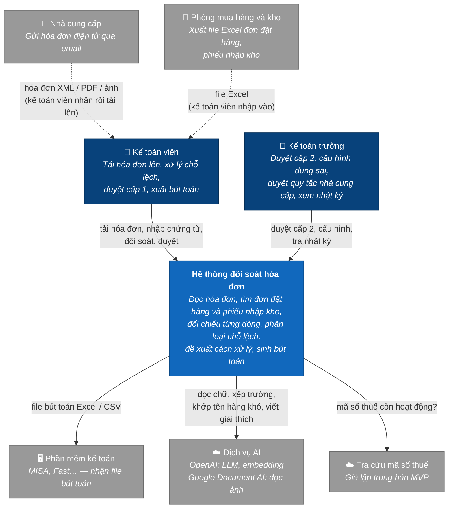
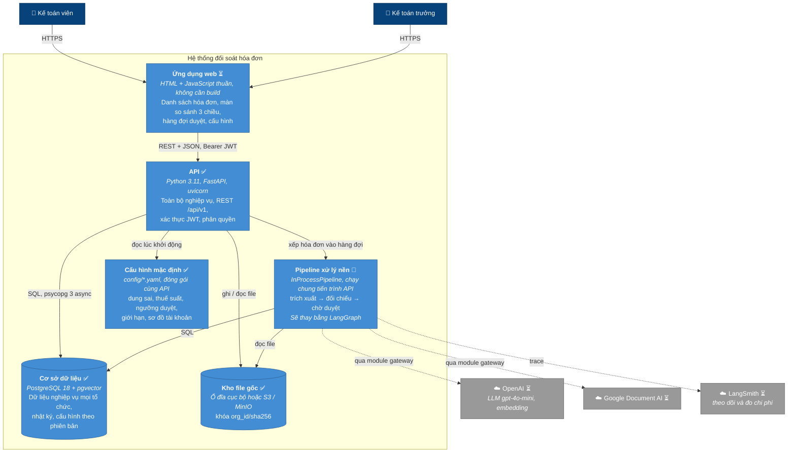
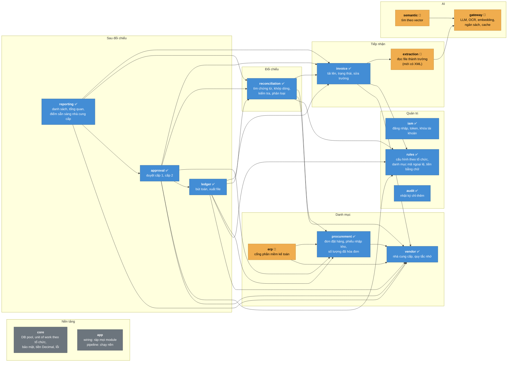
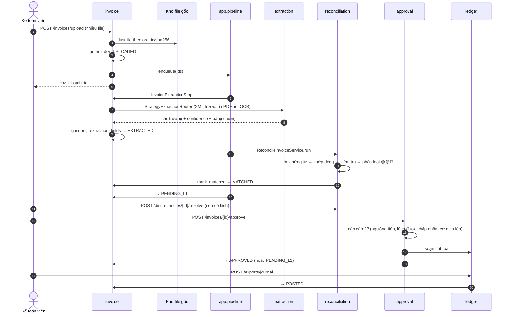
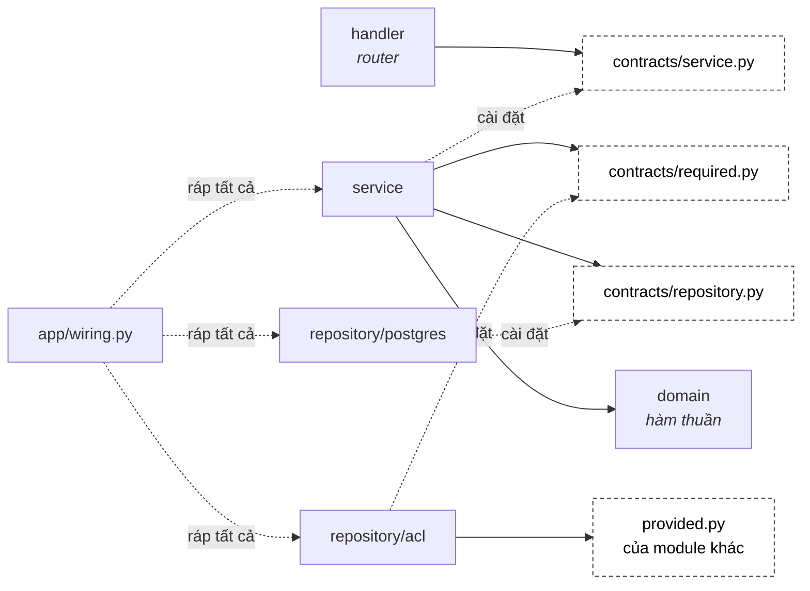
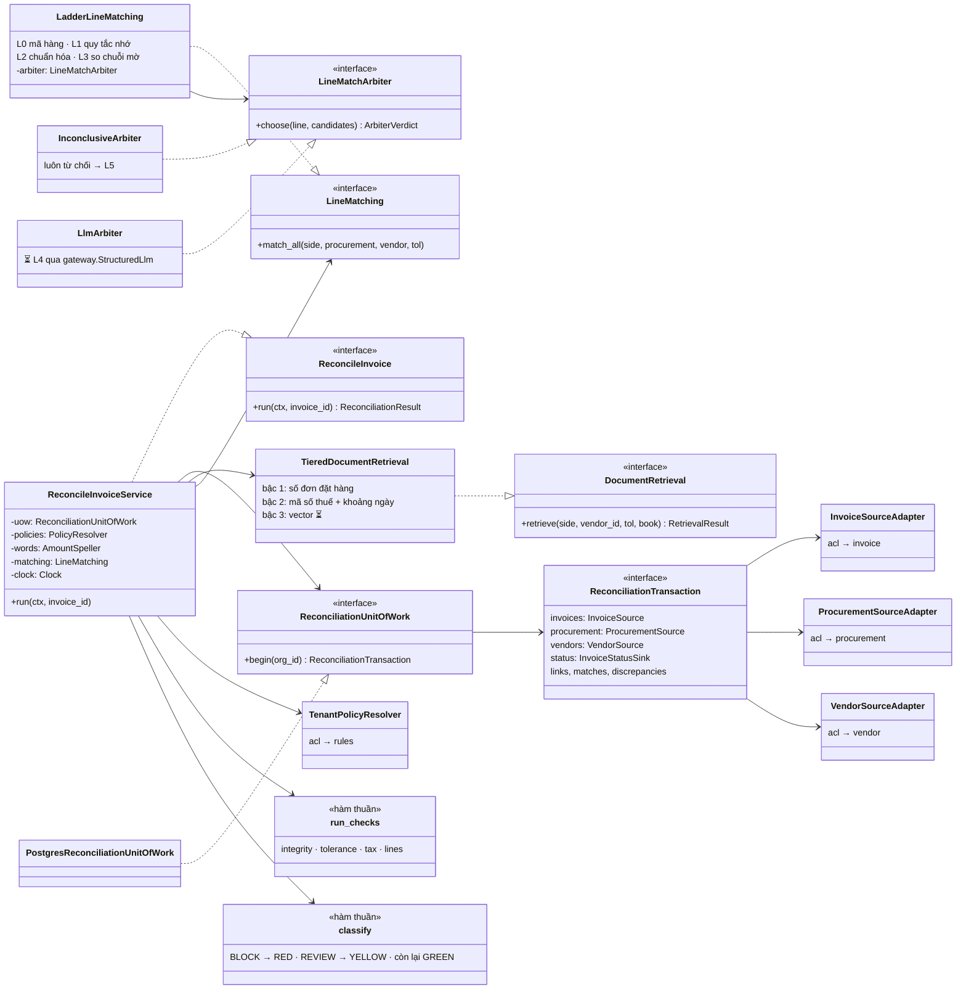
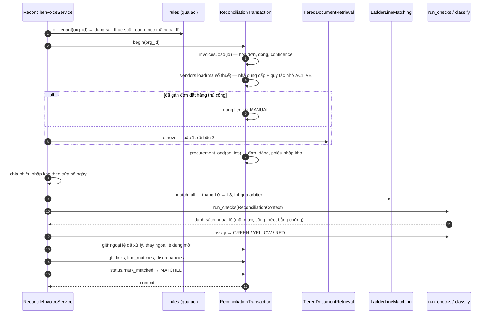

# Thiết kế C4 — Invoice Reconciliation Agent

> Kiến trúc hệ thống theo mô hình C4, từ tổng quan tới code · Ngày 23/09/2026
> Vẽ theo code thật ở repo `P-143` (nhánh `feat/module-api`), không theo ý định trên giấy
> Tài liệu liên quan: `PRD.md` (yêu cầu) · `USER_STORIES.md` (tình huống nghiệp vụ) · `P-143/src/module/README.md` (quy tắc module)

**C4 là gì.** Bốn mức phóng to dần, mỗi mức trả lời một câu hỏi:

| Mức | Tên | Câu hỏi |
|---|---|---|
| 1 | System Context — bối cảnh | Hệ thống phục vụ ai, nói chuyện với hệ thống nào bên ngoài? |
| 2 | Container — khối triển khai | Hệ thống gồm những khối chạy riêng nào: ứng dụng, cơ sở dữ liệu, kho file? |
| 3 | Component — thành phần | Bên trong khối API chia thành những module nào, module nào phụ thuộc module nào? |
| 4 | Code | Một module được viết thế nào: interface, class, luồng gọi? |

**Ký hiệu trạng thái** dùng trong toàn tài liệu:

| Ký hiệu | Nghĩa |
|---|---|
| ✅ | Đã chạy được, có test |
| 🚧 | Đã có interface hoặc khung, chưa có phần chạy thật |
| ⏳ | Chưa làm |

---

## Mức 1 — Bối cảnh hệ thống



**Ranh giới cần nhớ**

- Hệ thống **không nhận email trực tiếp** từ nhà cung cấp, và **không kết nối thẳng** với phần mềm kế toán ở bản MVP. Mọi thứ đi vào qua tay kế toán viên, đi ra dưới dạng file.
- Hệ thống **không thanh toán**. Nó chỉ đưa hóa đơn tới trạng thái "đã chốt bút toán".
- Dịch vụ AI chỉ được gọi ở 3 chỗ: đọc hóa đơn không phải XML, khớp tên hàng khó, viết câu giải thích. **Không có con số nào do AI quyết.**

---

## Mức 2 — Các khối triển khai



| Khối | Công nghệ | Trạng thái | Ghi chú |
|---|---|:-:|---|
| Ứng dụng web | HTML + JavaScript thuần, không cần build | ⏳ | Chưa có trong repo `P-143`. Đi tiếp từ `docs/prototype/`, hiện chạy trên dữ liệu mẫu. Màn hình theo `WIREFRAME.md` |
| API | FastAPI, uvicorn, psycopg 3 async, SQL thuần, không ORM | ✅ | Mọi endpoint ở `PRD.md` mục 8. Swagger tại `/docs` |
| Pipeline xử lý nền | `asyncio` task trong cùng tiến trình | 🚧 | `PIPELINE_MODE=background` cho API, `inline` cho test, `off` để giao cho worker riêng sau này. Chưa có LangGraph, chưa có checkpointer, nên hóa đơn đang chạy dở sẽ mất nếu khởi động lại |
| Cơ sở dữ liệu | PostgreSQL 18 (dùng `uuidv7()` sẵn có), pgvector | ✅ | Migration SQL thuần ở `migrations/`, mỗi file có checksum |
| Kho file gốc | `STORAGE_BACKEND=local` hoặc `s3` | ✅ | MinIO khi chạy cục bộ. Trùng `sha256` trong cùng tổ chức thì không lưu lại |
| Cấu hình mặc định | YAML | ✅ | Kế toán trưởng sửa qua API thì lưu thành bản mới ở bảng `config_versions`, đè lên YAML. File YAML hỏng thì API không khởi động |

**Chạy cục bộ:** `docker compose` gồm `db`, `minio`, `minio-init`, `backend`. **Triển khai:** Render (Web Service cho API, Static Site cho web, PostgreSQL) theo `BRIEF_v3.md`.

**Đa tổ chức** được đảm bảo ở khối API, không ở cơ sở dữ liệu: mọi bảng nghiệp vụ có `org_id`, mọi repository nhận `org_id` từ token và tự thêm điều kiện lọc vào câu SQL. Bản ghi của tổ chức khác trả `404`, không bao giờ trả `403`.

---

## Mức 3 — Thành phần bên trong API

### 3.1 Bản đồ module

API là một **modular monolith**: một tiến trình, chia thành các module có ranh giới cứng. Mũi tên `A → B` nghĩa là A đọc hoặc ghi dữ liệu của B **qua interface của B**, không bao giờ query thẳng vào bảng của B.



*Không vẽ các mũi tên tới `audit` cho đỡ rối: mọi module có ghi dữ liệu đều ghi nhật ký qua `audit` trong cùng transaction. Không vẽ mũi tên tới `core`: mọi module đều dùng nó. `app` biết mọi module; không module nào biết `app`.*

### 3.2 Từng module làm gì

| Module | Trách nhiệm | Bảng sở hữu | Endpoint chính | Trạng thái |
|---|---|---|---|:-:|
| **iam** | Đăng nhập, cấp và thu hồi token, khóa tài khoản sau 5 lần sai | `orgs`, `users`, `sessions`, `revoked_access_tokens`, `login_attempts` | `/auth/*` | ✅ |
| **audit** | Ghi nhật ký cho mọi module, lọc và xuất cho kiểm toán | `audit_logs` (chỉ `INSERT`, `SELECT`) | `/admin/audit-logs`, `/exports/audit` | ✅ |
| **rules** | Cấu hình theo tổ chức (YAML + bản mới nhất trong DB, có cache), danh mục mã ngoại lệ, đọc tiền bằng chữ | `config_versions` | `/admin/config*` | ✅ |
| **vendor** | Nhà cung cấp, quy tắc nhớ (tên hàng, quy đổi đơn vị, dung sai riêng) | `vendors`, `vendor_rules` | `/vendors*` | ✅ |
| **procurement** | Nhập đơn đặt hàng và phiếu nhập kho từ Excel/CSV; sổ số lượng đã hóa đơn theo từng dòng đơn đặt hàng | `purchase_orders`, `po_lines`, `goods_receipts`, `grn_lines`, `po_line_invoicings` | `/purchase-orders*`, `/goods-receipts/import` | ✅ |
| **erp** | Interface `ErpConnector` để sau này nối MISA | `sync_runs` | — | 🚧 |
| **invoice** | Tải lên, chống trùng theo `sha256`, lưu file, máy trạng thái hóa đơn, ghi kết quả trích xuất, sửa trường | `files`, `upload_batches`, `invoices`, `invoice_lines`, `extraction_fields` | `/invoices/upload`, `/invoices/{id}`, `PATCH …/fields`, `…/reprocess`, `…/file` | ✅ |
| **extraction** | Chọn cách đọc rẻ nhất cho từng file | — | — | 🚧 mới có XML |
| **reconciliation** | Tìm chứng từ, khớp dòng, kiểm dung sai, thuế, toàn vẹn, phân loại; xử lý ngoại lệ; gán lại đơn đặt hàng thủ công | `invoice_po_links`, `line_matches`, `discrepancies` | `…/comparison`, `…/discrepancies`, `/discrepancies/{id}/resolve`, `…/relink-po` | ✅ không LLM |
| **approval** | Duyệt, từ chối, trả lại; quyết định có cần cấp 2; ghi số lượng đã hóa đơn khi duyệt xong | `approvals` | `…/approve`, `…/reject`, `…/return`, `/approvals/queue` | ✅ |
| **ledger** | Sinh bút toán đề xuất, sửa tài khoản, xuất file (xuất là bước chốt: `APPROVED → POSTED`) | `journal_entries`, `journal_lines` | `…/journal`, `/exports/journal` | ✅ |
| **reporting** | Danh sách công việc, tổng quan, điểm sẵn sàng tự động hóa của nhà cung cấp, chi phí, báo cáo đối soát | — (chỉ đọc qua module khác) | `GET /invoices`, `/dashboard/summary`, `/vendors/{id}/readiness`, `/admin/costs`, `/exports/reconciliation` | ✅ |
| **gateway** | Cổng duy nhất ra dịch vụ AI: `StructuredLlm`, `OcrEngine`, `Embedder`, `BudgetGuard`; ghi chi phí, cache | `ai_calls`, `ai_cache` | — | 🚧 chỉ có interface |
| **semantic** | `SemanticIndex`: đánh chỉ mục và tìm theo vector | `embeddings` | — | 🚧 chỉ có interface |

### 3.3 Một hóa đơn đi qua các module thế nào



---

## Mức 4 — Code

### 4.1 Giải phẫu một module

Mọi module theo cùng một khuôn. Ví dụ dưới đây dùng tên thật của `reconciliation`.

```
src/module/reconciliation/
├── domain/                 entity, view, enum, và các hàm thuần (checks/, matching/, retrieval/)
│   └── contracts/          chỉ có interface (typing.Protocol)
│       ├── repository.py   bảng của chính module — nội bộ
│       ├── provided.py     module cung cấp cho module khác — đọc/ghi theo lô
│       ├── required.py     module cần từ bên ngoài — do chính module định nghĩa
│       └── service.py      use case
├── dto/                    dữ liệu đi qua ranh giới: HTTP, giữa các module
├── repository/
│   ├── postgres/           cài đặt repository.py bằng SQL thuần
│   └── acl/                cài đặt required.py bằng provided.py của module khác
├── service/                cài đặt service.py, chỉ phụ thuộc interface
└── handler/                FastAPI router
```



**Luật import** (kiểm tự động bằng `tests/test_architecture.py`):

- `service` không bao giờ import `repository`. Nó chỉ biết interface.
- Chỉ `repository/acl` được import module khác, và chỉ được import `domain` hoặc `dto` của module đó.
- Không có vòng phụ thuộc giữa các module.
- Entity chỉ giữ **id** của module khác, không giữ object. Đọc chéo luôn theo lô (`= ANY(%(ids)s)`), không có vòng lặp N+1.

**Transaction:** `TenantUnitOfWork` mở **một** transaction cho **một** tổ chức. Composition root gắn repository của module *và* các adapter `acl` sang module khác vào **cùng một connection**. Ví dụ: `reconciliation` ghi kết quả đối chiếu và chuyển trạng thái hóa đơn (bảng của `invoice`) trong cùng một lần commit.

### 4.2 Sơ đồ lớp của `reconciliation`



### 4.3 Một lần `ReconcileInvoiceService.run`

Toàn bộ chạy trong **một transaction**, với **số câu query cố định** bất kể hóa đơn có bao nhiêu dòng. Mọi kiểm tra là hàm thuần trên dữ liệu đã nạp sẵn. **Không có LLM trên đường này.**



### 4.4 Chỗ cắm AI vào sau này

Mọi điểm dùng AI đều là **một interface đã có sẵn**. Cài đặt thật chỉ cần thêm một class và đăng ký trong `src/app/wiring.py`, không phải sửa lõi.

| Điểm cắm | Interface | Hiện tại | Sẽ là | Yêu cầu |
|---|---|---|---|---|
| Đọc file | `extraction.InvoiceExtractor` (danh sách strategy trong `StrategyExtractionRouter`) | `XmlInvoiceExtractor` | + `PdfTextExtractor`, `OcrExtractor` qua `gateway` | F2.3, F2.8 |
| Khớp tên hàng khó | `reconciliation.LineMatchArbiter` | `InconclusiveArbiter` (luôn từ chối) | `LlmArbiter`, chỉ được chọn trong danh sách ứng viên | F5.1, F5.2 |
| Câu giải thích | `Discrepancy.explanation` | `None` | Bộ viết giải thích, chạy sau khi mã và số tiền đã chốt | F9.2, F9.3 |
| Tìm chứng từ bằng vector | `semantic.SemanticIndex` | chưa nối | Chỉ đề xuất ứng viên, luôn để người chọn | F4.3 |
| Gọi dịch vụ AI | `gateway.StructuredLlm`, `OcrEngine`, `Embedder`, `BudgetGuard` | chỉ có interface | OpenAI, Document AI; ghi `ai_calls`, cache `ai_cache` | F2.9, F2.10, F16 |
| Điều phối | `invoice.ProcessingQueue`, `reconciliation.FollowUpQueue` | `InProcessPipeline` | LangGraph + Postgres checkpointer, chờ duyệt bằng `interrupt` | F11.6 |
| Phần mềm kế toán | `erp.ErpConnector` | chỉ có interface | `SeedConnector`, `ExcelCsvConnector`, sau này `MisaConnector` | F17 |

---

## Phụ lục — Những điểm đang lệch so với PRD

| Điểm | PRD | Code hiện tại | Ảnh hưởng |
|---|---|---|---|
| Điều phối | LangGraph, chờ duyệt sống qua khởi động lại (F11.6) | `asyncio` task trong tiến trình | Khởi động lại khi đang xử lý thì hóa đơn kẹt ở `UPLOADED` / `EXTRACTED`, phải bấm xử lý lại |
| Trích xuất | XML, PDF có chữ, ảnh | Chỉ XML | PDF và ảnh vào trạng thái `FAILED` với `UNSUPPORTED_FORMAT` |
| Khớp dòng L4 | LLM chọn ứng viên | Luôn từ chối | Dòng rơi vào vùng so chuỗi mờ 75–92 điểm thành "không khớp được" |
| Tìm bậc 3 | Vector | Chưa nối | Trượt bậc 2 thì báo "không tìm thấy đơn đặt hàng" |
| Kiểm gian lận | F8 | Chưa có bước `fraud_check`. Đã có: trùng tuyệt đối chặn bằng unique index; nhà cung cấp mới buộc duyệt cấp 2 (trong `approval`) | Chưa có cảnh báo gần trùng, tách nhỏ, đổi tài khoản, giá vượt lịch sử |
| Email người dùng | Duy nhất trong tổ chức | Duy nhất toàn hệ thống | Đăng nhập không cần chọn tổ chức |
