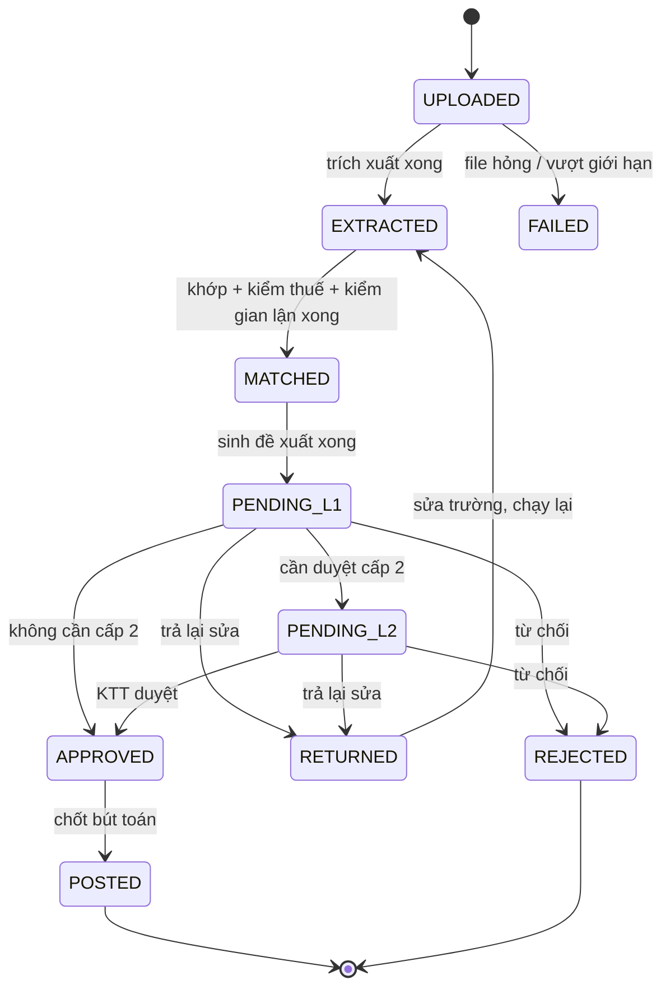

# PRD — Invoice Reconciliation Agent

> Tài liệu yêu cầu sản phẩm · Phiên bản 1.0 · Ngày 20/09/2026
> Pilot: Xe X · Repo `AI20K-Build-Phase-Cohort-4/P-143`
> Tài liệu liên quan: `BRIEF_v3.md` (định vị, lộ trình, rủi ro) · `WIREFRAME.md` (màn hình và luồng người dùng)
> Đối tượng đọc: kỹ sư trong nhóm, người chấm Demo Day, khách hàng pilot

---

## 1. Mục tiêu tài liệu và thuật ngữ

### 1.1 Tài liệu này trả lời

- Hệ thống **phải làm gì** (mục 3), **phân loại ngoại lệ thế nào** (mục 4), **định tuyến duyệt ra sao** (mục 5).
- Dữ liệu trông như thế nào (mục 7), API nào (mục 8), cấu hình nào (mục 9).
- Thế nào là xong: tiêu chí chấp nhận (mục 11) và cách đo (mục 12).

Tài liệu này **không** bàn về định vị thị trường, lộ trình thương mại hay rủi ro — xem `BRIEF_v3.md`.

### 1.2 Thuật ngữ

| Từ | Nghĩa trong tài liệu này |
|---|---|
| **HĐ** | Hóa đơn mua vào (invoice) từ nhà cung cấp |
| **PO** | Đơn đặt hàng (purchase order) |
| **GRN** | Phiếu nhập kho / biên bản giao nhận (goods receipt note) |
| **NCC** | Nhà cung cấp (vendor) |
| **KTV / KTT** | Kế toán viên / Kế toán trưởng |
| **3-way match** | Đối chiếu HĐ ↔ PO ↔ GRN theo từng dòng hàng |
| **Ngoại lệ** | Một khác biệt giữa ba chứng từ, hoặc một dấu hiệu bất thường, đã được gán mã (mục 4) |
| **Dung sai** | Ngưỡng chênh lệch được coi là chấp nhận được, cấu hình được |
| **Confidence** | Độ tin cậy 0–1 của một trường trích xuất hoặc một phép khớp |
| **Bằng chứng (evidence)** | Con trỏ về nguồn: đường dẫn XML, hoặc trang + vùng ảnh, hoặc id người sửa |
| **Tenant / `org_id`** | Một tổ chức khách hàng. Mọi dữ liệu nghiệp vụ thuộc đúng một tenant |

### 1.3 Quy ước bắt buộc trên toàn hệ thống

1. Mọi giá trị tiền và số lượng dùng `Decimal`. **`float` bị cấm** trong mọi đường đi của số liệu, kể cả tạm thời.
2. Tiền lưu `NUMERIC(18,4)`, hiển thị làm tròn đến đồng. Số lượng lưu `NUMERIC(18,4)`.
3. Mọi timestamp lưu UTC, hiển thị theo `Asia/Ho_Chi_Minh`.
4. Mọi trường trích xuất mang kèm `confidence` và `evidence`. Không có ngoại lệ.
5. Mọi thay đổi trạng thái và mọi lần sửa trường đều ghi `audit_logs`.
6. Không có API nào đổi trạng thái hóa đơn mà không có người dùng đứng sau (không có job tự duyệt).

---

## 2. Người dùng, công việc cần làm, phân quyền

### 2.1 Hai persona của MVP

**Kế toán viên (KTV) — Ngọc, 27 tuổi**
Mỗi ngày nhận 20–40 hóa đơn qua email và bản cứng. Công việc hiện tại: mở hóa đơn, tìm PO trong Excel, tìm phiếu nhập trong thư mục, so từng dòng, gõ lại vào phần mềm kế toán. Cuối tháng dồn 300 hóa đơn trong 3 ngày.
*Cần:* biết ngay hóa đơn nào yên tâm bấm duyệt, hóa đơn nào phải xem kỹ, và chỗ nào lệch thì lệch bao nhiêu.
*Sợ:* duyệt nhầm một hóa đơn giá cao hơn PO và bị hỏi khi quyết toán.

**Kế toán trưởng (KTT) — chị Hà, 41 tuổi**
Duyệt cấp 2 cho hóa đơn lớn, chịu trách nhiệm trước ban giám đốc và kiểm toán.
*Cần:* thấy được tổng quan, biết chỗ nào đang tắc, và khi ký thì có bằng chứng để giải trình.
*Sợ:* hệ thống "AI" tự quyết mà không giải thích được.

### 2.2 Ma trận phân quyền

| Hành động | KTV | KTT | Ghi chú |
|---|:-:|:-:|---|
| Đăng nhập, xem dashboard | ✅ | ✅ | |
| Upload hóa đơn | ✅ | ✅ | |
| Import PO / GRN (Excel, CSV) | ✅ | ✅ | |
| Xem chi tiết đối chiếu | ✅ | ✅ | |
| Sửa trường trích xuất sai | ✅ | ✅ | Ghi audit, kích hoạt chạy lại match |
| Duyệt cấp 1 | ✅ | ✅ | |
| Duyệt cấp 2 | ❌ | ✅ | Không được là người đã duyệt cấp 1 |
| Từ chối / trả lại | ✅ | ✅ | Bắt buộc nhập lý do |
| Sửa `tolerances.yaml`, `approval_policy.yaml` | ❌ | ✅ | Qua màn Cấu hình, ghi audit |
| Thêm / sửa / duyệt quy tắc memory NCC | ❌ | ✅ | KTV chỉ đề xuất gián tiếp qua việc sửa |
| Xem audit log | ❌ | ✅ | |
| Xem readiness score | ✅ | ✅ | |
| Export bút toán | ✅ | ✅ | Chỉ hóa đơn đã `APPROVED` |

**Kiểm ở backend.** Mỗi endpoint khai báo vai trò tối thiểu; frontend ẩn nút chỉ là tiện ích, không phải cơ chế bảo vệ. Có test tự động gọi endpoint cấp 2 bằng token KTV và phải nhận `403`.

**Tách biệt trách nhiệm:** `approvals` lưu `level`, `user_id`. Khi tạo bản ghi duyệt cấp 2, backend kiểm `user_id != approval_l1.user_id`, nếu trùng thì trả `409` kèm thông điệp rõ.

---

## 3. Yêu cầu chức năng

Ký hiệu: **[M]** bắt buộc cho MVP · **[S]** nên có · **[H2]** để chân trời 2.

### F1 — Xác thực và phiên làm việc **[M]**

- F1.1 Đăng nhập bằng email + mật khẩu, trả JWT access (hết hạn 60 phút) và refresh (7 ngày).
- F1.2 Mật khẩu băm bcrypt, cost ≥ 12. Không log mật khẩu ở bất kỳ mức nào.
- F1.3 JWT mang `sub`, `org_id`, `role`, `exp`. Mọi request nghiệp vụ lấy `org_id` **từ token**, không bao giờ từ query hay body.
- F1.4 Đăng xuất thu hồi refresh token.
- F1.5 Sai mật khẩu 5 lần trong 15 phút thì khóa tài khoản 15 phút.

### F2 — Tiếp nhận và trích xuất **[M]**

- F2.1 Upload nhiều file một lần: `.xml`, `.pdf`, `.png`, `.jpg`, `.jpeg`. Giới hạn theo `limits.yaml`.
- F2.2 Tính `sha256` của file. Trùng hash trong cùng tenant thì **không xử lý lại**, gắn vào hóa đơn đã có và báo cho người dùng.
- F2.3 Định tuyến theo loại, đúng thứ tự ưu tiên chi phí:

| Đầu vào | Bộ xử lý | Confidence |
|---|---|---|
| `.xml` | `xml_invoice.py` — parse theo schema hóa đơn điện tử VN | `1.0` cho mọi trường |
| `.pdf` có lớp text | `pdf_text.py` (`pdfplumber`) → LLM map trường | `0.95` cho trường trích trực tiếp bằng regex; theo LLM cho phần còn lại |
| `.pdf` scan hoặc ảnh | `ocr_docai.py` → LLM map trường | Min confidence của các token OCR tạo nên giá trị |

- F2.4 PDF được thử `pdfplumber` trước; nếu tỉ lệ ký tự trích được trên mỗi trang dưới ngưỡng `min_chars_per_page` (mặc định 200) thì coi là scan và chuyển sang OCR.
- F2.5 Trường phải trích cho **đầu hóa đơn**: `invoice_number`, `invoice_series` (ký hiệu), `invoice_date`, `vendor_name`, `vendor_tax_code`, `buyer_name`, `buyer_tax_code`, `currency`, `exchange_rate`, `subtotal`, `tax_amount`, `total_amount`, `amount_in_words`, `po_reference` (nếu có in trên hóa đơn), `payment_bank_account`.
- F2.6 Trường phải trích cho **mỗi dòng hàng**: `line_no`, `line_kind`, `item_code` (nếu có), `description`, `uom`, `quantity`, `unit_price`, `line_net`, `tax_rate`, `line_tax`, `line_total`.
  - `line_kind` là một trong `goods` (hàng hóa, dịch vụ), `discount` (chiết khấu, khuyến mại — `line_net` âm), `fee` (phí vận chuyển, phụ phí). Chỉ dòng `goods` đi vào khớp dòng với PO; dòng `discount` và `fee` vẫn tính vào kiểm cộng dồn F3.1. Không chắc loại dòng thì để `goods` và hạ `confidence` của trường này.
- F2.7 Mỗi trường ghi một bản ghi `extraction_fields` gồm `value`, `confidence`, `source_type` (`xml` / `pdf_text` / `ocr` / `manual`), `evidence` (JSON: xpath, hoặc `{page, bbox}`, hoặc `{user_id}`).
- F2.8 **Chống bịa số:** mọi giá trị số do LLM trả về phải xuất hiện trong text gốc sau khi chuẩn hóa (bỏ dấu phân cách nghìn, chuẩn hóa dấu thập phân). Không tìm thấy thì `value = null`, `confidence = 0`, và sinh ngoại lệ `INT-06`.
- F2.9 Mọi node LLM chạy `temperature = 0` và dùng structured output theo schema Pydantic.
- F2.10 Cache kết quả OCR và kết quả LLM map theo `sha256` file, TTL 30 ngày.
- F2.11 **Trường ngoài schema** — thông tin in trên hóa đơn mà không thuộc F2.5, F2.6 (số hợp đồng, biển số xe, mã khách hàng, ghi chú…) **không được bỏ đi**. Lưu vào `extras` gồm `label` như in trên hóa đơn, `value` dạng chữ, `evidence`. Với XML, toàn bộ khối `TTKhac` đi vào `extras`. `extras` hiển thị trên màn hình chi tiết nhưng **không dùng để đối chiếu hay tính tiền**. Nhãn nào xuất hiện ở nhiều nhà cung cấp thì cân nhắc nâng thành trường chính thức.
- F2.12 **Trường có trong schema mà hóa đơn không in:** `value = null`, không suy đoán. Trường tùy chọn (`po_reference`, `item_code`, `exchange_rate` khi `currency = VND`) để trống vẫn chạy tiếp. Trường bắt buộc còn lại trống thì `confidence = 0` và sinh `INT-01`.

### F3 — Kiểm tra toàn vẹn trường (N1) **[M]**

Chạy ngay sau trích xuất, trước khi khớp.

- F3.1 **Kiểm chéo cộng dồn:** `Σ line_net` = `subtotal`; `subtotal + tax_amount` = `total_amount`. Sai lệch vượt `sum_tolerance_vnd` thì sinh `INT-02`.
- F3.2 **Kiểm tiền bằng chữ:** chuyển `total_amount` sang chữ tiếng Việt và so khớp `amount_in_words` sau khi chuẩn hóa (bỏ dấu, lowercase, bỏ khoảng trắng thừa). Lệch thì sinh `INT-03`. Đây là lưới an toàn mạnh nhất với OCR sai chữ số.
- F3.3 **Kiểm mã số thuế:** đúng 10 hoặc 13 chữ số, và với 13 chữ số thì định dạng `##########-###`. Sai thì `INT-05`.
- F3.4 **Kiểm ngày:** `invoice_date` không ở tương lai, không quá `max_invoice_age_days` (mặc định 400). Sai thì `INT-04`.
- F3.5 **Ngưỡng confidence:** trường nào có `confidence < field_confidence_threshold` (mặc định 0.85, riêng trường tiền 0.95) thì sinh `INT-01` và **chặn hóa đơn đạt trạng thái 🟢** dù mọi thứ khác khớp.
- F3.6 Người dùng sửa trường thì `source_type = manual`, `confidence = 1.0`, ngoại lệ `INT-01` tương ứng đóng lại, và pipeline chạy lại từ node `retrieve_docs`.

### F4 — Truy hồi chứng từ liên quan (N4) **[M]** *(bậc 3 là **[S]**)*

Bậc thang, dừng ngay khi tìm đủ chứng từ tin cậy:

- F4.1 **Bậc 1 — theo số PO.** Nếu `po_reference` có giá trị, tìm PO trùng số trong cùng tenant. Trúng một PO → confidence `1.0`.
- F4.2 **Bậc 2 — theo NCC và thời gian.** Tìm PO của NCC có `vendor_tax_code` trùng, trạng thái `OPEN` hoặc `PARTIALLY_RECEIVED`, ngày PO trong khoảng `[invoice_date - lookback_days, invoice_date]` (mặc định 120 ngày). Chấm điểm ứng viên theo mức trùng tổng tiền và mức trùng danh mục hàng.
- F4.3 **Bậc 3 — tìm ngữ nghĩa** **[S]**. Embedding của `vendor_name + Σ description` so với embedding của các PO bằng pgvector, lấy top 5 theo cosine.
- F4.4 **GRN** luôn tìm theo PO đã xác định, lọc trạng thái `RECEIVED`, và chỉ lấy GRN có ngày ≤ `invoice_date + grn_late_days` (mặc định 30).
- F4.5 Hóa đơn có thể tham chiếu **nhiều PO** (`MULTI_PO`). Mô hình dữ liệu phải hỗ trợ quan hệ nhiều–nhiều giữa `invoices` và `purchase_orders`.
- F4.6 Không tìm thấy PO → `DOC-01`. Tìm thấy PO nhưng không có GRN → `DOC-02`. Nhiều ứng viên PO điểm gần nhau (chênh < 10%) → `DOC-06`, hỏi người dùng chọn.
- F4.7 **PO mềm:** hệ thống **không** yêu cầu `po_reference` khớp tuyệt đối mới cho đi tiếp. Thiếu số PO là một ngoại lệ có thể xử lý, không phải lỗi chặn.

### F5 — Khớp dòng hàng **[M]**

Bậc thang từ rẻ đến đắt. Mỗi dòng hóa đơn chỉ đi xuống bậc sau khi bậc trước không kết luận được.

| Bậc | Cách khớp | Điều kiện chấp nhận | Confidence gán | Chi phí |
|---|---|---|---|---|
| L0 | Trùng `item_code` | Trùng tuyệt đối | 1.00 | 0 |
| L1 | Alias trong memory NCC | Trúng alias đã được KTT duyệt | 1.00 | 0 |
| L2 | Trùng chuỗi đã chuẩn hóa | Sau khi bỏ dấu, lowercase, bỏ ký tự đặc biệt, chuẩn hóa đơn vị | 0.98 | 0 |
| L3 | `rapidfuzz.token_set_ratio` | Điểm ≥ 92 **và** cùng UOM sau quy đổi | điểm / 100 | ~0 |
| L4 | LLM chọn trong ứng viên | `rapidfuzz` 75–92 lấy top 5 ứng viên, LLM chọn và nêu lý do | LLM trả về | Cao |
| L5 | Không khớp | Mọi bậc trên đều trượt | 0 | — |

- F5.1 LLM ở bậc L4 **chỉ được chọn trong danh sách ứng viên đã cho**, trả `{po_line_id, confidence, reason}`. Không được tạo dòng mới, không được trả số.
- F5.2 Kết quả L4 với `confidence ≥ 0.80` được coi là khớp nhưng gắn `ITM-02` (🟡) — luôn cần người xác nhận. Dưới 0.80 thì thành `ITM-01` (🔴).
- F5.3 **Quy đổi đơn vị tính** lấy từ memory NCC (`uom_conversions`), ví dụ `thùng = 24 chai`. Không có quy tắc quy đổi mà UOM khác nhau → `QTY-04`.
- F5.4 Một dòng PO có thể được hóa đơn nhiều lần (giao nhiều đợt). Hệ thống giữ `qty_invoiced_to_date` và `qty_received_to_date` cho mỗi `po_line`, và so sánh **lũy kế**, không so từng hóa đơn riêng lẻ.
- F5.5 Dòng trên hóa đơn không khớp được dòng PO nào → `ITM-03`. Dòng PO đã nhận hàng nhưng không có trên hóa đơn → chỉ là thông tin (`ITM-04`, mức INFO), không chặn.
- F5.6 Với mỗi cặp dòng đã khớp, tính và lưu: `qty_delta`, `price_delta`, `price_delta_pct`, `amount_delta`, kèm công thức dạng chuỗi để hiển thị cho người dùng.

### F6 — Kiểm dung sai **[M]**

Áp dụng theo thứ tự ưu tiên: quy tắc riêng NCC → quy tắc riêng nhóm hàng → mặc định tenant.

- F6.1 **Giá:** `|price_delta_pct| ≤ price_tolerance_pct` (mặc định 2%) **và** `|amount_delta| ≤ price_tolerance_abs_vnd` (mặc định 50.000). Phải thỏa **cả hai**, để một lô hàng lớn lệch 1% không lọt.
- F6.2 **Số lượng lũy kế:** `qty_invoiced_to_date ≤ qty_received_to_date × (1 + qty_tolerance_pct)` (mặc định 0%). Vượt → `QTY-01`.
- F6.3 **Ngày:** `invoice_date` phải ≥ ngày GRN sớm nhất tương ứng, trừ dung sai `date_tolerance_days` (mặc định 3, để xử lý trường hợp hóa đơn xuất trước khi nhập kho ghi sổ).
- F6.4 Giá hóa đơn **thấp hơn** PO không được tự động cho qua im lặng: sinh `PRC-02` mức INFO, vì thường là chiết khấu chưa khai báo hoặc nhầm dòng.

### F7 — Kiểm thuế GTGT (N3) **[M]**

- F7.1 Thuế suất hợp lệ lấy từ `vat_rates.yaml` **theo ngày hóa đơn**: `0%`, `5%`, `8%`, `10%`, `KCT` (không chịu thuế), `KKKNT` (không kê khai nộp thuế). Thuế suất không nằm trong danh sách hiệu lực tại ngày đó → `TAX-04`.
- F7.2 Tính lại thuế từng dòng: `expected_line_tax = round(line_net × rate, 0)` (làm tròn đến đồng, `ROUND_HALF_UP`). Lệch quá 1 đồng → `TAX-02`.
- F7.3 Tổng thuế kỳ vọng = `Σ expected_line_tax`. So với `tax_amount` trên hóa đơn. Lệch trong `tax_rounding_tolerance_vnd` (mặc định `số dòng × 1`) → `TAX-03` mức INFO. Vượt → `TAX-02` mức BLOCK.
- F7.4 Hóa đơn có nhiều thuế suất phải có bảng tổng hợp theo từng thuế suất; hệ thống kiểm từng nhóm riêng (`TAX-05`).
- F7.5 Thuế suất trên hóa đơn khác thuế suất đã dùng trên PO cho cùng mặt hàng → `TAX-01`.
- F7.6 Mọi thay đổi chính sách thuế được thêm vào `vat_rates.yaml` dưới dạng khoảng hiệu lực, **không sửa đè**, để hóa đơn cũ tính lại vẫn ra kết quả cũ.

### F8 — Trùng lặp và dấu hiệu bất thường (N5) **[S]**

- F8.1 **Trùng tuyệt đối:** cùng `org_id` + `vendor_tax_code` + `invoice_series` + `invoice_number` → `FRD-01`, chặn cứng, không cho duyệt.
- F8.2 **Gần trùng:** cùng NCC, `|total_amount|` chênh ≤ 1.000 đồng, ngày cách nhau ≤ 7 ngày, khác số hóa đơn → `FRD-02`.
- F8.3 **Tách nhỏ để né ngưỡng:** ≥ 2 hóa đơn cùng NCC trong 7 ngày, mỗi hóa đơn dưới ngưỡng duyệt cấp 2 nhưng tổng vượt ngưỡng → `FRD-03`.
- F8.4 **NCC mới:** NCC có dưới 3 hóa đơn đã `POSTED` trong lịch sử → `FRD-04` mức REVIEW, buộc duyệt cấp 2.
- F8.5 **Đổi tài khoản nhận tiền:** `payment_bank_account` trên hóa đơn khác tài khoản đã lưu ở `vendors` → `FRD-05`, mức BLOCK. Đây là dấu hiệu lừa đảo chuyển hướng thanh toán phổ biến nhất.
- F8.6 **MST ngừng hoạt động:** gọi `tax_lookup` (mock sau interface `TaxAuthorityClient`) → trả `INACTIVE` thì `FRD-06`.
- F8.7 **Giá vượt lịch sử:** đơn giá cao hơn giá trung vị 6 tháng gần nhất của cùng mặt hàng cùng NCC quá `price_history_threshold_pct` (mặc định 20%) → `FRD-07`.
- F8.8 Mọi cờ `FRD-*` đều buộc duyệt cấp 2, bất kể số tiền.

### F9 — Phân loại và đề xuất xử lý **[M]**

- F9.1 Phân loại hóa đơn theo mức nghiêm trọng cao nhất trong các ngoại lệ của nó (bảng mục 5.1).
- F9.2 Với mỗi ngoại lệ, sinh **đề xuất xử lý** theo bảng mục 4. LLM chỉ viết lời giải thích bằng tiếng Việt cho kế toán đọc; **mã ngoại lệ, số tiền lệch và hành động đề xuất do rule engine quyết định**.
- F9.3 Lời giải thích phải nêu: lệch ở đâu, bao nhiêu, so với chứng từ nào, và công thức. Ví dụ: *"Đơn giá lốp Michelin 185/65R15 trên hóa đơn là 1.450.000 đ/cái, PO-2026-0412 ghi 1.380.000 đ/cái. Lệch 70.000 đ/cái × 8 cái = 560.000 đ, tương đương 5,07%, vượt dung sai 2% của nhà cung cấp này."*
- F9.4 Bốn hành động chuẩn: `ACCEPT` (chấp nhận lệch), `REQUEST_CREDIT_NOTE` (yêu cầu NCC xuất hóa đơn điều chỉnh), `WAIT_GRN` (chờ nhập đủ hàng), `REJECT` (từ chối).
- F9.5 Người dùng **luôn có thể chọn khác** với đề xuất; lựa chọn khác đề xuất phải kèm lý do và được ghi lại để phục vụ F12.

### F10 — Bút toán đề xuất **[M]**

- F10.1 Sinh bút toán khi hóa đơn đạt `APPROVED`:

| Vế | Tài khoản | Số tiền |
|---|---|---|
| Nợ | `152` / `153` / `156` nếu là hàng tồn kho, theo `item_category` | `line_net` gộp theo tài khoản |
| Nợ | `627` / `641` / `642` nếu là chi phí dịch vụ, theo `cost_center` | `line_net` gộp theo tài khoản |
| Nợ | `1331` | `tax_amount` |
| Có | `331` chi tiết theo NCC | `total_amount` |

- F10.2 Ánh xạ `item_category → tài khoản` nằm trong `config/account_mapping.yaml`, sửa được, mặc định theo Thông tư 200. Nếu khách dùng TT133 thì thay file.
- F10.3 Bút toán phải cân: `Σ Nợ = Σ Có`. Không cân thì không cho chuyển `POSTED` và báo lỗi hệ thống (đây là lỗi lập trình, không phải lỗi nghiệp vụ).
- F10.4 Dòng nào không xác định được tài khoản thì để trống và bắt người dùng chọn trước khi duyệt.
- F10.5 **MVP không ghi vào ERP.** Xuất file Excel/CSV theo mẫu ở F15.

### F11 — Duyệt nhiều cấp (N6) **[M]**

- F11.1 Duyệt cấp 1 luôn bắt buộc với mọi hóa đơn, kể cả 🟢.
- F11.2 Cần duyệt cấp 2 khi **bất kỳ** điều kiện nào đúng:
  - `total_amount > l2_threshold_vnd` (mặc định 50.000.000)
  - Có ít nhất một ngoại lệ được người dùng chọn `ACCEPT`
  - Có bất kỳ cờ `FRD-*`
  - NCC mới (`FRD-04`)
- F11.3 Người duyệt cấp 2 phải khác người duyệt cấp 1 (kiểm ở backend).
- F11.4 Từ chối hoặc trả lại bắt buộc nhập lý do ≥ 10 ký tự.
- F11.5 Trả lại (`RETURNED`) đưa hóa đơn về `EXTRACTED` để sửa và chạy lại; từ chối (`REJECTED`) là trạng thái cuối.
- F11.6 Các bước chờ duyệt là `interrupt` của LangGraph, lưu bằng Postgres checkpointer, **sống qua restart server**. Đây là yêu cầu kiểm thử được: restart service khi có hóa đơn đang `PENDING_L1` và nó phải tiếp tục được.

### F12 — Memory quy tắc riêng từng NCC (N7) **[S]**

- F12.1 Ba loại quy tắc: `ITEM_ALIAS` (tên hàng NCC ↔ mã hàng nội bộ), `UOM_CONVERSION`, `TOLERANCE_OVERRIDE`.
- F12.2 **Học từ hành vi:** khi KTV sửa một dòng khớp sai thành đúng, hoặc xác nhận một khớp L4, hệ thống tạo quy tắc `ITEM_ALIAS` ở trạng thái `PROPOSED` kèm `evidence_count = 1`.
- F12.3 Quy tắc `PROPOSED` đạt `evidence_count ≥ 3` và không có lần nào bị phủ nhận thì chuyển `ACTIVE` — nhưng chỉ sau khi **KTT duyệt**. Không tự kích hoạt.
- F12.4 Quy tắc bị phủ nhận (người dùng sửa ngược lại) thì `evidence_count` giảm; xuống 0 thì chuyển `RETIRED`.
- F12.5 KTT xem, sửa, tắt, xóa được mọi quy tắc qua màn hình riêng.
- F12.6 Mọi lần áp dụng quy tắc đều ghi lại trên `line_matches.matched_by = 'VENDOR_MEMORY'` và `rule_id`, để đo được memory đang tiết kiệm bao nhiêu lần gọi LLM.

### F13 — Vendor Automation Readiness Score (N8) **[S]**

- F13.1 Chấm điểm 0–100 cho mỗi NCC, tính lại hằng đêm hoặc khi có ≥ 10 hóa đơn mới:

| Thành phần | Trọng số | Công thức |
|---|---|---|
| Tỉ lệ hóa đơn có XML | 30 | `xml_count / total` |
| Tỉ lệ hóa đơn khớp được PO | 25 | `po_matched / total` |
| Tỉ lệ dòng hàng đã ánh xạ | 20 | `lines_mapped / lines_total` |
| Tỉ lệ đạt 🟢 ngay lần đầu | 15 | `green_first_pass / total` |
| Không có ngoại lệ lặp lại | 10 | `1 - repeat_exception_rate` |

- F13.2 Kèm 1–3 khuyến nghị sinh theo quy tắc, không phải LLM tự do. Ví dụ: *"NCC này gửi 82% hóa đơn dạng scan. Đề nghị chuyển sang XML sẽ đưa điểm từ 54 lên khoảng 78."*
- F13.3 Hiển thị ở màn hình danh sách NCC, sắp xếp được theo điểm tăng dần để tìm chỗ cần cải thiện nhất.

### F14 — Nhật ký kiểm toán **[M]**

- F14.1 Ghi mọi: đăng nhập, upload, sửa trường, đổi trạng thái, duyệt, từ chối, sửa cấu hình, sửa quy tắc memory.
- F14.2 Mỗi bản ghi: `org_id`, `user_id`, `action`, `entity_type`, `entity_id`, `before` (JSON), `after` (JSON), `reason`, `ip`, `created_at`.
- F14.3 Bảng **chỉ được thêm**. Không có endpoint `UPDATE` hay `DELETE`. Quyền DB của user ứng dụng trên bảng này chỉ có `INSERT` và `SELECT`.
- F14.4 KTT xem và lọc được theo hóa đơn, người dùng, khoảng thời gian, loại hành động.
- F14.5 Xuất được ra Excel để nộp cho kiểm toán.

### F15 — Xuất dữ liệu **[M]**

- F15.1 **Bút toán** (Excel/CSV): mỗi dòng gồm `ngày`, `số chứng từ`, `diễn giải`, `TK Nợ`, `TK Có`, `số tiền`, `mã NCC`, `MST`, `số hóa đơn`, `ký hiệu`.
- F15.2 **Báo cáo đối soát** (Excel): một sheet tổng hợp trạng thái, một sheet chi tiết từng ngoại lệ, một sheet các hóa đơn bị từ chối kèm lý do.
- F15.3 **Nhật ký kiểm toán** (Excel) theo khoảng thời gian.
- F15.4 Tên file có `org`, khoảng thời gian và timestamp. Mã hóa UTF-8 có BOM để Excel bản Việt mở không lỗi font.

### F16 — Giới hạn và hàng đợi (N2) **[S]**

- F16.1 Giới hạn theo `limits.yaml`: `max_files_per_upload` (20), `max_pages_per_file` (10), `max_file_size_mb` (20), `daily_ocr_pages` (500), `daily_llm_usd` (5.0).
- F16.2 Vượt giới hạn thì **từ chối rõ ràng** với thông điệp nêu giới hạn nào và giá trị hiện tại — không âm thầm cắt bớt.
- F16.3 Xử lý chạy nền theo hàng đợi. API upload trả ngay `202` kèm `batch_id`; frontend hỏi tiến độ qua polling.
- F16.4 Chạm ngân sách LLM/OCR trong ngày thì hóa đơn mới xếp hàng chờ, trạng thái hiển thị `QUEUED` kèm thời điểm dự kiến xử lý.
- F16.5 Mọi lệnh gọi LLM và OCR ghi lại `tokens`, `cost_usd`, `duration_ms` để dựng bảng chi phí mỗi hóa đơn.

### F17 — Cổng ERP **[M cho interface, H2 cho implementation thật]**

- F17.1 Định nghĩa Protocol:

```python
class ErpConnector(Protocol):
    def fetch_vendors(self, org_id: UUID, since: datetime) -> list[VendorDTO]: ...
    def fetch_purchase_orders(self, org_id: UUID, since: datetime) -> list[PurchaseOrderDTO]: ...
    def fetch_goods_receipts(self, org_id: UUID, since: datetime) -> list[GoodsReceiptDTO]: ...
    def push_journal_entries(self, org_id: UUID, entries: list[JournalEntryDTO]) -> PushResult: ...
    @property
    def capabilities(self) -> ConnectorCapabilities: ...
```

- F17.2 MVP có hai implementation: `SeedConnector` (đọc từ bảng seed trong DB) và `ExcelCsvConnector` (đọc file người dùng upload).
- F17.3 `capabilities` khai báo connector hỗ trợ gì (`can_push`, `supports_incremental`, `has_grn`). UI ẩn nút "Đẩy sang ERP" khi `can_push = False`.
- F17.4 `push_journal_entries` của MVP **chỉ sinh file**, không gọi mạng. Chữ ký hàm đã đúng để H2 chỉ cần thêm `MisaConnector`.
- F17.5 Mọi lần đồng bộ ghi `sync_runs` với số bản ghi lấy về, số lỗi, thời gian.

---

## 4. Bảng mã ngoại lệ

Đây là phần lõi tạo khác biệt của sản phẩm. Mỗi ngoại lệ có mã ổn định, mức nghiêm trọng, tín hiệu phát hiện, và hành động đề xuất mặc định.

**Mức nghiêm trọng:** `BLOCK` (🔴, chặn phân loại Khớp, cần xử lý) · `REVIEW` (🟡, cần người xem) · `INFO` (ghi nhận, không chặn).

### 4.1 Nhóm DOC — chứng từ

| Mã | Tên | Tín hiệu | Mức | Đề xuất mặc định |
|---|---|---|---|---|
| `DOC-01` | Không tìm thấy PO | Cả ba bậc truy hồi đều trượt | BLOCK | Gán PO thủ công, hoặc `REJECT` nếu là mua ngoài kế hoạch |
| `DOC-02` | Có PO, chưa có phiếu nhập | PO tìm được nhưng không GRN nào khớp | BLOCK | `WAIT_GRN` |
| `DOC-03` | Phiếu nhập về muộn | GRN có ngày > `invoice_date + grn_late_days` | REVIEW | `ACCEPT` nếu kho xác nhận |
| `DOC-04` | PO đã đóng | PO ở trạng thái `CLOSED` hoặc `CANCELLED` | BLOCK | `REJECT` hoặc mở lại PO |
| `DOC-05` | Hóa đơn gộp nhiều PO | Các dòng khớp vào ≥ 2 PO khác nhau | INFO | Không cần hành động, chỉ hiển thị rõ |
| `DOC-06` | PO nhập nhằng | ≥ 2 ứng viên PO chênh điểm < 10% | REVIEW | Người dùng chọn PO đúng |

### 4.2 Nhóm QTY — số lượng

| Mã | Tên | Tín hiệu | Mức | Đề xuất mặc định |
|---|---|---|---|---|
| `QTY-01` | Hóa đơn nhiều hơn hàng đã nhận | `qty_invoiced_to_date > qty_received_to_date × (1+tol)` | BLOCK | `REQUEST_CREDIT_NOTE` |
| `QTY-02` | Giao hàng từng phần hợp lệ | Số lượng hóa đơn < PO **nhưng** = số lượng GRN tương ứng | INFO | Không cần hành động — **đây là ca hay bị báo lệch oan nhất** |
| `QTY-03` | Giao thiếu so với PO | GRN < PO và PO đã quá hạn giao | REVIEW | Theo dõi, không chặn hóa đơn phần đã giao |
| `QTY-04` | Đơn vị tính không quy đổi được | UOM khác nhau, không có quy tắc quy đổi | BLOCK | Thêm quy tắc quy đổi vào memory NCC |
| `QTY-05` | Hóa đơn vượt số lượng PO | Lũy kế hóa đơn > số lượng trên PO | BLOCK | `REQUEST_CREDIT_NOTE` hoặc mở rộng PO |

### 4.3 Nhóm PRC — giá

| Mã | Tên | Tín hiệu | Mức | Đề xuất mặc định |
|---|---|---|---|---|
| `PRC-01` | Giá cao hơn PO | Vượt cả `price_tolerance_pct` và `price_tolerance_abs_vnd` | BLOCK | `REQUEST_CREDIT_NOTE` |
| `PRC-02` | Giá thấp hơn PO | Thấp hơn ngoài dung sai | INFO | Xác minh có phải chiết khấu chưa khai báo |
| `PRC-03` | Lệch do làm tròn | `|amount_delta| ≤ số dòng × 1 đồng` | INFO | `ACCEPT` |
| `PRC-04` | Chiết khấu không khai báo | `Σ line_total ≠ subtotal` và phần chênh âm, sau khi đã tính các dòng `discount` (F2.6) | REVIEW | Yêu cầu NCC ghi rõ dòng chiết khấu |

### 4.4 Nhóm TAX — thuế

| Mã | Tên | Tín hiệu | Mức | Đề xuất mặc định |
|---|---|---|---|---|
| `TAX-01` | Thuế suất khác PO | `tax_rate` hóa đơn ≠ `tax_rate` PO cho cùng mặt hàng | REVIEW | Xác minh chính sách thuế tại ngày xuất hóa đơn |
| `TAX-02` | Tiền thuế sai | `|line_tax - expected|` > 1 đồng, hoặc tổng vượt dung sai | BLOCK | `REQUEST_CREDIT_NOTE` |
| `TAX-03` | Lệch làm tròn thuế | Trong `tax_rounding_tolerance_vnd` | INFO | `ACCEPT` |
| `TAX-04` | Thuế suất không hiệu lực | Thuế suất không có trong `vat_rates.yaml` tại `invoice_date` | BLOCK | `REJECT`, đề nghị xuất lại |
| `TAX-05` | Bảng thuế nhiều thuế suất không khớp | Tổng theo từng thuế suất ≠ tổng khai báo | BLOCK | `REQUEST_CREDIT_NOTE` |

### 4.5 Nhóm ITM — dòng hàng

| Mã | Tên | Tín hiệu | Mức | Đề xuất mặc định |
|---|---|---|---|---|
| `ITM-01` | Không khớp được dòng | Mọi bậc L0–L4 đều trượt | BLOCK | Gán thủ công; hệ thống học thành alias |
| `ITM-02` | Khớp mờ, độ tin cậy trung bình | LLM khớp với `0.80 ≤ conf < 0.95` | REVIEW | Xác nhận để tạo alias |
| `ITM-03` | Dòng thừa trên hóa đơn | Dòng hóa đơn không có trên PO nào | BLOCK | Xác minh có phải hàng ngoài PO |
| `ITM-04` | Dòng PO chưa được hóa đơn | Đã nhận hàng nhưng chưa có hóa đơn | INFO | Theo dõi công nợ |

### 4.6 Nhóm INT — toàn vẹn dữ liệu và OCR

| Mã | Tên | Tín hiệu | Mức | Đề xuất mặc định |
|---|---|---|---|---|
| `INT-01` | Trường tin cậy thấp | `confidence` dưới ngưỡng | REVIEW | Người dùng xác nhận hoặc sửa |
| `INT-02` | Cộng dồn không khớp | `Σ line_net ≠ subtotal`, hoặc `subtotal + tax ≠ total` | BLOCK | Kiểm tra lại trích xuất |
| `INT-03` | Tiền bằng chữ không khớp tiền bằng số | So sánh chuỗi đã chuẩn hóa | BLOCK | Kiểm tra lại — dấu hiệu OCR sai chữ số |
| `INT-04` | Ngày không hợp lệ | Tương lai, hoặc quá cũ | REVIEW | Sửa tay |
| `INT-05` | Mã số thuế sai định dạng | Không phải 10 hoặc 13 chữ số | REVIEW | Sửa tay |
| `INT-06` | Giá trị không tìm thấy trong nguồn | LLM trả số không có trong text gốc | BLOCK | Nhập tay — **không bao giờ dùng số của LLM** |

### 4.7 Nhóm FRD — trùng lặp và bất thường

| Mã | Tên | Tín hiệu | Mức | Đề xuất mặc định |
|---|---|---|---|---|
| `FRD-01` | Hóa đơn trùng tuyệt đối | Trùng MST + ký hiệu + số | BLOCK | `REJECT`, không cho duyệt |
| `FRD-02` | Nghi trùng | Cùng NCC, tiền chênh ≤ 1.000đ, ngày cách ≤ 7 | REVIEW | Đối chiếu với hóa đơn nghi trùng |
| `FRD-03` | Tách nhỏ né ngưỡng | Nhiều hóa đơn nhỏ, tổng vượt ngưỡng duyệt | REVIEW | Chuyển duyệt cấp 2 |
| `FRD-04` | Nhà cung cấp mới | < 3 hóa đơn đã ghi sổ | REVIEW | Xác minh thông tin NCC |
| `FRD-05` | Đổi tài khoản nhận tiền | Khác tài khoản đã lưu | BLOCK | Gọi điện xác minh trực tiếp với NCC |
| `FRD-06` | MST ngừng hoạt động | `tax_lookup` trả `INACTIVE` | BLOCK | `REJECT` |
| `FRD-07` | Giá vượt lịch sử | > trung vị 6 tháng + 20% | REVIEW | Xác minh biến động giá |

---

## 5. Quy tắc phân loại và định tuyến duyệt

### 5.1 Phân loại hóa đơn

```
Nếu tồn tại ngoại lệ mức BLOCK        → 🔴 Lệch
Ngược lại, nếu tồn tại mức REVIEW     → 🟡 Cần kiểm tra
Ngược lại                             → 🟢 Khớp
```

Một bổ sung quan trọng: **hóa đơn chỉ được 🟢 khi mọi trường bắt buộc có `confidence ≥ ngưỡng`**, kể cả khi mọi phép so sánh đều khớp. Nguyên tắc "không chắc thì phải báo" ưu tiên hơn nguyên tắc "khớp thì cho qua".

### 5.2 Máy trạng thái



Chuyển trạng thái nào không có trong sơ đồ này thì backend trả `409`.

### 5.3 Bảng định tuyến duyệt

| Điều kiện | Cấp 1 | Cấp 2 |
|---|:-:|:-:|
| 🟢 và `total ≤ 50tr` | ✅ | — |
| 🟢 và `total > 50tr` | ✅ | ✅ |
| 🟡 bất kỳ | ✅ | chỉ khi có `ACCEPT` hoặc vượt ngưỡng |
| 🔴 có ngoại lệ được `ACCEPT` | ✅ | ✅ |
| Có bất kỳ `FRD-*` | ✅ | ✅ |
| `FRD-01` (trùng tuyệt đối) | ❌ | ❌ — chỉ cho `REJECT` |

---

## 6. Thuế và hạch toán: ví dụ đầy đủ

Một hóa đơn 2 dòng, thuế suất khác nhau, để làm rõ thứ tự tính và làm tròn.

| Dòng | Hàng | SL | Đơn giá | `line_net` | Thuế suất | `expected_line_tax` |
|---|---|---:|---:|---:|---:|---:|
| 1 | Lốp Michelin 185/65R15 | 8 | 1.380.000 | 11.040.000 | 10% | 1.104.000 |
| 2 | Dịch vụ cân chỉnh thước lái | 1 | 850.000 | 850.000 | 8% | 68.000 |

- `subtotal` kỳ vọng = 11.890.000
- `tax_amount` kỳ vọng = 1.172.000
- `total_amount` kỳ vọng = 13.062.000

Bút toán đề xuất:

| Vế | TK | Số tiền | Diễn giải |
|---|---|---:|---|
| Nợ | 152 | 11.040.000 | Lốp xe — nhập kho |
| Nợ | 627 | 850.000 | Dịch vụ cân chỉnh — chi phí sản xuất chung |
| Nợ | 1331 | 1.172.000 | Thuế GTGT được khấu trừ |
| Có | 331 | 13.062.000 | Phải trả NCC — Công ty TNHH ABC |

Thứ tự tính bắt buộc: **làm tròn ở cấp dòng trước, rồi mới cộng**. Cộng trước rồi làm tròn sẽ lệch với cách phần lớn phần mềm xuất hóa đơn ở Việt Nam đang tính và tạo ra hàng loạt `TAX-02` giả.

---

## 7. Mô hình dữ liệu

### 7.1 Nguyên tắc

- Mọi bảng nghiệp vụ có `org_id UUID NOT NULL`, index đầu tiên của mọi index tổ hợp là `org_id`.
- Truy cập DB đi qua lớp repository nhận `org_id` từ token và **luôn** thêm điều kiện. Không có query thô trong tầng API.
- Khóa chính dùng UUID v7 (sắp xếp được theo thời gian).
- Mọi bảng có `created_at`, `updated_at`; bảng nghiệp vụ chính có `created_by`.

### 7.2 Bảng chính

**`orgs`** — `id`, `name`, `tax_code`, `accounting_standard` (`TT200` / `TT133`), `base_currency`, `settings` (JSONB)

**`users`** — `id`, `org_id`, `email` (unique theo org), `password_hash`, `full_name`, `role` (`ACCOUNTANT` / `CHIEF_ACCOUNTANT`), `is_active`

**`vendors`** — `id`, `org_id`, `code`, `name`, `name_normalized`, `tax_code`, `bank_account`, `bank_name`, `address`, `readiness_score`, `readiness_computed_at`, `invoice_count_posted`

**`vendor_rules`** — `id`, `org_id`, `vendor_id`, `rule_type` (`ITEM_ALIAS` / `UOM_CONVERSION` / `TOLERANCE_OVERRIDE`), `payload` (JSONB), `status` (`PROPOSED` / `ACTIVE` / `RETIRED`), `evidence_count`, `approved_by`, `approved_at`

**`purchase_orders`** — `id`, `org_id`, `po_number`, `vendor_id`, `po_date`, `status` (`OPEN` / `PARTIALLY_RECEIVED` / `CLOSED` / `CANCELLED`), `currency`, `subtotal`, `tax_amount`, `total_amount`, `source` (`SEED` / `EXCEL` / `MISA`), `external_id`

**`po_lines`** — `id`, `org_id`, `po_id`, `line_no`, `item_code`, `description`, `description_normalized`, `uom`, `quantity`, `unit_price`, `tax_rate`, `line_net`, `item_category`, `cost_center`, `qty_received_to_date`, `qty_invoiced_to_date`

**`goods_receipts`** — `id`, `org_id`, `grn_number`, `po_id`, `vendor_id`, `receipt_date`, `status`, `warehouse`, `source`, `external_id`

**`grn_lines`** — `id`, `org_id`, `grn_id`, `po_line_id`, `line_no`, `item_code`, `description`, `uom`, `quantity_received`, `quantity_rejected`

**`invoices`** — `id`, `org_id`, `file_id`, `file_sha256`, `source_format` (`XML` / `PDF_TEXT` / `SCAN`), `invoice_number`, `invoice_series`, `invoice_date`, `vendor_id`, `vendor_tax_code_raw`, `currency`, `exchange_rate`, `subtotal`, `tax_amount`, `total_amount`, `amount_in_words`, `po_reference_raw`, `payment_bank_account`, `status`, `classification` (`GREEN` / `YELLOW` / `RED`), `graph_thread_id`, `processing_cost_usd`

**`invoice_po_links`** — `id`, `org_id`, `invoice_id`, `po_id`, `link_confidence`, `linked_by` (`PO_NUMBER` / `VENDOR_DATE` / `VECTOR` / `MANUAL`) — quan hệ nhiều–nhiều, phục vụ `DOC-05`

**`invoice_lines`** — `id`, `org_id`, `invoice_id`, `line_no`, `line_kind` (`goods` / `discount` / `fee`), `item_code`, `description`, `description_normalized`, `uom`, `quantity`, `unit_price`, `tax_rate`, `line_net`, `line_tax`, `line_total`

**`extraction_fields`** — `id`, `org_id`, `invoice_id`, `line_id` (nullable), `field_name`, `value_text`, `value_number`, `confidence`, `source_type` (`xml` / `pdf_text` / `ocr` / `manual`), `evidence` (JSONB), `superseded_by` (nullable, trỏ bản ghi sửa sau) — **chỉ thêm, không sửa đè**, để giữ lịch sử trích xuất

**`invoice_extras`** — `id`, `org_id`, `invoice_id`, `label`, `value_text`, `source_type`, `evidence` (JSONB) — trường ngoài schema theo F2.11, chỉ để hiển thị

**`line_matches`** — `id`, `org_id`, `invoice_line_id`, `po_line_id`, `grn_line_id`, `match_level` (`L0`…`L5`), `matched_by` (`ITEM_CODE` / `VENDOR_MEMORY` / `NORMALIZED` / `FUZZY` / `LLM` / `MANUAL`), `confidence`, `rule_id`, `qty_delta`, `price_delta`, `price_delta_pct`, `amount_delta`, `formula` (text)

**`discrepancies`** — `id`, `org_id`, `invoice_id`, `invoice_line_id` (nullable — ngoại lệ cấp hóa đơn thì null), `code` (ví dụ `PRC-01`), `severity`, `detected_value`, `expected_value`, `delta_amount`, `explanation` (LLM viết), `formula`, `proposed_action`, `chosen_action`, `chosen_by`, `chosen_reason`, `resolved_at`

**`approvals`** — `id`, `org_id`, `invoice_id`, `level` (1 / 2), `user_id`, `decision` (`APPROVE` / `REJECT` / `RETURN`), `reason`, `created_at`

**`journal_entries`** — `id`, `org_id`, `invoice_id`, `entry_date`, `status`, `exported_at`

**`journal_lines`** — `id`, `org_id`, `entry_id`, `account_debit`, `account_credit`, `amount`, `description`, `cost_center`

**`audit_logs`** — như F14.2. Chỉ `INSERT`.

**`embeddings`** — `id`, `org_id`, `entity_type` (`PO` / `INVOICE` / `ITEM`), `entity_id`, `vector VECTOR(1536)`, `model`, `created_at`. Index `ivfflat` trên `vector`.

**`llm_calls`** — `id`, `org_id`, `invoice_id`, `node`, `model`, `prompt_tokens`, `completion_tokens`, `cost_usd`, `duration_ms`, `cache_hit`

**`sync_runs`** — `id`, `org_id`, `connector`, `started_at`, `finished_at`, `records_fetched`, `errors`, `status`

### 7.3 Index cần có ngay

```sql
CREATE UNIQUE INDEX ix_invoice_natural_key
  ON invoices (org_id, vendor_tax_code_raw, invoice_series, invoice_number);   -- chặn FRD-01 ở tầng DB

CREATE INDEX ix_invoices_status      ON invoices (org_id, status, invoice_date DESC);
CREATE INDEX ix_po_lookup            ON purchase_orders (org_id, vendor_id, po_date DESC);
CREATE INDEX ix_po_number            ON purchase_orders (org_id, po_number);
CREATE INDEX ix_discrepancies_open   ON discrepancies (org_id, invoice_id) WHERE resolved_at IS NULL;
CREATE INDEX ix_vendor_rules_active  ON vendor_rules (org_id, vendor_id, rule_type) WHERE status = 'ACTIVE';
```

Ràng buộc unique ở dòng đầu là cách rẻ nhất để `FRD-01` không bao giờ lọt, kể cả khi logic ứng dụng có lỗi.

---

## 8. API

Tiền tố `/api/v1`. Mọi endpoint trừ `/auth/*` cần `Authorization: Bearer <jwt>`.

### 8.1 Xác thực

| Method | Path | Vai trò | Mô tả |
|---|---|---|---|
| POST | `/auth/login` | — | Trả access + refresh token |
| POST | `/auth/refresh` | — | Làm mới access token |
| POST | `/auth/logout` | mọi | Thu hồi refresh token |
| GET | `/auth/me` | mọi | Thông tin người dùng hiện tại |

### 8.2 Hóa đơn

| Method | Path | Vai trò | Mô tả |
|---|---|---|---|
| POST | `/invoices/upload` | mọi | Multipart, nhiều file. Trả `202` + `batch_id` |
| GET | `/invoices/batches/{id}` | mọi | Tiến độ xử lý lô |
| GET | `/invoices` | mọi | Danh sách, lọc theo `status`, `classification`, `vendor_id`, `date_from`, `date_to`, `q`; phân trang cursor |
| GET | `/invoices/{id}` | mọi | Chi tiết đầy đủ: trường + confidence + dòng + chứng từ liên quan |
| GET | `/invoices/{id}/comparison` | mọi | Dữ liệu cho màn so sánh 3 chiều, đã ghép dòng |
| GET | `/invoices/{id}/discrepancies` | mọi | Danh sách ngoại lệ kèm giải thích và đề xuất |
| PATCH | `/invoices/{id}/fields` | mọi | Sửa một hoặc nhiều trường; kích hoạt chạy lại |
| POST | `/invoices/{id}/relink-po` | mọi | Gán lại PO thủ công |
| POST | `/invoices/{id}/reprocess` | mọi | Chạy lại pipeline |
| GET | `/invoices/{id}/file` | mọi | Tải file gốc (stream, có kiểm tenant) |

### 8.3 Ngoại lệ và duyệt

| Method | Path | Vai trò | Mô tả |
|---|---|---|---|
| POST | `/discrepancies/{id}/resolve` | mọi | `{chosen_action, reason}` |
| POST | `/invoices/{id}/approve` | KTV+ | `{level, note}`. Backend tự xác định cấp theo vai trò và trạng thái |
| POST | `/invoices/{id}/reject` | mọi | `{reason}` — bắt buộc ≥ 10 ký tự |
| POST | `/invoices/{id}/return` | mọi | `{reason}` |
| GET | `/approvals/queue` | mọi | Hàng đợi chờ duyệt của chính mình, đã loại các hóa đơn mình đã duyệt cấp 1 |

### 8.4 Chứng từ và danh mục

| Method | Path | Vai trò | Mô tả |
|---|---|---|---|
| POST | `/purchase-orders/import` | mọi | Excel/CSV |
| GET | `/purchase-orders` | mọi | Danh sách, tìm kiếm |
| POST | `/goods-receipts/import` | mọi | Excel/CSV |
| GET | `/vendors` | mọi | Danh sách kèm `readiness_score` |
| GET | `/vendors/{id}/readiness` | mọi | Chi tiết điểm và khuyến nghị |
| GET | `/vendors/{id}/rules` | mọi | Quy tắc memory |
| POST | `/vendors/{id}/rules` | KTT | Tạo quy tắc |
| PATCH | `/vendors/rules/{id}` | KTT | Duyệt, sửa, ngừng dùng |

### 8.5 Quản trị và xuất dữ liệu

| Method | Path | Vai trò | Mô tả |
|---|---|---|---|
| GET | `/admin/config` | KTT | Cấu hình hiện hành |
| PUT | `/admin/config/{name}` | KTT | Cập nhật, ghi audit, có phiên bản |
| GET | `/admin/audit-logs` | KTT | Lọc và phân trang |
| GET | `/admin/costs` | KTT | Chi phí theo ngày, theo loại hóa đơn |
| POST | `/exports/journal` | mọi | Xuất bút toán |
| POST | `/exports/reconciliation` | mọi | Xuất báo cáo đối soát |
| POST | `/exports/audit` | KTT | Xuất nhật ký kiểm toán |

### 8.6 Quy ước lỗi

| Mã | Khi nào |
|---|---|
| `400` | Sai định dạng đầu vào |
| `401` | Thiếu hoặc hết hạn token |
| `403` | Không đủ quyền |
| `404` | Không tồn tại **hoặc thuộc tenant khác** — không bao giờ trả `403` cho dữ liệu tenant khác, vì như thế là tiết lộ sự tồn tại |
| `409` | Chuyển trạng thái không hợp lệ, hoặc vi phạm tách biệt trách nhiệm |
| `413` | Vượt giới hạn file |
| `429` | Vượt ngân sách xử lý trong ngày |
| `422` | Vi phạm quy tắc nghiệp vụ, kèm `code` là mã ngoại lệ |

Thân lỗi thống nhất: `{"error": {"code": "...", "message": "...", "details": {...}}}`.

---

## 9. Cấu hình

Mọi file trong `config/`, nạp lúc khởi động và cache, có thể override theo tenant trong `orgs.settings`.

### `config/tolerances.yaml`

```yaml
version: 1
effective_from: 2026-01-01
defaults:
  price_tolerance_pct: 2.0
  price_tolerance_abs_vnd: 50000
  qty_tolerance_pct: 0.0
  date_tolerance_days: 3
  grn_late_days: 30
  sum_tolerance_vnd: 10
  tax_rounding_per_line_vnd: 1
  field_confidence_threshold: 0.85
  money_field_confidence_threshold: 0.95
  fuzzy_auto_accept: 92
  fuzzy_candidate_floor: 75
  llm_match_accept: 0.80
  price_history_threshold_pct: 20.0
by_vendor:
  # MST: ghi đè
  "0101234567":
    price_tolerance_pct: 5.0      # NCC xăng dầu, giá biến động theo ngày
by_category:
  FUEL:
    price_tolerance_pct: 8.0
```

### `config/vat_rates.yaml`

```yaml
version: 1
rates:
  - code: "0"      | value: 0.00 | from: 2020-01-01 | to: null
  - code: "5"      | value: 0.05 | from: 2020-01-01 | to: null
  - code: "8"      | value: 0.08 | from: 2022-02-01 | to: null
  - code: "10"     | value: 0.10 | from: 2020-01-01 | to: null
  - code: "KCT"    | value: null | from: 2020-01-01 | to: null
  - code: "KKKNT"  | value: null | from: 2020-01-01 | to: null
rounding: ROUND_HALF_UP
round_to: 0            # đồng
order: LINE_THEN_SUM   # làm tròn từng dòng rồi mới cộng
```

*(Ghi chú: khoảng hiệu lực của thuế suất 8% thay đổi theo từng nghị quyết giảm thuế. Trước khi chạy thật phải rà lại các mốc hiệu lực với văn bản hiện hành — đây là dữ liệu cấu hình, không phải logic, nên sửa file là đủ.)*

### `config/approval_policy.yaml`

```yaml
version: 1
l2_threshold_vnd: 50000000
require_l2_when:
  - accepted_discrepancy: true
  - any_fraud_flag: true
  - new_vendor: true
new_vendor_posted_invoice_count: 3
separation_of_duties: true
reject_reason_min_length: 10
```

### `config/limits.yaml`

```yaml
version: 1
max_files_per_upload: 20
max_pages_per_file: 10
max_file_size_mb: 20
allowed_extensions: [xml, pdf, png, jpg, jpeg]
daily_ocr_pages: 500
daily_llm_usd: 5.0
queue_when_budget_exceeded: true
```

### `config/account_mapping.yaml`

```yaml
version: 1
standard: TT200
by_category:
  PARTS:     "152"
  TIRES:     "152"
  BATTERY:   "152"
  TOOLS:     "153"
  MERCHANDISE: "156"
  MAINTENANCE_SERVICE: "627"
  CLEANING_SERVICE:    "627"
  UNIFORM:   "641"
  OFFICE_SUPPLIES: "642"
  ELECTRICITY:     "627"
vat_input: "1331"
payable:   "331"
```

---

## 10. Yêu cầu phi chức năng

| Nhóm | Yêu cầu |
|---|---|
| **Hiệu năng** | XML: p95 < 3 giây từ upload đến `MATCHED`. Scan: p95 < 15 giây mỗi trang. Danh sách hóa đơn: p95 < 500ms với 10.000 bản ghi |
| **Khả năng chịu tải** | 500 hóa đơn trong một lô không làm sập hàng đợi; xử lý tuần tự có báo tiến độ |
| **Độ tin cậy** | Xử lý một hóa đơn thất bại không làm hỏng cả lô. Node lỗi thì hóa đơn vào `FAILED` kèm thông điệp, lô vẫn chạy tiếp |
| **Bền vững trạng thái** | Restart service khi có hóa đơn `PENDING_L1` thì sau khi lên lại vẫn duyệt tiếp được (kiểm thử được) |
| **Bảo mật** | Xem `BRIEF_v3.md` mục 10. Thêm: rate limit `/auth/login`; header bảo mật cơ bản; CORS chỉ cho domain frontend |
| **Cách ly tenant** | Có test tự động: user tenant A gọi mọi endpoint với id của tenant B và phải nhận `404` |
| **Giao diện** | Tiếng Việt toàn bộ. Responsive từ 360px. Dark mode. Định dạng số theo `vi-VN` (dấu chấm ngăn nghìn) |
| **Khả năng quan sát** | Mọi lượt chạy graph có `thread_id` tra được trên LangSmith. Mỗi hóa đơn hiển thị được chi phí xử lý |
| **Chất lượng mã** | Test coverage ≥ 60%, trong đó parser, rule engine thuế và dung sai phải ≥ 90% |
| **Khả năng cấu hình** | Đổi ngưỡng dung sai và ngưỡng duyệt **không cần deploy lại** |

---

## 11. User story và tiêu chí chấp nhận

### US-01 — Upload nhiều hóa đơn **[M]**

> Là KTV, tôi muốn kéo thả nhiều hóa đơn cùng lúc để không phải upload từng cái.

- [ ] Kéo thả hoặc chọn tối đa 20 file hỗn hợp XML/PDF/ảnh
- [ ] Hiện tiến độ từng file, không chặn thao tác khác
- [ ] File trùng hash báo rõ "đã tồn tại, hóa đơn số X" và không tốn tiền OCR
- [ ] File vượt giới hạn bị từ chối với thông điệp nêu rõ giới hạn nào
- [ ] Xong thì tự chuyển sang danh sách, lọc theo lô vừa upload

### US-02 — Thấy ngay hóa đơn nào cần chú ý **[M]**

> Là KTV, tôi muốn mở dashboard là biết ngay phải xử lý cái nào trước.

- [ ] Ba thẻ đếm: 🟢 Khớp / 🟡 Cần kiểm tra / 🔴 Lệch, bấm vào là lọc
- [ ] Danh sách mặc định sắp theo mức nghiêm trọng rồi đến số tiền giảm dần
- [ ] Mỗi dòng hiện: NCC, số hóa đơn, ngày, tổng tiền, phân loại, **số ngoại lệ và tổng tiền lệch**
- [ ] Lọc được theo trạng thái, NCC, khoảng ngày, và tìm theo số hóa đơn

### US-03 — So sánh 3 chiều theo từng dòng **[M]**

> Là KTV, tôi muốn thấy hóa đơn, PO và phiếu nhập cạnh nhau theo từng dòng hàng.

- [ ] Bảng ba cột HĐ / PO / GRN, các dòng đã khớp nằm ngang hàng
- [ ] Ô lệch được tô màu, hiện delta tuyệt đối và phần trăm
- [ ] Rê chuột vào một trường hiện nguồn: XML path, hoặc trang + vùng ảnh, hoặc "đã sửa tay bởi ..."
- [ ] Trường tin cậy thấp có viền cảnh báo và biểu tượng riêng
- [ ] Xem được file gốc bên cạnh, cuộn đến đúng trang chứa trường đang chọn

### US-04 — Sửa trường OCR sai **[M]**

> Là KTV, tôi muốn sửa một con số OCR đọc sai mà không phải upload lại.

- [ ] Bấm vào trường là sửa được tại chỗ
- [ ] Sau khi lưu, `confidence` thành 1.0, nguồn thành "manual", hiện tên người sửa
- [ ] Hệ thống tự chạy lại từ bước tìm chứng từ và cập nhật phân loại
- [ ] Giá trị cũ vẫn tra được trong lịch sử trích xuất và trong audit log

### US-05 — Hiểu vì sao lệch **[M]**

> Là KTV, tôi muốn đọc một câu là hiểu lệch ở đâu và lệch bao nhiêu.

- [ ] Mỗi ngoại lệ hiện: mã, tên tiếng Việt, số tiền lệch, **công thức**, và câu giải thích
- [ ] Có đề xuất xử lý mặc định, kèm lý do vì sao đề xuất thế
- [ ] Chọn hành động khác đề xuất thì bắt nhập lý do
- [ ] Không có ngoại lệ nào hiển thị mà thiếu công thức hoặc thiếu nguồn

### US-06 — Duyệt và sinh bút toán **[M]**

> Là KTV, tôi muốn duyệt hóa đơn và có sẵn bút toán để đẩy vào phần mềm kế toán.

- [ ] Nút duyệt chỉ bật khi mọi ngoại lệ BLOCK đã được xử lý
- [ ] Trước khi duyệt hiện bản xem trước bút toán, sửa được tài khoản
- [ ] Bút toán không cân thì không cho duyệt
- [ ] Duyệt xong trạng thái đúng theo bảng định tuyến mục 5.3
- [ ] Có `FRD-01` thì nút duyệt bị vô hiệu hóa hoàn toàn, chỉ còn `REJECT`

### US-07 — Duyệt cấp 2 **[M]**

> Là KTT, tôi muốn duyệt các hóa đơn lớn hoặc có rủi ro, và thấy rõ ai đã duyệt cấp 1.

- [ ] Hàng đợi cấp 2 không hiện hóa đơn do chính tôi duyệt cấp 1
- [ ] Thấy tên người duyệt cấp 1, thời điểm, và ghi chú của họ
- [ ] Thấy đầy đủ các ngoại lệ đã được `ACCEPT` và lý do
- [ ] Cố duyệt cấp 2 hóa đơn mình đã duyệt cấp 1 (qua API trực tiếp) thì nhận `409`

### US-08 — Kiểm tra thuế **[M]**

> Là KTV, tôi muốn biết tiền thuế trên hóa đơn có đúng không.

- [ ] Hiện thuế tính lại theo từng dòng cạnh thuế trên hóa đơn
- [ ] Lệch trong dung sai làm tròn thì hiện INFO, không chặn
- [ ] Thuế suất không hiệu lực tại ngày hóa đơn thì chặn và nêu rõ khoảng hiệu lực
- [ ] Hóa đơn nhiều thuế suất được kiểm từng nhóm riêng

### US-09 — Phát hiện trùng **[S]**

> Là KTV, tôi muốn không bao giờ thanh toán hai lần cho một hóa đơn.

- [ ] Upload lại hóa đơn trùng MST + ký hiệu + số thì bị chặn, kèm link tới hóa đơn gốc
- [ ] Hóa đơn nghi trùng hiện cảnh báo kèm bảng so sánh hai hóa đơn
- [ ] Ràng buộc unique ở DB chặn được kể cả khi gọi API song song

### US-10 — Memory nhà cung cấp **[S]**

> Là KTT, tôi muốn hệ thống nhớ cách đọc tên hàng của từng NCC để lần sau không hỏi lại.

- [ ] Sau 3 lần KTV khớp cùng một cặp tên, hệ thống đề xuất một alias
- [ ] Alias chỉ có hiệu lực sau khi tôi duyệt
- [ ] Có màn hình xem, sửa, ngừng dùng alias
- [ ] Hóa đơn tiếp theo của NCC đó khớp ở bậc L1, **không gọi LLM** — kiểm chứng được bằng số lần gọi LLM trong `llm_calls`

### US-11 — Nhật ký kiểm toán **[M]**

> Là KTT, tôi muốn trả lời được câu hỏi của kiểm toán về bất kỳ hóa đơn nào.

- [ ] Mỗi hóa đơn có tab dòng thời gian đầy đủ từ upload đến ghi sổ
- [ ] Mỗi mục ghi ai, lúc nào, giá trị trước và sau
- [ ] Không có API nào sửa hoặc xóa được nhật ký
- [ ] Xuất được ra Excel theo khoảng thời gian

### US-12 — Mức độ sẵn sàng tự động hóa của NCC **[S]**

> Là KTT, tôi muốn biết nên đề nghị NCC nào cải thiện gì.

- [ ] Danh sách NCC kèm điểm 0–100, sắp xếp được
- [ ] Bấm vào một NCC hiện phân rã 5 thành phần điểm
- [ ] Có 1–3 khuyến nghị cụ thể, kèm ước lượng điểm sau khi cải thiện

---

## 12. Kế hoạch đánh giá

### 12.1 Bộ dữ liệu

Sinh tổng hợp, có đáp án chuẩn vì mọi ảnh đều dựng từ XML gốc.

| Nhóm | Số hóa đơn | Ghi chú |
|---|---:|---|
| XML sạch, khớp hoàn toàn | 60 | Đường nền |
| PDF có text, khớp hoàn toàn | 40 | |
| Scan sạch, khớp hoàn toàn | 30 | |
| Scan có nhiễu (nghiêng, mờ, bóng, mộc đè số) | 40 | Kiểm N1 |
| Lệch giá (PRC-01, PRC-02, PRC-03) | 30 | |
| Lệch số lượng (QTY-01, QTY-02, QTY-05) | 30 | **QTY-02 phải ra INFO, không được báo lệch** |
| Lệch thuế (TAX-01…TAX-05) | 25 | |
| Thiếu chứng từ (DOC-01, DOC-02, DOC-03) | 20 | |
| Dòng hàng khó khớp (ITM-01, ITM-02, QTY-04) | 15 | Tên hàng viết khác, đơn vị khác |
| Trùng và gian lận (FRD-01…FRD-07) | 10 | |
| **Tổng** | **300** | |

### 12.2 Chỉ số đo và cách tính

| Chỉ số | Công thức | Mục tiêu |
|---|---|---|
| Độ chính xác trường (theo loại nguồn) | trường đúng / tổng trường | XML 100%, PDF/scan ≥ 99% trên trường không gắn cờ |
| **Sai mà không gắn cờ** | trường sai và `confidence ≥ ngưỡng` / tổng trường | ≈ 0% |
| Recall ngoại lệ | ngoại lệ thật được phát hiện / tổng ngoại lệ đã cài | ≥ 98% |
| Precision ngoại lệ | ngoại lệ đúng / tổng ngoại lệ báo | ≥ 85% |
| Độ chính xác mã ngoại lệ | mã đúng / ngoại lệ phát hiện đúng | ≥ 85% |
| **Tỉ lệ báo động giả trên QTY-02** | QTY-02 bị xếp BLOCK / tổng QTY-02 | ≤ 5% — chỉ số riêng cho ca hay sai nhất |
| Recall gian lận | phát hiện / đã cài | ≥ 95% |
| Độ chính xác phân loại 🟢 | 🟢 đúng / tổng 🟢 | ≥ 70% và **không có 🟢 nào thực sự có lệch** |
| Chi phí mỗi hóa đơn | `Σ cost_usd / số hóa đơn`, tách theo loại nguồn | Đo tuần 2, đặt mục tiêu sau |
| Thời gian xử lý | p50 và p95 theo loại nguồn | XML < 3s, scan < 15s |

Kết quả ghi vào `eval/results/report.md`, chạy lại được bằng một lệnh, và chạy lại mỗi khi đổi prompt hoặc ngưỡng.

### 12.3 Đo với người thật

Một buổi với 2 kế toán, 20 hóa đơn, đo bằng đồng hồ: thời gian đối soát thủ công so với thời gian dùng hệ thống. Ghi lại cả những chỗ họ không hiểu giao diện — đây là dữ liệu có giá trị hơn con số.

---

## 13. Phân rã theo tuần

| Tuần | Yêu cầu hoàn thành | Định nghĩa "xong" |
|---|---|---|
| **1** | F1, F2 (XML), F17 interface + `SeedConnector`, schema DB đầy đủ có `org_id`, bộ sinh dữ liệu | Đăng nhập được 2 vai trò; parse 50 XML mẫu ra đúng; thử Document AI có kết luận bằng văn bản |
| **2** | F2 (PDF, OCR), F3, F4 bậc 1–2, F5 bậc L0–L4, **bảng mã ngoại lệ mục 4 chốt xong** | Deploy Render chạy được; một hóa đơn scan đi hết đến `MATCHED`; test parser và rule thuế ≥ 90% |
| **3** | F6, F7, F9, F10, F11 cấp 1, F15.1 | Live URL chạy đủ phần Cơ bản; interrupt sống qua restart |
| **4** | F8, F11 cấp 2, F12, F13, F16, F4 bậc 3, F14 | Chạy eval đủ 300 hóa đơn, điền `eval/results/report.md` |
| **5** | Tinh chỉnh ngưỡng và prompt, hoàn thiện UI, tài liệu | Đạt các chỉ số mục 12.2, hoặc ghi rõ chỉ số nào không đạt và vì sao |

---

## 14. Ngoài phạm vi và câu hỏi mở

### 14.1 Ngoài phạm vi MVP

- Ghi thẳng vào ERP, thực hiện thanh toán
- Đối chiếu sao kê ngân hàng, công nợ phải thu, hóa đơn đầu ra
- Tra cứu thật trên hệ thống cơ quan thuế (dùng mock sau interface `TaxAuthorityClient`)
- Hợp đồng giá, rebate, chiết khấu theo sản lượng
- Hóa đơn ngoại tệ có chênh lệch tỷ giá (chấp nhận hóa đơn ngoại tệ, nhưng không hạch toán chênh lệch)
- Quy trình phê duyệt vượt quá 2 cấp, ủy quyền khi vắng mặt

### 14.2 Câu hỏi mở còn ảnh hưởng đến yêu cầu

| Câu hỏi | Ảnh hưởng đến | Cần trả lời trước |
|---|---|---|
| Chế độ kế toán TT200 hay TT133? | `account_mapping.yaml`, F10 | Tuần 3 |
| Ngưỡng duyệt cấp 2 thực tế? | `approval_policy.yaml`, F11 | Tuần 3 |
| Dung sai giá và số lượng thực tế? | `tolerances.yaml`, F6 | Tuần 3 |
| Tỉ lệ XML so với scan trong thực tế? | Ưu tiên công sức giữa parser và OCR | Tuần 2 |
| Có hóa đơn ngoại tệ không? | F2.5 `exchange_rate`, F10 | Tuần 3 |
| Được gửi dữ liệu ra dịch vụ ngoài không? | Toàn bộ lựa chọn OCR và LLM | **Tuần 1** |
| Xe X có sẵn quy trình duyệt điện tử nào? | F11 có phải sống chung không | Trước buổi dùng thử |
