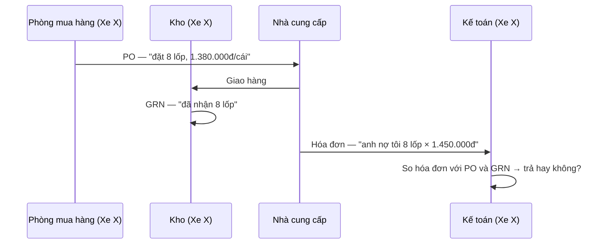

# User stories — Invoice Reconciliation Agent

> Tài liệu giải thích nghiệp vụ bằng tình huống cụ thể · Ngày 23/09/2026
> Tài liệu liên quan: `PRD.md` (yêu cầu chi tiết, mã ngoại lệ) · `BRIEF_v3.md` (định vị, lộ trình) · `WIREFRAME.md` (màn hình)
> Đối tượng đọc: kỹ sư trong nhóm chưa làm kế toán bao giờ

PRD trả lời *hệ thống phải làm gì*. Tài liệu này trả lời *vì sao người dùng cần thế*: mỗi tình huống là một chuyện có thật ở phòng kế toán, kèm số liệu, và chỉ ra nó chạm vào phần nào của PRD.

---

## 1. Bức tranh trong một trang

### 1.1 Ba tờ giấy, hai bên

Một tổ chức (ở đây là Xe X) mua hàng của nhà cung cấp (NCC). Mỗi lần mua đẻ ra ba chứng từ:

| Chứng từ | Ai lập | Nói gì | Vai trò khi đối soát |
|---|---|---|---|
| **PO** (đơn đặt hàng) | Xe X | Mình đã **đặt** gì, giá bao nhiêu | Mốc so — nội bộ |
| **GRN** (phiếu nhập kho) | Xe X | Mình đã **nhận** gì, bao nhiêu | Mốc so — nội bộ |
| **Hóa đơn** | NCC | NCC **đòi** mình bao nhiêu tiền | **Thứ bị kiểm** — từ bên ngoài |

Ba tờ giấy này không ngang hàng nhau. **Đối soát = kiểm lời đòi tiền của NCC bằng giấy tờ của chính mình.** Quy tắc vàng: chỉ trả cho hàng *đã đặt*, *đã nhận*, *đúng giá đã thỏa thuận*.

### 1.2 Mỗi hóa đơn chỉ có ba kết cục

Đối soát không phải đích đến. Đích đến là câu hỏi: **hóa đơn này có được ghi nợ phải trả và thanh toán không?**

| Kết cục | Khi nào | Trạng thái trong hệ thống |
|---|---|---|
| ✅ **Trả** | Khớp, hoặc lệch nhưng người có thẩm quyền chấp nhận | `APPROVED` → xuất bút toán → `POSTED` |
| ⏸ **Chưa trả** | Còn chờ một thứ gì đó: kho chưa nhập đủ, NCC chưa gửi hóa đơn điều chỉnh, chưa xác minh được NCC | **Chưa có trạng thái riêng** — xem mục 4 |
| ❌ **Không trả** | Sai, trùng, hoặc gian lận | `REJECTED` |

### 1.3 User story gốc

> *Là kế toán, tôi muốn biết ngay hóa đơn nào trả được, hóa đơn nào chưa, vì sao, và lệch bao nhiêu tiền — để tôi không trả sai và giải trình được khi kiểm toán hỏi.*

Mọi thứ trong PRD — OCR, khớp dòng hàng, mã ngoại lệ, duyệt 2 cấp, memory NCC, audit — đều phục vụ câu này.

---

## 2. Nhân vật và dữ liệu nền

**Người dùng**

| Tên | Vai trò | Làm gì trong ngày |
|---|---|---|
| **Ngọc** | Kế toán viên (KTV) | Nhận 20–40 hóa đơn/ngày qua email, đối soát, duyệt cấp 1 |
| **Tuấn** | Kế toán viên (KTV) | Như Ngọc, chia NCC với Ngọc |
| **chị Hà** | Kế toán trưởng (KTT) | Duyệt cấp 2, cấu hình dung sai, duyệt quy tắc NCC, trả lời kiểm toán |

**Nhà cung cấp** (dữ liệu tổng hợp, không có thật)

| Mã | Tên | Bán gì | Đặc điểm |
|---|---|---|---|
| `NCC-LOP` | Công ty TNHH Lốp Minh Phát | Lốp xe | Gửi XML đều đặn, NCC "ngoan" |
| `NCC-ACQ` | Công ty CP Ắc quy Điện Việt | Ắc quy xe điện | Hay giao nhiều đợt |
| `NCC-BD` | Garage Thành Công | Dịch vụ bảo dưỡng | Gửi PDF scan, không ghi số PO |
| `NCC-VS` | Công ty TNHH Vệ sinh Sạch Xanh | Hóa chất vệ sinh xe | Ghi đơn vị "thùng" trong khi PO ghi "chai" |
| `NCC-SAC` | Công ty CP Năng lượng Sạc Nhanh | Điện sạc | Hóa đơn lớn hằng tháng |

**Cấu hình mặc định dùng trong các ví dụ** (xem `PRD.md` mục 9): dung sai giá 2% **và** 50.000đ · dung sai số lượng 0% · ngưỡng duyệt cấp 2 là 50.000.000đ.

---

## 3. Tình huống

Mỗi tình huống có cùng khung: **Chuyện gì xảy ra** → **Hệ thống làm gì** → **Người làm gì** → **Kết cục**.

### Nhóm A — Ngày thường

#### TH-01 · Hóa đơn khớp hoàn toàn (đường "happy path")

**Chuyện gì xảy ra.** Ngày 10/09, Lốp Minh Phát giao 8 lốp Michelin 185/65R15 theo PO-2026-0412. Kho lập GRN-0981 nhận đủ 8. Hôm sau NCC gửi hóa đơn điện tử (XML) số 0001234, ký hiệu 1C26TMP.

| | PO-2026-0412 | GRN-0981 | Hóa đơn 0001234 |
|---|---:|---:|---:|
| Số lượng | 8 | 8 | 8 |
| Đơn giá | 1.380.000 | — | 1.380.000 |
| Thành tiền | 11.040.000 | — | 11.040.000 |
| Thuế 10% | 1.104.000 | — | 1.104.000 |
| Tổng | 12.144.000 | — | 12.144.000 |

**Hệ thống làm gì.** Parse XML (confidence 1.0 cho mọi trường) → hóa đơn có in số PO nên tìm thấy PO ngay (bậc 1) → khớp dòng theo mã hàng (L0) → giá, số lượng, thuế đều trong dung sai → **🟢 Khớp**, tổng 12,1tr < 50tr nên **chỉ cần duyệt cấp 1**.

**Người làm gì.** Ngọc mở hóa đơn, nhìn màn so sánh 3 cột thấy toàn dấu xanh, bấm **Duyệt**. Mất 10 giây thay vì 5 phút mở ba file.

**Kết cục.** ✅ `PENDING_L1 → APPROVED`. Cuối ngày Ngọc xuất file bút toán (Nợ 152 / Nợ 1331 / Có 331) để import vào phần mềm kế toán → `POSTED`.

> Đây là **lý do tồn tại của sản phẩm**: đẩy càng nhiều hóa đơn về dạng này càng tốt, để Ngọc dành thời gian cho các ca khó bên dưới. Mục tiêu ở BRIEF: ≥ 70% hóa đơn được phân loại 🟢 đúng.

*PRD: F2, F4.1, F5 (L0), F9, F11.1, F10, F15.1*

---

#### TH-02 · Giao hàng nhiều đợt — không phải lỗi

**Chuyện gì xảy ra.** PO-2026-0430 đặt 20 ắc quy của Điện Việt. NCC giao đợt 1 được 12 cái (GRN-1002), và xuất hóa đơn cho đúng 12 cái. 8 cái còn lại giao tuần sau.

| | PO | GRN-1002 | Hóa đơn đợt 1 |
|---|---:|---:|---:|
| Số lượng | **20** | 12 | 12 |

**Cách làm ngây thơ sẽ sai:** so hóa đơn với PO thấy 12 ≠ 20 → báo lệch. Đây là **ca báo lệch oan phổ biến nhất** trong thực tế.

**Hệ thống làm gì.** So với **GRN**, không so với PO: hóa đơn 12 = đã nhận 12 → hợp lệ. Sinh `QTY-02` mức **INFO** (chỉ để ghi nhận là giao từng phần) → vẫn **🟢**. Cập nhật lũy kế trên dòng PO: `qty_received_to_date = 12`, `qty_invoiced_to_date = 12`.

Tuần sau, đợt 2: GRN-1017 nhận 8, hóa đơn đợt 2 ghi 8. Hệ thống so **lũy kế**: đã hóa đơn 20 ≤ đã nhận 20 → 🟢.

**Kết cục.** ✅ cả hai hóa đơn đều trả được.

*PRD: F5.4 (lũy kế), F6.2, mã QTY-02*

---

#### TH-03 · Giá cao hơn PO

**Chuyện gì xảy ra.** Tương tự TH-01, nhưng hóa đơn ghi đơn giá **1.450.000** thay vì 1.380.000.

**Hệ thống làm gì.** Tính lệch và **ghi công thức**:

> Đơn giá lốp Michelin 185/65R15 trên hóa đơn là 1.450.000 đ/cái, PO-2026-0412 ghi 1.380.000 đ/cái. Lệch 70.000 đ/cái × 8 cái = **560.000 đ**, tương đương **5,07%**, vượt dung sai 2% và 50.000 đ.

→ `PRC-01` mức **BLOCK** → **🔴 Lệch**. Đề xuất: `REQUEST_CREDIT_NOTE` (yêu cầu NCC xuất hóa đơn điều chỉnh).

Con số 560.000 và 5,07% do **rule engine** tính bằng `Decimal`. LLM chỉ viết câu tiếng Việt bao quanh — nó không được phép tự ra số.

**Người làm gì — hai nhánh:**

- **Nhánh a.** Ngọc gọi NCC. NCC thừa nhận ghi nhầm giá. Ngọc chọn `REQUEST_CREDIT_NOTE`. → ⏸ **Chưa trả**, chờ NCC gửi hóa đơn điều chỉnh. *(Hệ thống hiện chưa có chỗ cho trạng thái này — xem mục 4.)*
- **Nhánh b.** Phòng mua hàng xác nhận giá lốp đã tăng từ đầu tháng, chỉ là PO chưa cập nhật. Ngọc chọn **`ACCEPT`**, bắt buộc nhập lý do: *"Phòng mua xác nhận giá mới từ 01/09, email ngày 02/09"*. Vì có ngoại lệ được chấp nhận nên hệ thống **bắt buộc chuyển duyệt cấp 2** cho chị Hà.

**Vì sao nhánh b cần cấp 2?** Chấp nhận trả nhiều hơn số đã đặt là một quyết định tiêu tiền. Một mình KTV không nên được quyết.

*PRD: F5.6, F6.1, F9.2–F9.5, F11.2, mã PRC-01*

---

#### TH-04 · Tên hàng và đơn vị tính khác nhau — hệ thống học dần

**Chuyện gì xảy ra.** PO-2026-0455 đặt hàng của Vệ sinh Sạch Xanh:

| | PO | Hóa đơn |
|---|---|---|
| Tên hàng | Nước rửa kính ô tô 500ml | NRK 500ML (THÙNG 24) |
| Mã hàng | `HC-NRK-500` | *(không có)* |
| Đơn vị | chai | thùng |
| Số lượng | 48 | 2 |

**Lần đầu tiên.**

1. Không có mã hàng nên không khớp được bằng L0. Chuẩn hóa chuỗi (L2) và fuzzy (L3) đều không đủ điểm. Hệ thống đưa 5 ứng viên cho LLM chọn (L4). LLM chọn đúng dòng "Nước rửa kính ô tô 500ml" với confidence 0.88 → `ITM-02` (**🟡**, cần người xác nhận).
2. Đơn vị "thùng" ≠ "chai" mà chưa có quy tắc quy đổi → `QTY-04` (**🔴**).
3. Ngọc xác nhận khớp đúng. Chị Hà vào trang NCC Sạch Xanh, thêm quy tắc `UOM_CONVERSION`: *1 thùng = 24 chai*. Chạy lại: 2 thùng = 48 chai = PO → hết lệch.
4. Việc Ngọc xác nhận khớp sinh ra một quy tắc `ITEM_ALIAS` **đề xuất** (`PROPOSED`): "NRK 500ML (THÙNG 24)" ↔ `HC-NRK-500`, `evidence_count = 1`.

**Tháng sau**, NCC gửi thêm 2 hóa đơn cùng cách ghi. Ngọc tiếp tục xác nhận → `evidence_count = 3` → hệ thống **đề nghị** KTT kích hoạt. Chị Hà duyệt → `ACTIVE`.

**Từ lần thứ 4 trở đi**, dòng này khớp ngay ở bậc L1 (memory NCC), **không gọi LLM**, không 🟡. Rẻ hơn, nhanh hơn, và Ngọc hết phải bấm xác nhận.

> Đây là "hào cạnh tranh" trong BRIEF: dùng càng lâu, hệ thống càng hiểu thói quen từng NCC, và khách càng khó chuyển sang đối thủ.

*PRD: F5 (L1–L4), F5.3, F12, mã ITM-02, QTY-04*

---

#### TH-05 · Hóa đơn không ghi số PO

**Chuyện gì xảy ra.** Garage Thành Công gửi hóa đơn bảo dưỡng 3 xe, tổng 9.720.000đ, **không in số PO**. Các engine khớp cứng theo số PO sẽ dừng ở đây. BRIEF gọi đó là lý do các công cụ hiện có chỉ tự động được ~30% hóa đơn.

**Hệ thống làm gì.** Truy hồi theo bậc thang ("PO mềm"):

1. Bậc 1 — số PO: không có, bỏ qua.
2. Bậc 2 — tìm PO của NCC có cùng MST, trạng thái còn mở, ngày PO trong 120 ngày trước ngày hóa đơn. Tìm được 2 ứng viên:

| Ứng viên | Tổng tiền | Danh mục hàng | Điểm |
|---|---:|---|---:|
| PO-2026-0388 | 9.720.000 | Bảo dưỡng định kỳ ×3 | 0.97 |
| PO-2026-0401 | 9.500.000 | Bảo dưỡng định kỳ ×3 | 0.91 |

Hai điểm chênh nhau dưới 10% → `DOC-06` (**🟡**, PO nhập nhằng) → **hỏi người dùng chọn**, không tự đoán.

**Người làm gì.** Ngọc xem biển số xe ghi trên hóa đơn, thấy trùng với PO-0388, bấm chọn. Hệ thống ghi `linked_by = MANUAL` và đối soát tiếp.

*PRD: F4.2, F4.6, F4.7, mã DOC-06*

---

### Nhóm B — Đọc sai, sửa tay

#### TH-06 · OCR đọc sai một chữ số

**Chuyện gì xảy ra.** Garage Thành Công gửi **ảnh scan** hóa đơn. Con dấu đỏ đè lên dòng tổng tiền. OCR đọc `13.062.000` thành `13.862.000`.

**Hệ thống làm gì.** Hai lưới an toàn bắt được lỗi, dù từng trường riêng lẻ trông vẫn hợp lệ:

| Kiểm tra | Kết quả |
|---|---|
| Cộng dồn: tiền hàng + thuế = tổng? | 11.890.000 + 1.172.000 = 13.062.000 ≠ **13.862.000** → `INT-02` |
| Tiền bằng chữ: *"Mười ba triệu không trăm sáu mươi hai nghìn đồng"* ↔ 13.862.000? | Không khớp → `INT-03` |
| Confidence trường `total_amount` | 0.71 < ngưỡng 0.95 → `INT-01` |

→ **🔴**, và hóa đơn **không thể thành 🟢** cho tới khi có người xác nhận.

**Người làm gì.** Ngọc mở hóa đơn. Màn hình làm nổi vùng ảnh chứa con số bị nghi. Ngọc sửa thành 13.062.000. Trường đó chuyển thành `source_type = manual`, `confidence = 1.0`, ghi audit (giá trị cũ, giá trị mới, ai sửa). Pipeline chạy lại từ bước tìm chứng từ → 🟢.

> **Nguyên tắc "không chắc thì phải báo"**: một con số sai lọt qua mà không bị gắn cờ là lỗi nặng nhất của sản phẩm. Chỉ số quan trọng nhất ở BRIEF là *tỷ lệ trường sai nhưng không bị gắn cờ ≈ 0%*.

*PRD: F2.3, F3.1–F3.6, mã INT-01/02/03*

---

#### TH-07 · LLM "bịa" số

**Chuyện gì xảy ra.** Một hóa đơn PDF có lớp text nhưng bảng bị vỡ cột. LLM map trường và trả về `tax_amount = 1.172.000`, nhưng con số này **không xuất hiện ở đâu** trong text gốc (LLM tự cộng các dòng thuế lại).

**Hệ thống làm gì.** Kiểm mọi số LLM trả về: phải tìm thấy trong text gốc sau khi chuẩn hóa. Không thấy → bỏ giá trị (`value = null`, `confidence = 0`) → `INT-06` (**🔴**).

**Người làm gì.** Ngọc nhìn ảnh gốc và nhập tay số thuế.

> Kể cả khi số LLM "tự cộng" ra là đúng, hệ thống vẫn loại nó đi. Số liệu kế toán phải truy được về chứng từ, không được là "AI nói thế".

*PRD: F2.8, mã INT-06*

---

### Nhóm C — Chưa trả được

#### TH-08 · Hóa đơn đến trước hàng

**Chuyện gì xảy ra.** Ngày 15/09, Điện Việt giao 10 ắc quy và gửi hóa đơn điện tử luôn trong ngày. Nhưng thủ kho đến 18/09 mới lập GRN trong hệ thống. Tới lượt Ngọc thì phòng mua hàng mới gửi file Excel PO/GRN theo lịch **thứ Hai hằng tuần**.

**Hệ thống làm gì.** Ngày 15/09 tìm được PO nhưng chưa có GRN nào → `DOC-02` (**🔴**), đề xuất `WAIT_GRN`.

**Người làm gì.** Ngọc chọn `WAIT_GRN`. Hóa đơn đứng yên.

**Thứ Hai 21/09**, Ngọc import file GRN mới, trong đó có GRN nhận đủ 10 ắc quy. **Rồi sao nữa?**

- Nếu hệ thống **không** tự đối soát lại: Ngọc phải nhớ hóa đơn này, tìm nó, bấm "Xử lý lại". Với 300 hóa đơn cuối tháng thì chắc chắn sẽ sót.
- Nếu hệ thống **tự** đối soát lại các hóa đơn đang mắc `DOC-02` của PO vừa có GRN: hóa đơn tự chuyển 🟢, xuất hiện trong hàng đợi duyệt của Ngọc.

**Kết cục.** ⏸ Chưa trả → ✅ Trả, **nhưng PRD chưa mô tả bước chuyển này.** Xem mục 4, câu hỏi Q1 và Q2.

*PRD: F4.4, F4.6, F9.4 (`WAIT_GRN`), mã DOC-02*

---

#### TH-09 · Hóa đơn nhiều hơn hàng nhận

**Chuyện gì xảy ra.** PO đặt 20 ắc quy. Kho nhận 20 nhưng **trả lại 2 cái hỏng** (GRN ghi `quantity_received = 20`, `quantity_rejected = 2`). NCC vẫn xuất hóa đơn 20 cái.

**Hệ thống làm gì.** Số nhận thực = 18. Đã hóa đơn 20 > 18 → `QTY-01` (**🔴**), lệch 2 × 3.200.000 = 6.400.000đ + thuế. Đề xuất `REQUEST_CREDIT_NOTE`.

**Người làm gì.** Ngọc gửi email cho NCC yêu cầu xuất hóa đơn điều chỉnh giảm 2 cái. → ⏸ Chưa trả.

**Câu hỏi còn mở:** khi NCC gửi hóa đơn điều chỉnh giảm, nó là một hóa đơn mới (có số, ký hiệu riêng, ghi "điều chỉnh cho hóa đơn số …"). Hệ thống có ghép nó với hóa đơn gốc để tính "20 − 2 = 18 → khớp" không? Xem Q3.

*PRD: F6.2, mã QTY-01*

---

### Nhóm D — Duyệt và phân quyền

#### TH-10 · Hóa đơn lớn cần hai người

**Chuyện gì xảy ra.** Năng lượng Sạc Nhanh gửi hóa đơn điện sạc tháng 8: tiền hàng 110.000.000, thuế 10% = 11.000.000, **tổng 121.000.000đ**. Mọi thứ khớp.

**Hệ thống làm gì.** 🟢, nhưng tổng > 50tr → cần **cấp 1 + cấp 2**.

**Người làm gì.**

1. Tuấn duyệt cấp 1 → `PENDING_L2`.
2. Hóa đơn xuất hiện trong hàng đợi của chị Hà. Chị xem chi tiết, duyệt cấp 2 → `APPROVED`.

**Biến thể — tách biệt trách nhiệm.** Hôm Tuấn nghỉ, chị Hà tự duyệt cấp 1 hóa đơn này. Sau đó chị bấm duyệt cấp 2 → backend trả **`409`**: *"Người duyệt cấp 2 phải khác người duyệt cấp 1"*. Ẩn nút ở frontend thôi là không đủ; backend phải chặn.

> Xem Q5: nếu Xe X chỉ có **một** KTT mà chị Hà đã duyệt cấp 1, thì ai duyệt cấp 2?

*PRD: F11.1–F11.3, mục 2.2, mục 5.3*

---

#### TH-11 · KTT trả lại hóa đơn

**Chuyện gì xảy ra.** Tiếp TH-03 nhánh b. Ngọc chấp nhận giá cao hơn với lý do *"giá mới"*. Chị Hà đọc thì thấy lý do quá chung chung, không dẫn chứng từ nào.

**Người làm gì.** Chị Hà bấm **Trả lại**, nhập lý do (≥ 10 ký tự): *"Cần đính kèm email/biên bản xác nhận giá mới của phòng mua"*. → `RETURNED → EXTRACTED`. Hóa đơn quay về tay Ngọc, chạy lại từ đầu sau khi Ngọc bổ sung.

**Khác với Từ chối:** `REJECTED` là trạng thái cuối, hóa đơn chết. `RETURNED` nghĩa là "làm lại cho đúng".

*PRD: F11.4, F11.5*

---

### Nhóm E — Trùng lặp và gian lận

#### TH-12 · NCC gửi lại cùng một hóa đơn

**Hai biến thể, cách xử lý khác nhau:**

| | Biến thể a | Biến thể b |
|---|---|---|
| Chuyện gì | NCC gửi email nhắc, đính kèm **đúng file XML cũ**. Ngọc upload lại | NCC in hóa đơn cũ ra PDF và gửi lại. File khác, nhưng **cùng MST + ký hiệu + số** |
| Hệ thống phát hiện bằng | `sha256` của file trùng | Khóa tự nhiên `(org, MST, ký hiệu, số)` trùng — có unique index ở DB |
| Kết quả | Không xử lý lại (không tốn tiền OCR/LLM), báo *"File này đã có ở hóa đơn 0001234"* | `FRD-01` (**🔴 chặn cứng**), chỉ cho phép `REJECT` |

Trả tiền hai lần cho cùng một hóa đơn là lỗi mất tiền thật và rất phổ biến. Vì thế nó được chặn ở tầng DB, kể cả khi code ứng dụng có bug.

*PRD: F2.2, F8.1, mục 7.3, mã FRD-01*

---

#### TH-13 · Đổi tài khoản nhận tiền

**Chuyện gì xảy ra.** Một hóa đơn "của Lốp Minh Phát" đến, mọi thứ khớp PO và GRN, nhưng **số tài khoản ngân hàng khác** với tài khoản đang lưu cho NCC này. Kèm email: *"Công ty chúng tôi đổi ngân hàng, vui lòng chuyển khoản vào tài khoản mới."*

**Hệ thống làm gì.** `FRD-05` (**🔴**). Mọi cờ `FRD-*` đều bắt buộc KTT duyệt cấp 2, bất kể số tiền.

**Người làm gì.** Chị Hà **gọi điện** cho NCC theo số đã lưu (không gọi số trong email). Nếu NCC xác nhận đổi thật: cập nhật tài khoản NCC rồi duyệt. Nếu NCC không hề gửi email đó thì đây là lừa đảo, `REJECT`.

> Đây là kiểu lừa đảo chuyển hướng thanh toán phổ biến nhất. Hóa đơn giả thường khớp hoàn hảo với PO/GRN, vì kẻ gian đã đọc được email thật.

*PRD: F8.5, F8.8, mã FRD-05*

---

#### TH-14 · Tách nhỏ để né ngưỡng duyệt

**Chuyện gì xảy ra.** Trong 6 ngày, Garage Thành Công gửi 3 hóa đơn: 18tr, 19tr, 17tr. Mỗi cái dưới 50tr, nên nếu xét riêng thì chỉ cần KTV duyệt. Tổng 54tr > 50tr.

**Hệ thống làm gì.** `FRD-03` (**🟡**) → buộc chị Hà duyệt cấp 2 và xem cả ba hóa đơn cùng lúc.

*PRD: F8.3, mã FRD-03*

---

### Nhóm F — Thuế

#### TH-15 · Tính sai tiền thuế

**Chuyện gì xảy ra.** Hóa đơn của Garage Thành Công có dòng *"Dịch vụ cân chỉnh thước lái"*: tiền hàng 850.000, thuế suất 8%, nhưng tiền thuế ghi **85.000** (NCC lấy nhầm 10%).

**Hệ thống làm gì.** Tính lại: 850.000 × 8% = 68.000. Lệch 17.000 > 1 đồng → `TAX-02` (**🔴**). Đề xuất `REQUEST_CREDIT_NOTE`.

**Biến thể — lệch do làm tròn.** Hóa đơn 3 dòng, NCC cộng tiền hàng rồi mới tính thuế, nên tổng thuế lệch 2đ so với cách "làm tròn từng dòng rồi cộng" → `TAX-03` mức **INFO**, không chặn. Nếu không phân biệt hai trường hợp này, hệ thống sẽ đổ ra hàng loạt cảnh báo giả mỗi ngày.

*PRD: F7.2, F7.3, mục 6, mã TAX-02/03*

---

### Nhóm G — Cuối kỳ

#### TH-16 · Chốt sổ và xuất bút toán

**Chuyện gì xảy ra.** Cuối ngày, Ngọc có 25 hóa đơn `APPROVED`.

**Người làm gì.** Bấm **Xuất bút toán** → file Excel/CSV (UTF-8 có BOM để Excel bản Việt mở không lỗi font) → import vào phần mềm kế toán. Các hóa đơn chuyển `POSTED`.

Hệ thống **không** trả tiền và **không** ghi thẳng vào ERP (MVP). Nó chỉ đưa hóa đơn tới trạng thái "sẵn sàng thanh toán".

*PRD: F10, F15.1, F17.4*

---

#### TH-17 · Kiểm toán hỏi

**Chuyện gì xảy ra.** Tháng 3 năm sau, kiểm toán hỏi: *"Hóa đơn 0001234 của Lốp Minh Phát trả cao hơn PO 560.000đ — ai quyết, dựa vào đâu?"*

**Người làm gì.** Chị Hà lọc audit log theo hóa đơn và thấy ngay:

| Lúc | Ai | Làm gì | Chi tiết |
|---|---|---|---|
| 11/09 09:02 | Ngọc | Upload | file XML, sha256 … |
| 11/09 09:15 | Ngọc | Chọn `ACCEPT` cho `PRC-01` | Lý do: "Phòng mua xác nhận giá mới từ 01/09, email ngày 02/09" |
| 11/09 09:15 | Ngọc | Duyệt cấp 1 | |
| 11/09 14:40 | Hà | Duyệt cấp 2 | |
| 11/09 17:00 | Ngọc | Xuất bút toán | → `POSTED` |

Xuất ra Excel và gửi kiểm toán. Audit log **chỉ được thêm**: không ai sửa hay xóa được, kể cả KTT.

*PRD: F14, F15.3*

---

#### TH-18 · NCC nào đang làm khổ phòng kế toán?

**Chuyện gì xảy ra.** Chị Hà mở danh sách NCC, sắp xếp theo điểm sẵn sàng tự động hóa tăng dần. Garage Thành Công đứng cuối, **41/100**. Khuyến nghị:

> *NCC này gửi 90% hóa đơn dạng scan và 70% không ghi số PO. Đề nghị NCC gửi hóa đơn điện tử XML và ghi số PO trên hóa đơn — ước tính đưa điểm lên khoảng 75.*

Chị Hà gửi đề nghị cho garage. Tháng sau phần lớn hóa đơn của họ tự thành 🟢.

> Biến "dữ liệu bẩn" từ lời than phiền thành việc làm được. Đây là màn hình bán hàng mạnh nhất trong demo.

*PRD: F13*

---

## 4. Những chỗ chưa rõ

Đi hết các tình huống thì thấy PRD chưa trả lời mấy câu dưới đây. Cần chốt trong nhóm, và hỏi Xe X nếu được.

| # | Câu hỏi | Lộ ra ở | Vì sao quan trọng |
|---|---|---|---|
| **Q1** | Hóa đơn ở nhóm ⏸ **"Chưa trả"** (chờ GRN, chờ hóa đơn điều chỉnh, chờ xác minh NCC) nằm ở trạng thái nào? Hiện nó chỉ có thể đứng mãi ở `PENDING_L1` với ngoại lệ BLOCK chưa xử lý | TH-03a, TH-08, TH-09 | Kế toán cần một danh sách "đang chờ gì, chờ ai, từ bao giờ". Trong thực tế đây là nhóm tốn thời gian nhất |
| **Q2** | Import PO/GRN mới có **tự đối soát lại** các hóa đơn đang mắc `DOC-01` / `DOC-02` không? | TH-08 | Nếu phải bấm tay thì sẽ sót. Hỏi Xe X: PO/GRN đến tay kế toán bằng cách nào, bao lâu một lần? |
| **Q3** | Hóa đơn **điều chỉnh** (giảm / tăng / thay thế) được ghép với hóa đơn gốc thế nào? | TH-03a, TH-09, TH-15 | `REQUEST_CREDIT_NOTE` là đề xuất phổ biến nhất, mà kết quả của nó chưa có chỗ đứng trong mô hình dữ liệu |
| **Q4** | Xuất bút toán xong mà import vào phần mềm kế toán bị lỗi thì sao? Có cho xuất lại hóa đơn đã `POSTED` không? | TH-16 | Hiện ta coi export là bước chốt sổ |
| **Q5** | Tổ chức chỉ có **một** KTT mà KTT đó đã duyệt cấp 1, thì ai duyệt cấp 2? | TH-10 | Cần luật: cấm KTT duyệt cấp 1 hóa đơn cần cấp 2, hoặc cho phép người thứ ba |
| **Q6** | Chấp nhận **một phần**: lệch 2 dòng, đồng ý dòng 1, đòi điều chỉnh dòng 2. Hóa đơn đi đâu? | TH-03 | Kết cục "một nửa trả, một nửa chờ" chưa được mô tả |

---

## 5. Bảng tra nhanh

| Tình huống | Phân loại | Mã ngoại lệ | Cần cấp 2? | Kết cục | PRD |
|---|:-:|---|:-:|---|---|
| TH-01 Khớp hoàn toàn | 🟢 | — | — | ✅ | F5, F11 |
| TH-02 Giao nhiều đợt | 🟢 | QTY-02 (INFO) | — | ✅ | F5.4 |
| TH-03 Giá cao hơn PO | 🔴 | PRC-01 | nếu `ACCEPT` | ⏸ / ✅ | F6.1, F9 |
| TH-04 Tên, đơn vị khác | 🟡 → 🔴 | ITM-02, QTY-04 | — | ✅ + học | F5, F12 |
| TH-05 Không số PO | 🟡 | DOC-06 | — | ✅ | F4.2 |
| TH-06 OCR sai số | 🔴 | INT-01/02/03 | — | ✅ sau khi sửa | F3 |
| TH-07 LLM bịa số | 🔴 | INT-06 | — | ✅ sau khi nhập tay | F2.8 |
| TH-08 Hóa đơn trước hàng | 🔴 | DOC-02 | — | ⏸ → ✅ | F4.4 · **Q1, Q2** |
| TH-09 Hóa đơn > hàng nhận | 🔴 | QTY-01 | — | ⏸ | F6.2 · **Q3** |
| TH-10 Hóa đơn lớn | 🟢 | — | ✅ | ✅ | F11.2 · **Q5** |
| TH-11 KTT trả lại | — | — | — | quay lại | F11.5 |
| TH-12 Gửi trùng | 🔴 | FRD-01 | chỉ `REJECT` | ❌ | F8.1 |
| TH-13 Đổi tài khoản | 🔴 | FRD-05 | ✅ | ✅ / ❌ | F8.5 |
| TH-14 Tách nhỏ | 🟡 | FRD-03 | ✅ | ✅ / ❌ | F8.3 |
| TH-15 Thuế sai / làm tròn | 🔴 / 🟢 | TAX-02 / TAX-03 | — | ⏸ / ✅ | F7 |
| TH-16 Xuất bút toán | — | — | — | `POSTED` | F10, F15 · **Q4** |
| TH-17 Kiểm toán hỏi | — | — | — | — | F14 |
| TH-18 NCC điểm thấp | — | — | — | — | F13 |
