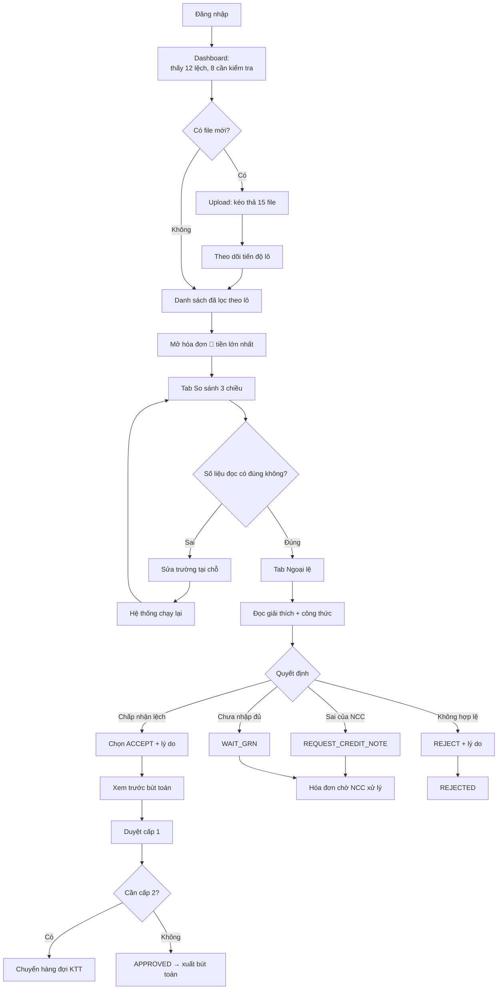
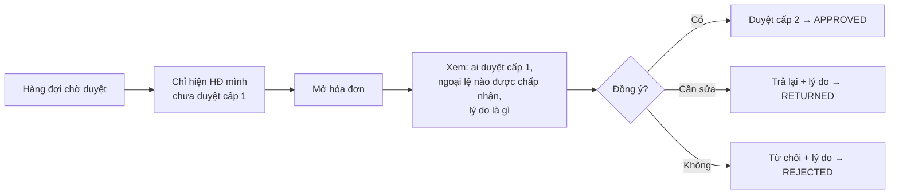
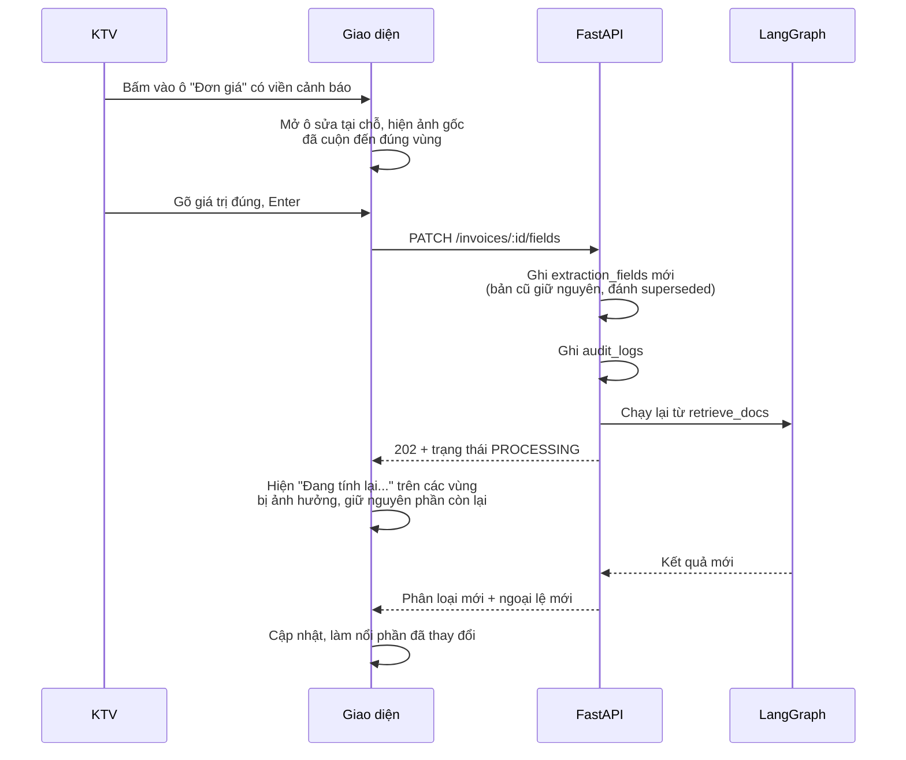

# Wireframe & UI Flow — Invoice Reconciliation Agent

> Luồng người dùng và phác thảo màn hình · Phiên bản 1.0 · Ngày 20/09/2026
> Tài liệu liên quan: `BRIEF_v3.md` (định vị) · `PRD.md` (yêu cầu chức năng, mã ngoại lệ, API)
> Đối tượng đọc: người làm frontend, người chấm Demo Day

---

## 1. Nguyên tắc thiết kế

Năm nguyên tắc, xếp theo thứ tự ưu tiên khi phải đánh đổi.

1. **Giảm số lần phải chuyển ngữ cảnh.** Kế toán hiện phải mở ba file để so. Màn hình chính phải đặt hóa đơn, PO và phiếu nhập cạnh nhau, ngang hàng theo từng dòng.
2. **Mỗi con số phải chỉ được về nguồn.** Rê chuột vào bất kỳ giá trị nào thì thấy nó đến từ đâu: đường dẫn XML, trang và vùng ảnh, hay ai đã sửa tay.
3. **Nói lệch bao nhiêu, đừng chỉ nói "có lệch".** Mọi cảnh báo đi kèm số tiền và công thức.
4. **Không chắc thì phải trông khác đi.** Trường tin cậy thấp có dấu hiệu thị giác riêng, không lẫn với trường bình thường.
5. **Hành động nguy hiểm phải khó bấm nhầm.** Duyệt hóa đơn có ngoại lệ cần một bước xác nhận riêng nêu rõ đang chấp nhận lệch bao nhiêu tiền.

---

## 2. Sơ đồ trang

```
/login                              Đăng nhập

/                                   Dashboard (mặc định sau khi đăng nhập)
/upload                             Upload và theo dõi tiến độ lô
/invoices                           Danh sách hóa đơn
/invoices/:id                       Chi tiết hóa đơn
    ├── ?tab=compare                  So sánh 3 chiều          ← màn hình lõi
    ├── ?tab=exceptions               Ngoại lệ và xử lý
    ├── ?tab=journal                  Bút toán đề xuất
    └── ?tab=timeline                 Dòng thời gian / audit
/approvals                          Hàng đợi chờ duyệt của tôi
/vendors                            Danh sách NCC + readiness score
/vendors/:id                        Chi tiết NCC: quy tắc memory + phân rã điểm
/documents/purchase-orders          Danh sách và import PO
/documents/goods-receipts           Danh sách và import phiếu nhập
/exports                            Xuất bút toán và báo cáo
/admin/config                       Cấu hình ngưỡng           [chỉ KTT]
/admin/audit                        Nhật ký kiểm toán         [chỉ KTT]
/admin/costs                        Chi phí xử lý             [chỉ KTT]
```

Điều hướng chính đặt ở thanh bên trái, gom thành 3 nhóm: **Xử lý** (Dashboard, Upload, Hóa đơn, Chờ duyệt) · **Dữ liệu** (NCC, PO, Phiếu nhập) · **Quản trị** (Cấu hình, Nhật ký, Chi phí — ẩn với KTV).

---

## 3. Luồng người dùng

### 3.1 Luồng chính — KTV xử lý hóa đơn hằng ngày



### 3.2 Luồng KTT duyệt cấp 2



### 3.3 Luồng sửa trường OCR (chi tiết vì đây là tương tác tinh tế nhất)



**Chi tiết dễ bị làm sai:** khi tính lại, **không** hiện spinner toàn trang. Chỉ vùng bị ảnh hưởng mờ đi. Kế toán đang đọc dở, làm mới cả trang là mất chỗ đang đọc.

---

## 4. Bản đồ trạng thái hóa đơn với giao diện

| Trạng thái | Hiển thị ở đâu | Nhãn tiếng Việt | Hành động khả dụng |
|---|---|---|---|
| `UPLOADED` | Trang upload | Đã tải lên | — |
| `QUEUED` | Trang upload | Đang chờ xử lý | Hủy |
| `EXTRACTED` | Danh sách | Đã đọc xong | Sửa trường, gán PO |
| `MATCHED` | Danh sách | Đã đối chiếu | Xử lý ngoại lệ |
| `PENDING_L1` | Danh sách + Chờ duyệt | Chờ duyệt cấp 1 | Duyệt, trả lại, từ chối |
| `PENDING_L2` | Chờ duyệt (KTT) | Chờ duyệt cấp 2 | Duyệt cấp 2, trả lại, từ chối |
| `APPROVED` | Danh sách | Đã duyệt | Xuất bút toán |
| `POSTED` | Danh sách | Sẵn sàng thanh toán | Xem, xuất lại |
| `RETURNED` | Danh sách | Trả lại sửa | Sửa, gửi lại |
| `REJECTED` | Danh sách (lọc riêng) | Đã từ chối | Chỉ xem |
| `FAILED` | Danh sách (lọc riêng) | Xử lý lỗi | Xử lý lại, xóa |

---

## 5. Wireframe từng màn hình

Ký hiệu: `[ ]` nút · `▼` dropdown · `▸` mục mở rộng được · `◉` trạng thái đang chọn

### S1 — Đăng nhập

```
┌──────────────────────────────────────────────────────────────┐
│                                                              │
│                    ┌────────────────────┐                    │
│                    │   [logo]           │                    │
│                    │   Đối soát hóa đơn │                    │
│                    └────────────────────┘                    │
│                                                              │
│              Email                                           │
│              ┌────────────────────────────────┐              │
│              │ ngoc.nguyen@xex.vn             │              │
│              └────────────────────────────────┘              │
│              Mật khẩu                                        │
│              ┌────────────────────────────────┐              │
│              │ ••••••••••••              👁   │              │
│              └────────────────────────────────┘              │
│                                                              │
│              [       Đăng nhập        ]                      │
│                                                              │
│              ⚠ Sai email hoặc mật khẩu.                      │
│                Còn 3 lần thử trước khi khóa 15 phút.         │
│                                                              │
└──────────────────────────────────────────────────────────────┘
```

Thông báo lỗi **không** được tiết lộ email có tồn tại hay không.

### S2 — Dashboard

```
┌────────────┬─────────────────────────────────────────────────────────────────┐
│ ĐỐI SOÁT   │  Tổng quan                          Ngọc (KTV) ▼   🌙   [Thoát] │
│            ├─────────────────────────────────────────────────────────────────┤
│ XỬ LÝ      │                                                                 │
│ ◉ Tổng quan│  ┌───────────┐ ┌───────────┐ ┌───────────┐ ┌───────────┐        │
│ ↑ Upload   │  │ 🟢 KHỚP   │ │🟡 CẦN XEM │ │ 🔴 LỆCH   │ │ CHỜ DUYỆT │        │
│ ▤ Hóa đơn  │  │           │ │           │ │           │ │           │        │
│ ✓ Chờ duyệt│  │    42     │ │     8     │ │    12     │ │    15     │        │
│   (15)     │  │ 486,2 tr  │ │  91,4 tr  │ │ 203,7 tr  │ │ 312,0 tr  │        │
│            │  │           │ │           │ │ lệch 8,4tr│ │           │        │
│ DỮ LIỆU    │  └───────────┘ └───────────┘ └───────────┘ └───────────┘        │
│ ⌂ Nhà CC   │     bấm để lọc     bấm để lọc    bấm để lọc    bấm để lọc       │
│ ▤ Đơn hàng │                                                                 │
│ ▤ Phiếu nhập│ ┌─────────────────────────────┐ ┌─────────────────────────────┐│
│            │  │ Cần xử lý trước              │ │ Ngoại lệ hay gặp tuần này  ││
│ QUẢN TRỊ   │  ├─────────────────────────────┤ ├─────────────────────────────┤│
│ ⚙ Cấu hình │  │🔴 HĐ 00012457 · Lốp Việt    │ │ PRC-01 Giá cao hơn PO   ▇▇▇9││
│ ▤ Nhật ký  │  │   48,5 tr · lệch 2,4 tr     │ │ QTY-01 HĐ > hàng nhận   ▇▇ 6││
│ ₫ Chi phí  │  │   PRC-01, TAX-02            │ │ INT-01 OCR tin cậy thấp ▇▇ 5││
│            │  │                              │ │ DOC-02 Thiếu phiếu nhập ▇  3││
│ ─────────  │  │🔴 HĐ 00012441 · Pin Minh Anh│ │ TAX-03 Lệch làm tròn    ▇  2││
│ v1.0       │  │   31,2 tr · lệch 1,1 tr     │ └─────────────────────────────┘│
│            │  │   QTY-01                     │                               │
│            │  │                              │ ┌─────────────────────────────┐│
│            │  │🟡 HĐ 00012460 · VPP Hòa Bình│ │ Hoạt động gần đây           ││
│            │  │   4,8 tr · OCR tin cậy thấp │ ├─────────────────────────────┤│
│            │  │   INT-01 (2 trường)          │ │ 09:42 Ngọc duyệt HĐ 12390   ││
│            │  │                              │ │ 09:31 Hà duyệt cấp 2 HĐ 12385│
│            │  │        [ Xem tất cả → ]      │ │ 09:15 Ngọc sửa đơn giá 12441 ││
│            │  └─────────────────────────────┘ └─────────────────────────────┘│
└────────────┴─────────────────────────────────────────────────────────────────┘
```

Thẻ 🔴 hiện **cả tổng tiền lệch**, không chỉ số lượng hóa đơn — đó là con số kế toán quan tâm.

### S3 — Upload và tiến độ lô

```
┌─────────────────────────────────────────────────────────────────────────────┐
│  Tải hóa đơn lên                                                            │
├─────────────────────────────────────────────────────────────────────────────┤
│                                                                             │
│   ┌───────────────────────────────────────────────────────────────────┐     │
│   │                                                                   │     │
│   │                         ⬆                                         │     │
│   │            Kéo thả hóa đơn vào đây hoặc [ Chọn file ]             │     │
│   │                                                                   │     │
│   │     XML · PDF · PNG · JPG   ·   tối đa 20 file   ·   20 MB/file   │     │
│   │     Đã dùng hôm nay: 214/500 trang OCR · 1,82/5,00 USD            │     │
│   └───────────────────────────────────────────────────────────────────┘     │
│                                                                             │
│   Lô #a7f3 — 15 file                          Tiến độ: 11/15   ⏱ ~40 giây  │
│   ┌───────────────────────────────────────────────────────────────────┐     │
│   │ ✓ HD_00012457.xml        XML       0,8s   🔴 Lệch   → xem         │     │
│   │ ✓ HD_00012458.pdf        PDF text  2,1s   🟢 Khớp   → xem         │     │
│   │ ✓ scan_0459.jpg          OCR      11,4s   🟡 Cần xem → xem        │     │
│   │ ⟳ scan_0460.jpg          OCR — đang đọc ▓▓▓▓▓▓░░░░ 62%            │     │
│   │ ⏸ HD_00012461.pdf        Đang chờ trong hàng đợi                  │     │
│   │ ⚠ HD_00012462.pdf        Bỏ qua — trùng với HĐ 00012399 → xem     │     │
│   │ ✗ anh_mo.jpg             Lỗi — file vượt 10 trang (có 14 trang)   │     │
│   └───────────────────────────────────────────────────────────────────┘     │
│                                                                             │
│   [ Xem 15 hóa đơn của lô này ]                    [ Tải thêm file ]        │
└─────────────────────────────────────────────────────────────────────────────┘
```

Hiện **ngân sách đã dùng trong ngày** ngay trên vùng thả file — người dùng biết trước khi chạm giới hạn, không bị chặn bất ngờ.

### S4 — Danh sách hóa đơn

```
┌─────────────────────────────────────────────────────────────────────────────────┐
│  Hóa đơn                                                     [ ⬆ Tải lên ]      │
├─────────────────────────────────────────────────────────────────────────────────┤
│ 🔍 [ số HĐ, NCC, mã số thuế...        ]  Trạng thái ▼  Phân loại ▼  NCC ▼       │
│ Từ [01/09/2026] đến [20/09/2026]         Lô ▼          [ Xóa lọc ]  [ ⬇ Xuất ]  │
├─────────────────────────────────────────────────────────────────────────────────┤
│ ☐ │ │ Số HĐ     │ Nhà cung cấp     │ Ngày   │  Tổng tiền │ Lệch    │ Trạng thái │
├───┼─┼───────────┼──────────────────┼────────┼────────────┼─────────┼────────────┤
│ ☐ │🔴│ 00012457 │ Lốp xe Việt      │ 18/09  │ 48.520.000 │ 2.410.000│ Chờ duyệt 1│
│   │ │           │ ▸ PRC-01 · TAX-02│        │            │  (5,0%) │            │
├───┼─┼───────────┼──────────────────┼────────┼────────────┼─────────┼────────────┤
│ ☐ │🔴│ 00012441 │ Pin Minh Anh     │ 17/09  │ 31.200.000 │ 1.120.000│ Đã đối chiếu│
│   │ │           │ ▸ QTY-01         │        │            │  (3,6%) │            │
├───┼─┼───────────┼──────────────────┼────────┼────────────┼─────────┼────────────┤
│ ☐ │🟡│ 00012460 │ VPP Hòa Bình     │ 18/09  │  4.830.000 │       — │ Đã đối chiếu│
│   │ │           │ ▸ INT-01 (2)     │        │            │         │            │
├───┼─┼───────────┼──────────────────┼────────┼────────────┼─────────┼────────────┤
│ ☐ │🟢│ 00012458 │ Dầu nhớt Phương  │ 18/09  │ 12.400.000 │       — │ Chờ duyệt 1│
├───┼─┼───────────┼──────────────────┼────────┼────────────┼─────────┼────────────┤
│ ☐ │🟢│ 00012390 │ Đồng phục Sao Mai│ 15/09  │  8.900.000 │       — │ Đã duyệt   │
└───┴─┴───────────┴──────────────────┴────────┴────────────┴─────────┴────────────┘
│ Đã chọn 0   [ Duyệt hàng loạt ]  ← chỉ bật khi mọi HĐ đã chọn đều 🟢            │
│                                              ‹ 1 2 3 … 12 ›   62 hóa đơn        │
└─────────────────────────────────────────────────────────────────────────────────┘
```

**Duyệt hàng loạt chỉ cho phép với hóa đơn 🟢.** Chọn lẫn một hóa đơn 🟡 hay 🔴 thì nút tắt kèm giải thích — không để người dùng duyệt nhanh qua thứ cần đọc.

### S5 — Chi tiết hóa đơn · tab So sánh 3 chiều **(màn hình lõi)**

```
┌───────────────────────────────────────────────────────────────────────────────────┐
│ ‹ Danh sách   HĐ 00012457 · Lốp xe Việt      🔴 Lệch      [Trả lại] [Từ chối]     │
│                                                            [ ✓ Duyệt cấp 1 ]      │
├───────────────────────────────────────────────────────────────────────────────────┤
│ ◉ So sánh 3 chiều │ Ngoại lệ (2) │ Bút toán │ Dòng thời gian                      │
├───────────────────────────────────────────────────────────────────────────────────┤
│ ┌─── Thông tin chung ───────────────────────────────────────────────────────────┐ │
│ │ Số HĐ    00012457 ⓘ      Ký hiệu  1C26TLV      Ngày   18/09/2026 ⓘ           │ │
│ │ NCC      Công ty TNHH Lốp xe Việt · MST 0101234567 ⓘ                          │ │
│ │ PO       PO-2026-0412 ⓘ (khớp qua số PO in trên HĐ)  [ đổi PO ]               │ │
│ │ Phiếu nhập  PN-2026-0871 (14/09) · PN-2026-0878 (17/09)                       │ │
│ │ Tổng tiền   48.520.000 ⚠  (tin cậy 0,82 — nên kiểm tra)                       │ │
│ └───────────────────────────────────────────────────────────────────────────────┘ │
│                                                                                   │
│ ┌─── Đối chiếu theo dòng ───────────────────────────┐ ┌─── Chứng từ gốc ────────┐ │
│ │                                                   │ │ [HĐ] [PO] [PN]  ⤢ ⊕ ⊖   │ │
│ │ ① Lốp Michelin 185/65R15                          │ │ ┌─────────────────────┐ │ │
│ │ ┌────────┬──────────┬──────────┬──────────┐       │ │ │ HÓA ĐƠN GTGT        │ │ │
│ │ │        │ Hóa đơn  │    PO    │ Phiếu nhập│      │ │ │ Số: 00012457        │ │ │
│ │ ├────────┼──────────┼──────────┼──────────┤       │ │ │ ...                 │ │ │
│ │ │ SL     │     8    │    10    │     8    │ ✓     │ │ │ ┌───────────────┐   │ │ │
│ │ │ Đơn giá│1.450.000⚠│ 1.380.000│        — │ ✗     │ │ │ │ 1.450.000     │◀──┼─┼─┤
│ │ │ Thành  │11.600.000│11.040.000│        — │ ✗     │ │ │ └───────────────┘   │ │ │
│ │ │ Thuế 10│ 1.160.000│ 1.104.000│        — │ ✗     │ │ │  ▲ vùng đang chọn   │ │ │
│ │ └────────┴──────────┴──────────┴──────────┘       │ │ │                     │ │ │
│ │  ⚠ Giá cao hơn PO 70.000 đ/cái (+5,07%)           │ │ │ Trang 1/1           │ │ │
│ │    → lệch 560.000 đ · vượt dung sai 2%  [PRC-01]  │ │ └─────────────────────┘ │ │
│ │    Khớp dòng: mã hàng trùng (L0)                  │ │                         │ │
│ │                                                   │ │ Nguồn trường đang chọn: │ │
│ │ ② Dịch vụ cân chỉnh thước lái                     │ │  OCR · trang 1          │ │
│ │ ┌────────┬──────────┬──────────┬──────────┐       │ │  vùng (412, 688)        │ │
│ │ │ SL     │     1    │     1    │     1    │ ✓     │ │  tin cậy 0,82           │ │
│ │ │ Đơn giá│   850.000│   850.000│        — │ ✓     │ │  [ Sửa giá trị ]        │ │
│ │ │ Thuế  8│    68.000│    68.000│        — │ ✓     │ │                         │ │
│ │ └────────┴──────────┴──────────┴──────────┘       │ │                         │ │
│ │  ✓ Khớp trong dung sai                            │ │                         │ │
│ │                                                   │ │                         │ │
│ │ ┌─── Tổng cộng ───────────────────────────────┐   │ │                         │ │
│ │ │ Tiền hàng  12.450.000 │ PO 11.890.000 │ +560.000│ │                         │ │
│ │ │ Thuế GTGT   1.228.000 │    1.172.000  │  +56.000│ │                         │ │
│ │ │ TỔNG       13.678.000 │   13.062.000  │ +616.000│ │                         │ │
│ │ │ Bằng chữ: khớp ✓                             │   │ │                         │ │
│ │ └─────────────────────────────────────────────┘   │ │                         │ │
│ └───────────────────────────────────────────────────┘ └─────────────────────────┘ │
└───────────────────────────────────────────────────────────────────────────────────┘
```

Bốn điều bắt buộc ở màn này:

- **Hàng nào lệch thì cả hàng đổi nền**, không chỉ một ô — mắt bắt nhanh hơn.
- **Ô có `confidence` thấp mang dấu `⚠`** và viền đứt nét, khác hẳn ô lệch (nền đỏ nhạt). Hai vấn đề khác nhau, không được trông giống nhau.
- **Bấm một ô thì khung chứng từ bên phải cuộn và làm nổi đúng vùng** sinh ra giá trị đó.
- **Cách khớp dòng được ghi rõ** ("mã hàng trùng (L0)", "memory NCC", "LLM tin cậy 0,86"). Kế toán cần biết máy tự tin đến đâu.

### S6 — tab Ngoại lệ và xử lý

```
┌───────────────────────────────────────────────────────────────────────────────────┐
│ So sánh 3 chiều │ ◉ Ngoại lệ (2) │ Bút toán │ Dòng thời gian                      │
├───────────────────────────────────────────────────────────────────────────────────┤
│                                                                                   │
│ ┌─ 🔴 PRC-01 · Giá cao hơn PO ─────────────────────────── lệch 560.000 đ ───────┐ │
│ │                                                                               │ │
│ │ Dòng ① Lốp Michelin 185/65R15                                                 │ │
│ │                                                                               │ │
│ │ Đơn giá trên hóa đơn là 1.450.000 đ/cái, trong khi PO-2026-0412 ghi           │ │
│ │ 1.380.000 đ/cái. Chênh 70.000 đ/cái cho 8 cái, tương đương 560.000 đ          │ │
│ │ (+5,07%), vượt dung sai 2% đang áp dụng cho nhà cung cấp này.                 │ │
│ │                                                                               │ │
│ │ Công thức  (1.450.000 − 1.380.000) × 8 = 560.000                              │ │
│ │            560.000 / 11.040.000 = 5,07%  >  2,00%                             │ │
│ │ Nguồn      HĐ: OCR trang 1, vùng (412,688), tin cậy 0,82  [xem]               │ │
│ │            PO: PO-2026-0412 dòng 1, nhập từ Excel 02/09/2026  [xem]           │ │
│ │                                                                               │ │
│ │ ℹ Nhà cung cấp này đã 2 lần tăng giá trong 6 tháng qua. Giá trung vị           │ │
│ │   6 tháng: 1.390.000 đ/cái.                                                   │ │
│ │                                                                               │ │
│ │ Đề xuất của hệ thống:  ⭐ Yêu cầu NCC xuất hóa đơn điều chỉnh                  │ │
│ │                                                                               │ │
│ │  ( ) Chấp nhận lệch          ( ) Chờ nhập đủ hàng                              │ │
│ │  (•) Yêu cầu điều chỉnh      ( ) Từ chối hóa đơn                               │ │
│ │                                                                               │ │
│ │  Lý do (bắt buộc khi khác đề xuất)                                             │ │
│ │  ┌─────────────────────────────────────────────────────────────────────────┐  │ │
│ │  │                                                                         │  │ │
│ │  └─────────────────────────────────────────────────────────────────────────┘  │ │
│ │                                                          [ Lưu xử lý ]        │ │
│ └───────────────────────────────────────────────────────────────────────────────┘ │
│                                                                                   │
│ ┌─ 🔴 TAX-02 · Tiền thuế sai ────────────────────────────── lệch 56.000 đ ──────┐ │
│ │ ▸ Thuế dòng ① ghi 1.160.000, tính lại từ 11.600.000 × 10% = 1.160.000 ✓.      │ │
│ │   Nhưng tiền hàng đúng theo PO là 11.040.000 → thuế đúng 1.104.000.           │ │
│ │   Ngoại lệ này sẽ tự đóng khi PRC-01 được xử lý.          [ đã liên kết ]     │ │
│ └───────────────────────────────────────────────────────────────────────────────┘ │
│                                                                                   │
│ ┌─ ℹ QTY-02 · Giao hàng từng phần ────────────────────────────── không cần xử lý ┐│
│ │ Hóa đơn 8 cái trên PO 10 cái, khớp đúng số lượng đã nhận theo PN-0871 và      ││
│ │ PN-0878. Còn 2 cái chưa giao. Đây là tình huống bình thường.                  ││
│ └───────────────────────────────────────────────────────────────────────────────┘ │
└───────────────────────────────────────────────────────────────────────────────────┘
```

Ba chi tiết quan trọng:

- **Ngoại lệ liên kết nhau** (`TAX-02` là hệ quả của `PRC-01`) được nói rõ, không bắt xử lý hai lần.
- **Ngoại lệ INFO vẫn hiển thị** nhưng thu gọn, nền xám, không có nút. `QTY-02` xuất hiện ở đây chính là bằng chứng hệ thống hiểu giao hàng từng phần — đây là chỗ đối thủ báo lệch oan.
- **Ngữ cảnh lịch sử** ("đã 2 lần tăng giá trong 6 tháng") giúp quyết định, và nó đến từ dữ liệu, không phải LLM suy đoán.

### S7 — tab Bút toán và xác nhận duyệt

```
┌───────────────────────────────────────────────────────────────────────────────────┐
│ So sánh 3 chiều │ Ngoại lệ (2) │ ◉ Bút toán │ Dòng thời gian                      │
├───────────────────────────────────────────────────────────────────────────────────┤
│ Ngày ghi sổ [18/09/2026]   Số chứng từ  PT-2026-09-0457                          │
│                                                                                   │
│ ┌──────┬─────────────────────────────────────┬─────────────┬─────────────┐        │
│ │ TK   │ Diễn giải                           │      Nợ     │      Có     │        │
│ ├──────┼─────────────────────────────────────┼─────────────┼─────────────┤        │
│ │ 152▼ │ Lốp Michelin 185/65R15 — nhập kho   │  11.040.000 │             │        │
│ │ 627▼ │ Dịch vụ cân chỉnh thước lái         │     850.000 │             │        │
│ │ 1331 │ Thuế GTGT được khấu trừ             │   1.172.000 │             │        │
│ │ 331▼ │ Phải trả — Cty TNHH Lốp xe Việt     │             │  13.062.000 │        │
│ ├──────┼─────────────────────────────────────┼─────────────┼─────────────┤        │
│ │      │ TỔNG                                │  13.062.000 │  13.062.000 │ ✓ cân  │
│ └──────┴─────────────────────────────────────┴─────────────┴─────────────┘        │
│                                                                                   │
│ ℹ Bút toán lập theo **số liệu PO**, không theo số trên hóa đơn, vì ngoại lệ       │
│   PRC-01 đang được xử lý theo hướng yêu cầu NCC xuất hóa đơn điều chỉnh.          │
│                                                                                   │
│                                      [ Xuất Excel ]    [ ✓ Duyệt cấp 1 ]         │
└───────────────────────────────────────────────────────────────────────────────────┘

   Bấm Duyệt khi còn ngoại lệ được chấp nhận → hộp xác nhận:

   ┌─────────────────────────────────────────────────────────────┐
   │  Xác nhận duyệt cấp 1                                       │
   ├─────────────────────────────────────────────────────────────┤
   │  Bạn đang duyệt hóa đơn 00012457 với:                       │
   │                                                             │
   │   • 1 chênh lệch được chấp nhận:  560.000 đ                 │
   │   • Tổng thanh toán:           13.062.000 đ                 │
   │                                                             │
   │  ⚠ Hóa đơn này sẽ cần Kế toán trưởng duyệt cấp 2            │
   │    (lý do: có chênh lệch được chấp nhận)                    │
   │                                                             │
   │  Ghi chú cho người duyệt cấp 2                              │
   │  ┌───────────────────────────────────────────────────────┐  │
   │  │ Đã gọi NCC xác nhận giá mới theo phụ lục HĐ ngày 01/09│  │
   │  └───────────────────────────────────────────────────────┘  │
   │                                                             │
   │                       [ Hủy ]        [ Xác nhận duyệt ]     │
   └─────────────────────────────────────────────────────────────┘
```

Hộp xác nhận **nêu số tiền đang chấp nhận lệch**. Đây là bước cố ý làm chậm lại — duyệt lệch không được dễ như duyệt khớp.

### S8 — Hàng đợi chờ duyệt (góc nhìn KTT)

```
┌─────────────────────────────────────────────────────────────────────────────────┐
│  Chờ duyệt                                        ◉ Cấp 2 (7)  │  Cấp 1 (8)     │
├─────────────────────────────────────────────────────────────────────────────────┤
│ │ │ Số HĐ     │ NCC          │  Tổng tiền │ Lý do cần cấp 2 │ Cấp 1 duyệt bởi   │
├─┼─┼───────────┼──────────────┼────────────┼─────────────────┼───────────────────┤
│ │🔴│ 00012457 │ Lốp xe Việt  │ 13.062.000 │ Chấp nhận lệch  │ Ngọc · 09:48 hôm nay│
│ │ │           │              │            │ 560.000 đ       │ "Đã gọi NCC xác..."│
├─┼─┼───────────┼──────────────┼────────────┼─────────────────┼───────────────────┤
│ │🟢│ 00012402 │ Sạc điện ABC │ 78.400.000 │ Vượt ngưỡng 50tr│ Ngọc · 08:12 hôm nay│
├─┼─┼───────────┼──────────────┼────────────┼─────────────────┼───────────────────┤
│ │🟡│ 00012399 │ Cơ khí Tân Phú│ 22.100.000│ ⚠ NCC mới       │ Ngọc · hôm qua    │
│ │ │           │              │            │ (FRD-04)        │                   │
├─┼─┼───────────┼──────────────┼────────────┼─────────────────┼───────────────────┤
│ │🟡│ 00012388 │ Dầu nhớt PL  │ 19.800.000 │ ⚠ Đổi tài khoản │ Ngọc · hôm qua    │
│ │ │           │              │            │ nhận tiền(FRD-05)│                  │
└─┴─┴───────────┴──────────────┴────────────┴─────────────────┴───────────────────┘
```

Cột **"Lý do cần cấp 2"** là cột quan trọng nhất của màn này: KTT quyết định đọc kỹ cái nào dựa vào đó. Hóa đơn do chính KTT duyệt cấp 1 không xuất hiện ở tab Cấp 2.

### S9 — Nhà cung cấp và điểm sẵn sàng tự động hóa

```
┌─────────────────────────────────────────────────────────────────────────────────┐
│  Nhà cung cấp                                  Sắp xếp: Điểm thấp nhất ▼        │
├─────────────────────────────────────────────────────────────────────────────────┤
│ Nhà cung cấp        │ MST        │ HĐ/tháng │ Tự động │ Điểm sẵn sàng           │
├─────────────────────┼────────────┼──────────┼─────────┼─────────────────────────┤
│ Cơ khí Tân Phú      │ 0312345678 │    18    │   22%   │ ▇▇▇░░░░░░░  31  Yếu     │
│ VPP Hòa Bình        │ 0309876543 │    12    │   41%   │ ▇▇▇▇▇░░░░░  48  Trung   │
│ Lốp xe Việt         │ 0101234567 │    24    │   67%   │ ▇▇▇▇▇▇▇░░░  71  Khá     │
│ Dầu nhớt Phương Linh│ 0104567890 │    31    │   88%   │ ▇▇▇▇▇▇▇▇▇░  92  Tốt     │
└─────────────────────┴────────────┴──────────┴─────────┴─────────────────────────┘
```

### S10 — Chi tiết NCC: phân rã điểm và quy tắc memory

```
┌─────────────────────────────────────────────────────────────────────────────────┐
│ ‹ Nhà cung cấp    Cơ khí Tân Phú · MST 0312345678                              │
├─────────────────────────────────────────────────────────────────────────────────┤
│ ◉ Mức độ sẵn sàng │ Quy tắc riêng (4) │ Lịch sử hóa đơn                         │
├─────────────────────────────────────────────────────────────────────────────────┤
│                                                                                 │
│   Điểm sẵn sàng tự động hóa        31 / 100   ▇▇▇░░░░░░░                        │
│                                                                                 │
│   Hóa đơn có XML              ▇░░░░░░░░░   6/30    →  1,8 / 30 điểm             │
│   Khớp được đơn hàng          ▇▇▇▇▇▇░░░░  19/30    → 15,8 / 25 điểm             │
│   Dòng hàng đã ánh xạ         ▇▇▇▇░░░░░░  38/94    →  8,1 / 20 điểm             │
│   Đạt 🟢 ngay lần đầu         ▇▇░░░░░░░░   6/30    →  3,0 / 15 điểm             │
│   Không có ngoại lệ lặp lại   ▇▇░░░░░░░░           →  2,3 / 10 điểm             │
│                                                                                 │
│   ┌─── Nên làm gì ────────────────────────────────────────────────────────────┐ │
│   │ 1. Đề nghị NCC gửi hóa đơn XML thay vì ảnh chụp.                          │ │
│   │    80% hóa đơn hiện là ảnh chụp → điểm dự kiến tăng lên ~59.              │ │
│   │ 2. Chuẩn hóa 56 tên hàng chưa ánh xạ được sang mã nội bộ.                 │ │
│   │    [ Xem danh sách và ánh xạ ]        → điểm dự kiến tăng lên ~71.        │ │
│   │ 3. 11 hóa đơn trong 3 tháng qua không có đơn hàng tương ứng.              │ │
│   │    Cần siết quy trình tạo PO trước khi mua.                               │ │
│   └───────────────────────────────────────────────────────────────────────────┘ │
├─────────────────────────────────────────────────────────────────────────────────┤
│  Tab "Quy tắc riêng":                                                           │
│  ┌──────────────┬──────────────────────────────────┬──────────┬──────────────┐  │
│  │ Loại         │ Nội dung                         │ Bằng chứng│ Trạng thái  │  │
│  ├──────────────┼──────────────────────────────────┼──────────┼──────────────┤  │
│  │ Tên hàng     │ "Bulong M8 inox" → SKU BL-M8-304 │ 5 lần    │ ✓ Đang dùng  │  │
│  │ Tên hàng     │ "Bulon M8"       → SKU BL-M8-304 │ 3 lần    │ ⏳ Chờ duyệt  │  │
│  │              │                                   │          │ [Duyệt][Bỏ] │  │
│  │ Đơn vị tính  │ 1 hộp = 100 cái                  │ 7 lần    │ ✓ Đang dùng  │  │
│  │ Dung sai giá │ 5% (mặc định 2%)                 │ KTT đặt  │ ✓ Đang dùng  │  │
│  └──────────────┴──────────────────────────────────┴──────────┴──────────────┘  │
└─────────────────────────────────────────────────────────────────────────────────┘
```

Quy tắc ở trạng thái **"Chờ duyệt"** là cốt lõi của nguyên tắc HITL áp dụng cho chính phần học máy: hệ thống đề xuất, người quyết.

### S11 — Cấu hình ngưỡng (chỉ KTT)

```
┌─────────────────────────────────────────────────────────────────────────────────┐
│  Cấu hình                        Phiên bản 3 · sửa lần cuối 12/09 bởi Hà        │
├─────────────────────────────────────────────────────────────────────────────────┤
│ ◉ Dung sai │ Duyệt │ Thuế suất │ Giới hạn xử lý │ Tài khoản kế toán             │
├─────────────────────────────────────────────────────────────────────────────────┤
│  Mặc định toàn công ty                                                          │
│   Dung sai giá                [  2,0 ] %   và  [   50.000 ] đ  (phải thỏa cả hai)│
│   Dung sai số lượng           [  0,0 ] %                                        │
│   Dung sai ngày               [    3 ] ngày                                     │
│   Phiếu nhập về muộn tối đa   [   30 ] ngày                                     │
│   Ngưỡng tin cậy trường       [ 0,85 ]   ·  riêng trường tiền  [ 0,95 ]         │
│                                                                                 │
│  Ghi đè theo nhà cung cấp                                   [ + Thêm ]          │
│   ┌────────────────────┬──────────────┬──────────────┬──────────────────────┐   │
│   │ Cơ khí Tân Phú     │ giá 5,0%     │ SL 0,0%      │ [ sửa ] [ xóa ]      │   │
│   │ Sạc điện ABC       │ giá 8,0%     │ SL 2,0%      │ [ sửa ] [ xóa ]      │   │
│   └────────────────────┴──────────────┴──────────────┴──────────────────────┘   │
│                                                                                 │
│  ⚠ Thay đổi chỉ áp dụng cho hóa đơn xử lý từ thời điểm lưu.                     │
│    Hóa đơn đã đối chiếu giữ nguyên kết quả theo cấu hình lúc đó.                │
│                                                                                 │
│                       [ Xem lịch sử thay đổi ]      [ Hủy ]  [ Lưu ]            │
└─────────────────────────────────────────────────────────────────────────────────┘
```

### S12 — Dòng thời gian / nhật ký kiểm toán của một hóa đơn

```
┌─────────────────────────────────────────────────────────────────────────────────┐
│ So sánh 3 chiều │ Ngoại lệ (2) │ Bút toán │ ◉ Dòng thời gian                    │
├─────────────────────────────────────────────────────────────────────────────────┤
│                                                                                 │
│  ●  18/09 09:02  Ngọc tải lên  HD_00012457.xml · 84 KB · sha256 3f9a…          │
│  │                                                                              │
│  ●  18/09 09:02  Hệ thống đọc xong  XML · 0,8 giây · 14 trường · tin cậy 1,00  │
│  │                                                                              │
│  ●  18/09 09:02  Hệ thống tìm chứng từ  PO-2026-0412 (qua số PO in trên HĐ)    │
│  │               PN-2026-0871, PN-2026-0878                                     │
│  │                                                                              │
│  ●  18/09 09:02  Hệ thống đối chiếu  2 dòng · khớp L0 (mã hàng) · 0 gọi LLM    │
│  │               Phát hiện: PRC-01, TAX-02, QTY-02(info)                        │
│  │                                                                              │
│  ●  18/09 09:15  Ngọc sửa trường  đơn giá dòng 1                                │
│  │               1.540.000 → 1.450.000                                          │
│  │               Lý do: OCR đọc nhầm 4 thành 5                                  │
│  │                                                                              │
│  ●  18/09 09:15  Hệ thống tính lại  phân loại 🔴 (giữ nguyên)                   │
│  │                                                                              │
│  ●  18/09 09:46  Ngọc xử lý ngoại lệ  PRC-01 → Yêu cầu NCC điều chỉnh           │
│  │               Ghi chú: "Đã gọi NCC xác nhận giá mới theo phụ lục 01/09"      │
│  │                                                                              │
│  ●  18/09 09:48  Ngọc duyệt cấp 1  chấp nhận lệch 560.000 đ                     │
│  │                                                                              │
│  ○  Đang chờ  Kế toán trưởng duyệt cấp 2                                        │
│                                                                                 │
│                                                   [ ⬇ Xuất nhật ký (Excel) ]   │
└─────────────────────────────────────────────────────────────────────────────────┘
```

Đây là màn hình để trả lời kiểm toán, và cũng là màn hình thuyết phục nhất khi demo: nó cho thấy hệ thống **không phải hộp đen**.

### S13 — Bố cục trên điện thoại

Trên màn hình hẹp, bảng ba cột không dùng được. Chuyển sang thẻ xếp dọc theo từng dòng hàng.

```
┌───────────────────────────┐
│ ☰  HĐ 00012457       🔴   │
├───────────────────────────┤
│ Lốp xe Việt               │
│ 18/09/2026 · 48.520.000 đ │
│ Lệch 2.410.000 đ (5,0%)   │
├───────────────────────────┤
│ [So sánh][Lệch 2][BT][LS] │
├───────────────────────────┤
│ ① Lốp Michelin 185/65R15  │
│ ┌───────────────────────┐ │
│ │ Số lượng              │ │
│ │  HĐ 8  PO 10  PN 8  ✓ │ │
│ ├───────────────────────┤ │
│ │ Đơn giá            ✗  │ │
│ │  HĐ  1.450.000 ⚠      │ │
│ │  PO  1.380.000        │ │
│ │  →  +70.000 (+5,07%)  │ │
│ └───────────────────────┘ │
│ ⚠ PRC-01 · lệch 560.000đ  │
│   [ Xem và xử lý ]        │
├───────────────────────────┤
│ ② Dịch vụ cân chỉnh    ✓  │
│   Khớp trong dung sai     │
├───────────────────────────┤
│ [Trả lại] [ ✓ Duyệt ]     │
└───────────────────────────┘
```

Trên điện thoại **ưu tiên xem và duyệt**, không ưu tiên sửa trường — sửa số tiền trên màn hình nhỏ dễ sai.

---

## 6. Thành phần dùng chung

### 6.1 Màu trạng thái

| Dùng cho | Sáng | Tối | Lưu ý |
|---|---|---|---|
| 🟢 Khớp | `#16794C` nền `#E7F5EE` | `#4ADE80` nền `#0F2A1E` | |
| 🟡 Cần kiểm tra | `#A16207` nền `#FEF6E0` | `#FACC15` nền `#2B2007` | |
| 🔴 Lệch | `#B42318` nền `#FEE7E5` | `#F87171` nền `#2C0F0D` | |
| ℹ Thông tin | `#475467` nền `#F2F4F7` | `#98A2B3` nền `#1D2939` | |
| ⚠ Tin cậy thấp | viền đứt nét `#A16207` | viền đứt nét `#FACC15` | **Không** dùng nền — phải khác với ô lệch |

Màu **không bao giờ là tín hiệu duy nhất**: mọi trạng thái đi kèm biểu tượng và chữ, cho người mù màu và cho ảnh chụp đen trắng trong tài liệu.

### 6.2 Các thành phần

| Thành phần | Mô tả | Xuất hiện ở |
|---|---|---|
| `StatusPill` | Chấm màu + nhãn ("🔴 Lệch") | S2, S4, S5, S8 |
| `ConfidenceBadge` | `⚠ 0,82` — hiện khi dưới ngưỡng, ẩn khi trên | S5, S6 |
| `ExceptionChip` | `PRC-01` mã đơn sắc, rê chuột hiện tên đầy đủ | S4, S5, S6 |
| `DeltaCell` | Giá trị + chênh lệch tuyệt đối + % | S5 |
| `EvidencePopover` | Nguồn trường: loại, vị trí, tin cậy, nút "xem trong file" | S5, S6 |
| `DocumentViewer` | Khung xem PDF/ảnh, cuộn và làm nổi theo `bbox` | S5 |
| `InlineEditField` | Sửa tại chỗ, Enter lưu, Esc hủy, hiện giá trị cũ | S5 |
| `ActionRadioGroup` | Bốn hành động chuẩn, đánh dấu ⭐ cho đề xuất | S6 |
| `ApprovalConfirmDialog` | Nêu số tiền chấp nhận lệch trước khi duyệt | S7 |
| `ScoreBar` | Thanh điểm 0–100 kèm nhãn Yếu/Trung/Khá/Tốt | S9, S10 |
| `TimelineItem` | Một mục nhật ký: thời điểm, người, hành động, trước/sau | S12 |

### 6.3 Định dạng số và ngày

- Tiền: `13.062.000` (dấu chấm ngăn nghìn, không hiện `đ` trong bảng, có `đ` trong câu văn)
- Phần trăm: `5,07%` (dấu phẩy thập phân)
- Ngày: `18/09/2026`; trong dòng thời gian dùng `18/09 09:48`
- Số âm: màu đỏ và dấu trừ, không dùng ngoặc đơn
- Không bao giờ làm tròn số tiền khi hiển thị trong bảng đối chiếu

---

## 7. Trạng thái rỗng, đang tải và lỗi

Mỗi màn hình phải thiết kế đủ bốn trạng thái. Đây là chỗ hay bị bỏ quên và là chỗ người chấm hay bấm vào.

| Màn hình | Rỗng | Đang tải | Lỗi |
|---|---|---|---|
| Dashboard | "Chưa có hóa đơn nào. [Tải lên hóa đơn đầu tiên]" | Khung xương các thẻ | "Không tải được số liệu. [Thử lại]" |
| Danh sách | "Không có hóa đơn khớp bộ lọc. [Xóa lọc]" | Khung xương 5 dòng | Thanh lỗi giữ nguyên bộ lọc |
| Chi tiết | — | Khung xương từng vùng, không phải spinner toàn trang | "Không tải được hóa đơn" + nút quay lại |
| Chờ duyệt | "Không có gì chờ bạn duyệt. 🎉" | Khung xương | |
| NCC | "Chưa có nhà cung cấp. Import PO để tự tạo." | | |

**Quy tắc chung khi tính lại sau sửa trường:** chỉ làm mờ vùng bị ảnh hưởng, giữ nguyên vị trí cuộn, và làm nổi vùng vừa thay đổi trong 2 giây sau khi có kết quả.

---

## 8. Phím tắt

Kế toán xử lý hàng trăm hóa đơn — phím tắt tiết kiệm thật, không phải trang trí.

| Phím | Hành động | Ở đâu |
|---|---|---|
| `j` / `k` | Hóa đơn sau / trước | Danh sách |
| `Enter` | Mở hóa đơn đang chọn | Danh sách |
| `1` `2` `3` `4` | Chuyển tab | Chi tiết |
| `e` | Sửa trường đang chọn | Chi tiết |
| `a` | Mở hộp xác nhận duyệt | Chi tiết |
| `r` | Trả lại | Chi tiết |
| `Esc` | Đóng hộp thoại / hủy sửa | Mọi nơi |
| `/` | Nhảy vào ô tìm kiếm | Mọi nơi |
| `?` | Hiện bảng phím tắt | Mọi nơi |

Phím `a` **không** duyệt ngay — nó mở hộp xác nhận. Không có phím tắt nào gây ra hành động không hoàn tác được.

---

## 9. Bản đồ màn hình ↔ API

| Màn hình | Endpoint |
|---|---|
| S1 Đăng nhập | `POST /auth/login`, `GET /auth/me` |
| S2 Dashboard | `GET /invoices?…` (đếm theo phân loại), `GET /admin/audit-logs?limit=10` |
| S3 Upload | `POST /invoices/upload`, `GET /invoices/batches/{id}` |
| S4 Danh sách | `GET /invoices` |
| S5 So sánh | `GET /invoices/{id}`, `GET /invoices/{id}/comparison`, `GET /invoices/{id}/file`, `PATCH /invoices/{id}/fields`, `POST /invoices/{id}/relink-po` |
| S6 Ngoại lệ | `GET /invoices/{id}/discrepancies`, `POST /discrepancies/{id}/resolve` |
| S7 Bút toán | `GET /invoices/{id}` (phần journal), `POST /invoices/{id}/approve`, `POST /exports/journal` |
| S8 Chờ duyệt | `GET /approvals/queue`, `POST /invoices/{id}/approve|reject|return` |
| S9 NCC | `GET /vendors` |
| S10 Chi tiết NCC | `GET /vendors/{id}/readiness`, `GET /vendors/{id}/rules`, `PATCH /vendors/rules/{id}` |
| S11 Cấu hình | `GET /admin/config`, `PUT /admin/config/{name}` |
| S12 Dòng thời gian | `GET /admin/audit-logs?invoice_id=…` |

---

## 10. Thứ tự dựng màn hình

| Tuần | Màn hình | Mức hoàn thiện |
|---|---|---|
| 1 | S1, S3, S4 | Chạy được, chưa cần đẹp. Danh sách chỉ cần trạng thái và phân loại |
| 2 | S5 bản đầu | Bảng ba cột có dữ liệu thật. Chưa cần khung xem chứng từ |
| 3 | S5 đầy đủ, S6, S7, S2 | **Đây là tuần quyết định ấn tượng demo.** S5 và S6 phải xong hẳn |
| 4 | S8, S9, S10, S12 | S12 dòng thời gian là màn hình bán hàng, đừng để cuối |
| 5 | S11, S13, dark mode, trạng thái rỗng/lỗi | Đánh bóng |

**Nếu thiếu thời gian, cắt theo thứ tự:** S11 cấu hình (sửa file YAML tay) → S9/S10 readiness → S13 mobile (chỉ cần không vỡ layout) → S2 dashboard (vào thẳng danh sách).

**Không bao giờ cắt:** S5 so sánh 3 chiều, S6 ngoại lệ, S7 xác nhận duyệt, S12 dòng thời gian. Bốn màn này là toàn bộ câu chuyện sản phẩm.
